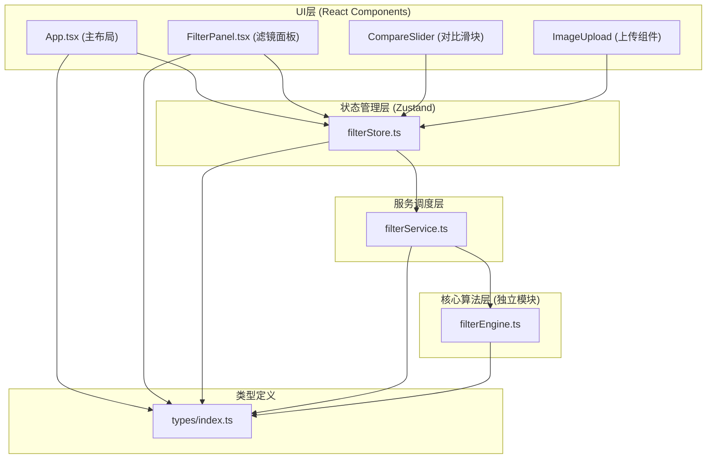

## 1. 架构设计



## 2. 技术描述

- **前端框架**：React 18 + TypeScript
- **构建工具**：Vite + @vitejs/plugin-react
- **状态管理**：Zustand
- **图像处理**：Canvas 2D API（原生像素操作）
- **项目结构**：模块化分层架构，算法模块与UI模块完全分离

## 3. 目录结构

```
src/
├── App.tsx                 # 主布局组件
├── main.tsx               # 入口文件
├── index.css              # 全局样式
├── types/
│   └── index.ts           # 类型定义（Filter, FilterParam等）
├── stores/
│   └── filterStore.ts     # Zustand全局状态管理
├── modules/
│   └── filterEngine.ts    # 滤镜核心算法（独立模块，无React依赖）
├── services/
│   └── filterService.ts   # 调度服务层，桥接UI与引擎
└── components/
    ├── FilterPanel.tsx    # 滤镜面板组件
    ├── CompareSlider.tsx  # 对比滑块组件
    ├── ImageUpload.tsx    # 图片上传组件
    └── ExportButton.tsx   # 导出按钮组件
```

## 4. 核心模块设计

### 4.1 类型定义 (src/types/index.ts)

```typescript
export interface Filter {
  id: string;
  name: string;
  description: string;
  thumbnail?: string;
}

export interface FilterParam {
  name: string;
  label: string;
  min: number;
  max: number;
  default: number;
  step: number;
}

export interface FilterParams {
  intensity: number;
}

export interface FilterState {
  originalImage: HTMLImageElement | null;
  originalImageData: ImageData | null;
  processedImageData: ImageData | null;
  selectedFilter: string | null;
  filterParams: FilterParams;
  sliderPosition: number;
  imageUploaded: boolean;
}
```

### 4.2 滤镜引擎模块 (src/modules/filterEngine.ts)

- 纯函数模块，无任何React依赖
- 接收ImageData和参数，返回处理后的ImageData
- 内置4种滤镜算法：
  - `applyMonet()`：莫奈印象 - 色彩柔和，轻微模糊
  - `applyVanGogh()`：梵高笔触 - 增强边缘，色彩饱和
  - `applyCyberpunk()`：赛博朋克 - 高对比，粉青色调
  - `applyInkWash()`：水墨淡彩 - 低饱和，灰度增强
- 所有算法基于Canvas像素级操作（getImageData/putImageData）

### 4.3 服务调度层 (src/services/filterService.ts)

- 作为UI层与算法层的桥梁
- 提供统一接口：`applyFilter(filterName, params)`
- 内部调用filterEngine对应算法
- 处理结果通过Zustand store更新UI
- 性能优化：防抖处理，确保<100ms延迟

### 4.4 状态管理 (src/stores/filterStore.ts)

使用Zustand管理全局状态：
- 原图数据与处理后数据
- 当前选中滤镜ID
- 滤镜参数（强度值0-100）
- 对比滑块位置（0-100）
- 图片上传状态

### 4.5 组件设计

**App.tsx**：
- 整体布局：桌面端左右分栏（60%/40%），移动端上下堆叠
- 集成对比区域、滤镜面板、参数调节区

**CompareSlider.tsx**：
- 双层Canvas叠加（原图底层，效果图上层）
- 通过CSS clip-path实现左右分割显示
- 鼠标/触摸事件实现滑块拖拽
- 位置默认50%

**FilterPanel.tsx**：
- 滤镜卡片网格布局
- 每张卡片：64x64缩略图 + 滤镜名称
- 选中状态视觉反馈
- 参数滑块组件

**ImageUpload.tsx**：
- 160x160虚线边框上传区域
- 支持点击选择和拖拽上传
- 文件类型校验
- 图片加载后存储到store

## 5. 性能优化策略

1. **像素处理优化**：
   - 使用Uint8ClampedArray直接操作像素数据，避免频繁调用setPixel
   - 滤镜强度通过线性插值混合原图与处理后图像
   - 单次遍历完成所有像素处理

2. **渲染优化**：
   - 图像处理在离屏Canvas完成
   - 只在必要时重绘（滤镜切换/参数改变）
   - 参数调整使用requestAnimationFrame节流

3. **内存管理**：
   - 及时释放无用ImageData引用
   - 限制最大处理分辨率（1200x1200）

## 6. 导出功能设计

1. 使用原始尺寸图片进行滤镜处理（而非显示尺寸）
2. 创建与原图等尺寸的离屏Canvas
3. 应用滤镜算法处理完整分辨率图像
4. 使用canvas.toBlob()导出PNG格式
5. 触发浏览器下载，文件名格式：`filtered_时间戳.png`

## 7. 响应式断点

- `min-width: 768px`：桌面端布局（左右分栏）
- `max-width: 767px`：移动端布局（上下堆叠）
- 使用CSS Media Queries实现
