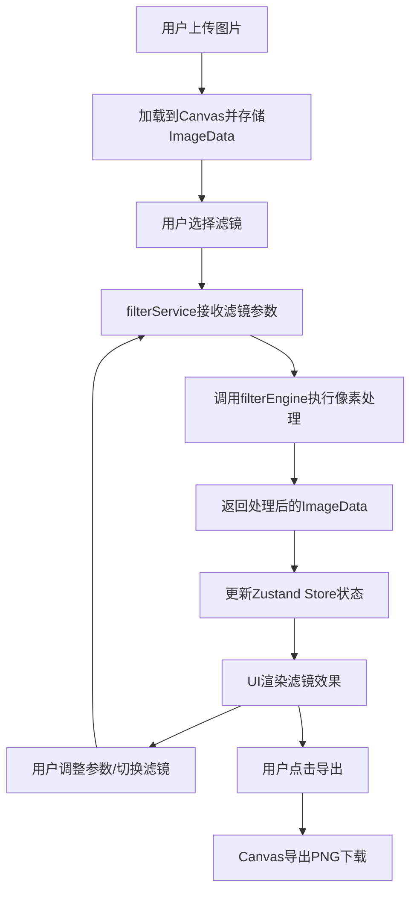

## 1. 产品概述

时光滤镜是一款交互式图片色彩迁移与风格化处理Web应用，用户上传照片后可实时应用预设艺术滤镜，通过滑块对比原图与处理效果，最终导出调整后的图片。

- 核心价值：提供便捷的图片艺术化处理体验，让普通用户无需专业软件即可获得高质量艺术效果
- 目标用户：摄影爱好者、社交媒体用户、设计师及对图片美化有需求的普通用户

## 2. 核心功能

### 2.1 功能模块

1. **图片上传模块**：点击或拖拽上传图片，支持多种常见图片格式
2. **滤镜引擎模块**：基于Canvas 2D像素操作的核心算法，实现多种艺术滤镜效果
3. **滤镜选择面板**：展示预设滤镜卡片，支持缩略图预览和选中状态
4. **参数微调模块**：通过滑块调整滤镜强度，实时预览效果
5. **对比滑块模块**：左右拖拽滑块，同步对比原图与处理后效果
6. **图片导出模块**：将处理后的图片以PNG格式下载，保持原始尺寸

### 2.2 页面详情

| 页面名称 | 模块名称 | 功能描述 |
|-----------|-------------|---------------------|
| 主页面 | 上传区域 | 160x160虚线边框区域，支持点击上传和拖拽上传 |
| 主页面 | 对比画布区域 | 左侧显示原图，右侧显示滤镜效果，中间可拖拽滑块 |
| 主页面 | 滤镜面板 | 展示4种预设滤镜卡片（莫奈印象、梵高笔触、赛博朋克、水墨淡彩） |
| 主页面 | 参数调节区 | 滤镜强度滑块，范围0%-100% |
| 主页面 | 导出按钮 | 导出当前处理后的图片为PNG格式 |

## 3. 核心流程

### 3.1 用户操作流程

用户进入应用 → 上传图片 → 选择预设滤镜 → 调整滤镜强度 → 通过滑块对比效果 → 导出图片

### 3.2 数据处理流程

## 4. 用户界面设计

### 4.1 设计风格

- **主色调**：深色主题，主背景 #121220，卡片背景 #1A1A2E
- **强调色**：#6C63FF（紫色），用于选中状态、按钮、滑块
- **文字颜色**：#E0E0E0（浅灰色）
- **边框颜色**：#3A3A5C（深紫灰色）
- **按钮样式**：圆角8px，悬停时亮度提升，点击时缩放0.95
- **字体**：系统无衬线字体
- **整体风格**：现代简约深色UI，科技感与艺术感结合

### 4.2 页面布局

| 区域 | 模块名称 | UI元素细节 |
|-----------|-------------|-------------|
| 左侧60% | 对比区域 | 背景#1A1A2E，圆角16px，1px #3A3A5C边框，内含双Canvas叠加和滑块 |
| 滑块 | 对比滑块 | 宽4px颜色#6C63FF，拖拽区域高40px，滑块圆点直径16px白色，阴影0 2px 8px #00000040 |
| 右侧40% | 滤镜面板 | 宽260px卡片，背景#2D2D44，圆角12px，1px #3A3A5C边框 |
| 滤镜卡片 | 滤镜选择 | 包含64x64缩略图、滤镜名称，选中时边框2px #6C63FF |
| 参数区 | 强度滑块 | 轨道宽200px高6px背景#3A3A5C，滑块圆点直径16px颜色#6C63FF |
| 导出区 | 导出按钮 | 背景#6C63FF白色文字，圆角8px，宽120px |

### 4.3 响应式设计

- **桌面端**（≥768px）：左右两栏布局，左侧60%对比区域，右侧40%控制面板
- **移动端**（<768px）：上下布局，上方全宽对比区域，下方控制面板
- 触摸操作优化：滑块拖拽区域适当扩大

### 4.4 交互动效

- 图片切换：200ms淡入过渡
- 按钮悬停：亮度提升10%
- 按钮点击：缩小到0.95倍
- 滤镜卡片选中：边框颜色和宽度平滑过渡
- 滑块拖拽：平滑无闪烁，左右图片同步裁剪
