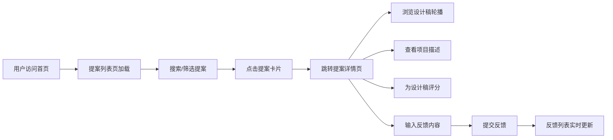

## 1. 产品概述

提案画廊是一个为小型设计工作室打造的轻量级提案展示与反馈收集平台，无需登录即可浏览提案、查看设计稿并提供反馈，帮助设计团队快速组织展示内容并高效收集客户意见。

- 目标用户：设计工作室的客户（无需注册）、设计团队成员
- 核心价值：简化提案展示流程，降低沟通成本，快速收集结构化反馈

## 2. 核心功能

### 2.1 用户角色

| 角色 | 注册方式 | 核心权限 |
|------|----------|----------|
| 访客用户 | 无需注册 | 浏览提案列表、查看提案详情、提交反馈、为设计稿评分 |
| 设计团队 | 后台管理（本版本未实现） | 管理提案内容（本版本通过模拟数据实现） |

### 2.2 功能模块

1. **提案列表页**：卡片网格展示、搜索筛选、响应式布局
2. **提案详情页**：设计稿轮播、项目描述、星级评分、反馈提交与展示

### 2.3 页面详情

| 页面名称 | 模块名称 | 功能描述 |
|---------|----------|----------|
| 提案列表页 | 搜索筛选区 | 关键词搜索（匹配名称/描述）、阶段筛选下拉（全部/初稿/修改中/定稿） |
| 提案列表页 | 卡片网格区 | 2行3列响应式布局，卡片悬停动效，展示封面图、名称、设计阶段标签 |
| 提案详情页 | 设计稿轮播区 | 左右箭头切换、淡入淡出动画、图片序号指示器 |
| 提案详情页 | 星级评分区 | 5颗星交互评分，实时更新平均评分 |
| 提案详情页 | 项目描述区 | 展示项目背景、设计理念等详细信息 |
| 提案详情页 | 反馈区 | 反馈输入框（500字限制）、提交按钮、反馈列表（头像、内容、相对时间、点赞） |

## 3. 核心流程

## 4. 用户界面设计

### 4.1 设计风格

- **主色调**：紫色系 - 主色#6200EE，暗色#3700B3，亮色#BB86FC
- **背景色**：#FAFAFA，卡片背景#FFFFFF
- **文字颜色**：主体#333333，辅助文字#666666
- **按钮风格**：圆角8px，主色背景，悬停变暗色
- **卡片风格**：圆角16px，1px #E0E0E0边框，柔和阴影，悬停上移6px加深阴影
- **字体**：系统字体栈，14px基础字号，行高1.6
- **设计标签颜色**：初稿#FF9800，修改中#2196F3，定稿#4CAF50

### 4.2 页面设计概述

| 页面名称 | 模块名称 | UI元素 |
|---------|----------|--------|
| 提案列表页 | 搜索筛选区 | 搜索框（圆角20px，内嵌搜索图标，宽度300px右对齐），筛选下拉菜单 |
| 提案列表页 | 卡片网格区 | CSS Grid布局（3列，间距24px，最大宽度1200px居中），卡片入场动画（scale 0.95→1，opacity 0→1，0.3s，逐卡延迟0.05s） |
| 提案详情页 | 设计稿轮播区 | 高度420px，背景#F5F5F5，左右箭头（圆形36px，半透明黑底），圆点指示器（8px直径，间距12px） |
| 提案详情页 | 星级评分区 | 5颗星（20px，未选中#DDDDDD，选中#FFC107，悬停#FFB300），平均评分显示（18px字重700） |
| 提案详情页 | 项目描述区 | 字体14px，颜色#666666，行高1.6 |
| 提案详情页 | 反馈区 | 左侧70%内容区，右侧30%固定反馈面板（340px宽，白底左边框阴影），反馈输入框（高80px，圆角8px） |

### 4.3 响应式设计

- **桌面端（>768px）**：列表3列布局，详情页左右分栏（70%/30%）
- **平板端（768px-1024px）**：列表2列布局，详情页保持分栏
- **移动端（<768px）**：列表单列布局，详情页反馈面板移到底部
- **触摸优化**：按钮最小44px可点击区域，滑动手势支持

### 4.4 动效设计

- 卡片入场：staggered动画，逐卡延迟
- 卡片悬停：上移6px，阴影加深，transition 0.3s
- 轮播切换：淡入淡出，0.3s过渡
- 按钮悬停：背景色变化，0.2s过渡
- 反馈提交：顶部插入动画，0.3s滑入

## 5. 性能约束

- 提案列表页首次渲染时间 ≤ 500ms
- 轮播图切换响应时间 ≤ 100ms
- 反馈提交到显示时间 ≤ 800ms
- 模拟数据量控制在20条以内
