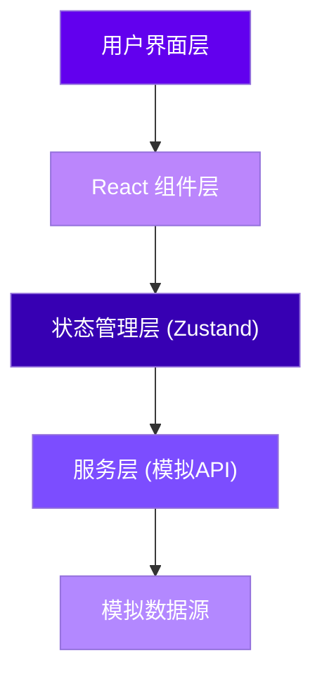
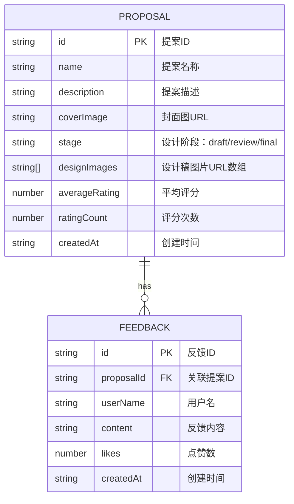

## 1. 架构设计



**数据流向说明：**
1. `src/services/proposalService.ts` → `src/store/proposalStore.ts`：模拟API获取数据
2. `src/store/proposalStore.ts` → `src/components/ProposalList.tsx`：状态分发到列表组件
3. `src/store/proposalStore.ts` → `src/components/ProposalDetail.tsx`：状态分发到详情组件
4. 用户交互 → `src/services/proposalService.ts`：提交反馈/评分 → 更新store

## 2. 技术栈说明

| 技术 | 版本 | 用途 |
|------|------|------|
| React | ^18.2.0 | 前端UI框架 |
| React DOM | ^18.2.0 | React DOM渲染 |
| TypeScript | ^5.0.0 | 类型安全 |
| Vite | ^5.0.0 | 构建工具 |
| @vitejs/plugin-react | ^4.2.0 | Vite React插件 |
| Zustand | ^4.4.0 | 状态管理 |
| react-router-dom | ^6.20.0 | 路由管理 |
| uuid | ^9.0.0 | 唯一ID生成 |

## 3. 目录结构

```
d:\Pro\tasks\auto44\
├── index.html                 # 入口HTML
├── package.json               # 项目配置与依赖
├── vite.config.ts             # Vite构建配置
├── tsconfig.json              # TypeScript配置
└── src\
    ├── App.tsx               # 应用根组件（路由配置）
    ├── main.tsx              # 应用入口
    ├── services\
    │   └── proposalService.ts # 模拟API服务
    ├── store\
    │   └── proposalStore.ts   # Zustand状态仓库
    ├── components\
    │   ├── ProposalList.tsx   # 提案列表组件
    │   └── ProposalDetail.tsx # 提案详情组件
    └── types\
        └── index.ts           # TypeScript类型定义
```

## 4. 路由定义

| 路由 | 组件 | 用途 |
|------|------|------|
| `/` | `ProposalList` | 提案列表页 |
| `/proposal/:id` | `ProposalDetail` | 提案详情页 |

## 5. 数据模型

### 5.1 ER图



### 5.2 TypeScript类型定义

```typescript
// 设计阶段枚举
type DesignStage = 'draft' | 'review' | 'final';

// 提案接口
interface Proposal {
  id: string;
  name: string;
  description: string;
  coverImage: string;
  stage: DesignStage;
  designImages: string[];
  averageRating: number;
  ratingCount: number;
  createdAt: string;
}

// 反馈接口
interface Feedback {
  id: string;
  proposalId: string;
  userName: string;
  content: string;
  likes: number;
  createdAt: string;
}

// 状态仓库接口
interface ProposalStore {
  proposals: Proposal[];
  selectedProposal: Proposal | null;
  feedbacks: Feedback[];
  searchKeyword: string;
  filterStage: DesignStage | 'all';
  setProposals: (proposals: Proposal[]) => void;
  setSelectedProposal: (proposal: Proposal | null) => void;
  setFeedbacks: (feedbacks: Feedback[]) => void;
  addFeedback: (feedback: Feedback) => void;
  updateProposalRating: (proposalId: string, rating: number) => void;
  setSearchKeyword: (keyword: string) => void;
  setFilterStage: (stage: DesignStage | 'all') => void;
  getFilteredProposals: () => Proposal[];
}
```

## 6. 模块调用关系

### 6.1 模拟API模块 (`proposalService.ts`)

| 方法 | 参数 | 返回值 | 延迟 | 调用者 |
|------|------|--------|------|--------|
| `fetchProposals()` | 无 | `Promise<Proposal[]>` | 200ms | `App.tsx` 首次渲染 |
| `fetchProposalDetail(id)` | `id: string` | `Promise<Proposal>` | 150ms | `ProposalDetail.tsx` |
| `fetchFeedback(proposalId)` | `proposalId: string` | `Promise<Feedback[]>` | 150ms | `ProposalDetail.tsx` |
| `submitFeedback(data)` | `{proposalId, userName, content}` | `Promise<Feedback>` | 300ms | `ProposalDetail.tsx` |
| `submitRating(proposalId, rating)` | `proposalId: string, rating: number` | `Promise<{averageRating, ratingCount}>` | 200ms | `ProposalDetail.tsx` |

### 6.2 状态仓库 (`proposalStore.ts`)

- 数据源：`proposalService.ts` 返回数据
- 消费方：`ProposalList.tsx`、`ProposalDetail.tsx`
- 核心方法：
  - `setProposals()` - 初始化提案列表
  - `setSelectedProposal()` - 设置当前查看的提案
  - `addFeedback()` - 新增反馈
  - `updateProposalRating()` - 更新评分
  - `getFilteredProposals()` - 获取搜索/筛选后的列表

### 6.3 组件数据流

```
App.tsx (首次加载)
  ↓ 调用 fetchProposals()
proposalService.ts
  ↓ 返回数据
proposalStore.ts (setProposals)
  ├─→ ProposalList.tsx (渲染列表)
  │     ↓ 用户点击卡片
  │     路由跳转 /proposal/:id
  └─→ ProposalDetail.tsx
        ├─→ 调用 fetchProposalDetail()
        ├─→ 调用 fetchFeedback()
        ├─→ 用户评分 → submitRating() → 更新store
        └─→ 用户提交反馈 → submitFeedback() → addFeedback() → 刷新列表
```

## 7. 性能优化策略

1. **模拟数据量**：控制在20条以内，确保首次加载 < 500ms
2. **图片懒加载**：使用 `loading="lazy"` 优化图片加载
3. **组件记忆化**：使用 `React.memo` 避免不必要重渲染
4. **轮播图优化**：使用CSS transition而非JS动画，确保切换 < 100ms
5. **反馈优化**：乐观更新UI，300ms后确认，确保 < 800ms显示
6. **搜索防抖**：200ms防抖处理搜索输入
