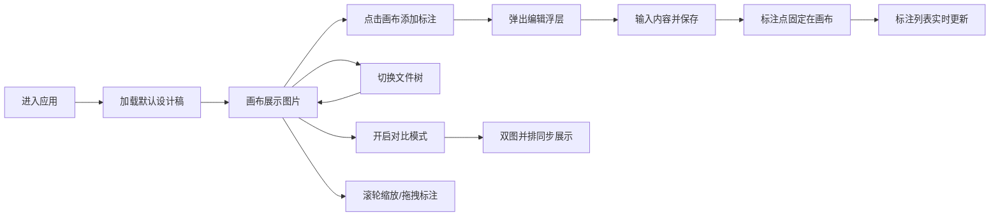

## 1. 产品概述

笔触回响是一款面向设计师与开发者的Web端设计稿标注与协作工具，解决设计交接过程中沟通效率低、标注散乱的问题。

- 核心目标：提供直观的设计稿批注、标记和版本对比功能，让设计评审与开发交付更高效
- 目标用户：UI设计师、前端开发者、产品经理
- 核心价值：统一的设计标注平台，减少反复沟通成本

## 2. 核心功能

### 2.1 用户角色

| 角色 | 注册方式 | 核心权限 |
|------|----------|----------|
| 通用用户 | 无需注册 | 浏览设计稿、添加/编辑/删除标注、使用版本对比 |

### 2.2 功能模块

1. **主界面**：顶栏、左侧文件树、右侧标注画布
2. **文件树管理**：设计稿列表展示、选中切换
3. **标注画布**：图片展示、缩放、标注点添加/编辑/删除、拖拽
4. **标注列表**：当前画布所有标注汇总、快速删除
5. **版本对比模式**：双图并排对比、同步缩放

### 2.3 页面详情

| 页面名称 | 模块名称 | 功能描述 |
|----------|----------|----------|
| 主应用 | 顶栏 | 显示产品标题、对比模式开关 |
| 主应用 | 左侧文件树 | 设计稿文件列表，点击切换，选中高亮 |
| 主应用 | 右侧画布 | 展示设计稿图片，支持缩放、点击添加标注、拖拽标注点 |
| 主应用 | 标注编辑浮层 | 新增/编辑标注内容，最多80字，保存/取消操作 |
| 主应用 | 标注列表面板 | 右下角悬浮，展示所有标注摘要，支持快速删除 |
| 主应用 | 对比模式 | 画布一分为二，左右各展示一份设计稿，同步缩放 |

## 3. 核心流程

用户打开应用 → 默认展示第一个设计稿 → 在画布上点击添加标注点 → 输入标注内容并保存 → 可在右下角列表中查看/删除标注 → 切换文件树查看其他设计稿 → 开启对比模式进行版本差异比较 → 滚轮缩放查看细节，拖拽调整标注位置。

## 4. 用户界面设计

### 4.1 设计风格

- **主色调**：深色主题，主背景 `#121220`，文字 `#E0E0E0`
- **强调色**：`#6C63FF`（品牌紫，用于选中态、开关、保存按钮），`#FF6B6B`（警示红，用于标注点、删除按钮）
- **辅助色**：`#1E1E2E`（文件树背景）、`#2A2A3E`（画布背景）、`#1A1A2E`（顶栏背景）
- **圆角规范**：统一采用 `8px` / `12px` 圆角，卡片与面板阴影柔和
- **字体**：系统无衬线字体，字号层级清晰
- **交互动效**：所有点击、拖拽、缩放操作均带 `0.2s-0.3s` CSS 过渡

### 4.2 页面设计概述

| 页面名称 | 模块名称 | UI 元素 |
|----------|----------|---------|
| 主应用 | 顶栏 | 高度 40px，背景 `#1A1A2E`，左侧标题「笔触回响」，右侧对比模式开关（滑块样式，圆角 12px） |
| 主应用 | 左侧文件树 | 宽 240px，背景 `#1E1E2E`，圆角 12px，每项高 36px，圆角 8px，选中态背景 `#6C63FF` |
| 主应用 | 右侧画布 | 背景 `#2A2A3E`，占满剩余空间，图片居中，支持 0.5x-3x 滚轮缩放，CSS transform 实现 |
| 主应用 | 标注点 | 直径 12px 圆形，颜色 `#FF6B6B`，外发光同色，z-index 最高，可拖拽 |
| 主应用 | 标注编辑浮层 | 宽 240px，白色背景 `#FFFFFF`，圆角 8px，带阴影；输入框宽 200px，背景 `#F5F5F5`，圆角 6px，边框 `#E0E0E0`；保存按钮 `#6C63FF`，取消按钮 `#E0E0E0` |
| 主应用 | 标注列表面板 | 右下角悬浮，宽 200px，最大高 300px，背景 `#FFFFFF`，圆角 8px，1px `#E0E0E0` 边框；删除按钮直径 20px 圆形，背景 `#FF6B6B`，文字「X」 |
| 主应用 | 对比模式 | 画布一分为二，中间 2px `#6C63FF` 分隔线，左右各展示一张设计稿，使用共同缩放滑块控制 |

### 4.3 响应式

- 桌面端优先（Desktop-first）
- 屏幕宽度 < 600px 时，左侧文件树自动隐藏，顶栏显示汉堡菜单按钮，点击以覆盖层形式展开
- 画布在移动端占满全屏

### 4.4 性能

- 标注点超过 100 个时，拖拽和缩放操作帧率 ≥ 30fps
- 标注列表滚动流畅，使用 CSS transform 和 GPU 加速
