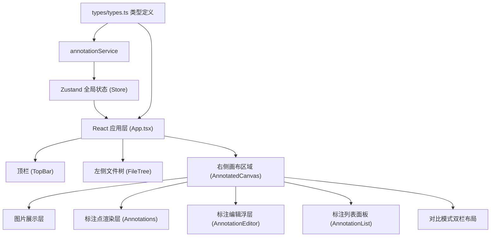
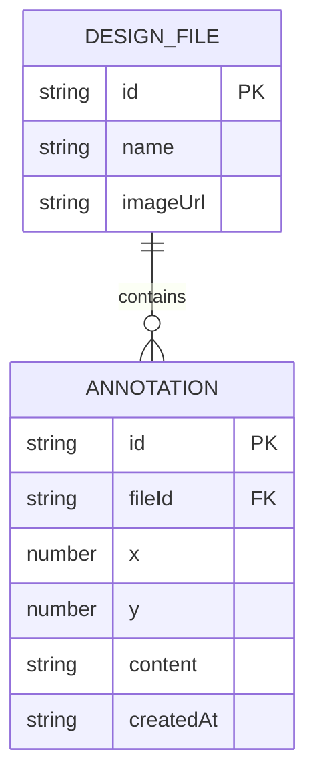

## 1. 架构设计



## 2. 技术描述

- **前端框架**：React 18 + TypeScript
- **构建工具**：Vite 5 + @vitejs/plugin-react
- **状态管理**：Zustand
- **工具库**：uuid（用于标注点唯一标识）
- **后端**：无，纯前端应用，数据存储在浏览器内存（Zustand store）
- **数据库**：无

## 3. 路由定义

纯单页应用，无路由。

| 路由 | 用途 |
|------|------|
| / | 主应用界面 |

## 4. API 定义

无后端服务，所有逻辑在前端 annotationService 中实现。

核心服务接口：

```typescript
// annotationService.ts
interface IAnnotationService {
  getAnnotations(fileId: string): Annotation[];
  addAnnotation(fileId: string, annotation: Omit<Annotation, 'id'>): Annotation;
  updateAnnotation(fileId: string, id: string, patch: Partial<Annotation>): Annotation | undefined;
  deleteAnnotation(fileId: string, id: string): boolean;
}
```

## 5. 服务架构图

无后端。前端数据流：


## 6. 数据模型

### 6.1 数据模型定义



### 6.2 类型定义

```typescript
// src/types/types.ts
export interface DesignFile {
  id: string;
  name: string;
  imageUrl: string;
}

export interface Annotation {
  id: string;
  fileId: string;
  x: number;      // 相对图片宽度的 0-1 坐标
  y: number;      // 相对图片高度的 0-1 坐标
  content: string;
  createdAt: number;
}
```

## 7. 项目文件结构

```
├── package.json
├── index.html
├── tsconfig.json
├── vite.config.js
└── src/
    ├── main.tsx
    ├── App.tsx
    ├── store/
    │   └── useAppStore.ts          (Zustand store)
    ├── components/
    │   ├── FileTree.tsx
    │   ├── AnnotatedCanvas.tsx
    │   ├── AnnotationPoint.tsx     (标注点组件)
    │   ├── AnnotationEditor.tsx    (编辑浮层)
    │   └── AnnotationList.tsx      (标注列表面板)
    ├── services/
    │   └── annotationService.ts
    ├── types/
    │   └── types.ts
    └── styles/
        └── global.css
```
