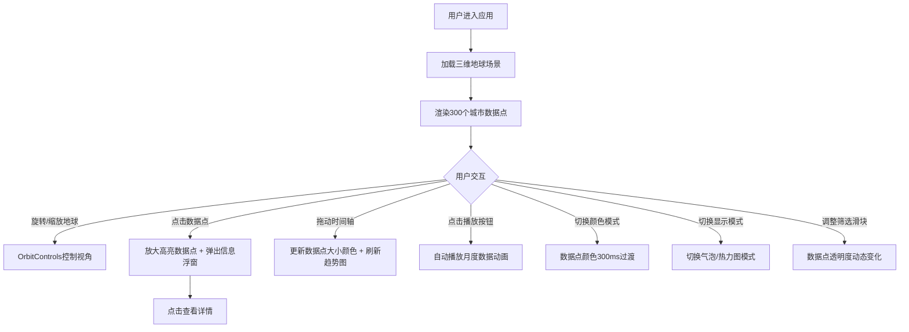

## 1. 产品概述

全球空气质量与气候模式三维可视化应用，通过交互式三维地球展示全球主要城市的空气质量和气象数据的空间分布与动态变化，解决传统二维图表难以直观展示空间关系的问题。

- 主要目的：提供直观、沉浸式的全球空气质量与气候数据探索体验
- 解决问题：气象数据在二维图表中难以直观展示空间分布和动态变化
- 目标用户：环境研究者、数据分析师、教育工作者、对空气质量关注的公众

## 2. 核心功能

### 2.1 功能模块

1. **三维地球场景**：可自由旋转缩放的三维地球，300个城市数据气泡点
2. **城市信息浮窗**：点击城市显示详细数据面板
3. **时间轴动画**：2020-2024年月度数据播放与趋势图
4. **模式切换面板**：颜色模式、显示模式、数据筛选
5. **图例与统计概览**：颜色映射、全球平均AQI、极值城市

### 2.2 页面详情

| 页面名称 | 模块名称 | 功能描述 |
|-----------|-------------|---------------------|
| 主页面 | 三维地球场景 | 球体半径5单位，深蓝色海洋与绿色大陆纹理，略微凹陷表示陆地边界 |
| 主页面 | 城市数据气泡 | 300个城市数据点，直径0.12-0.35，颜色绿到红渐变，悬浮0.02单位高度，2秒呼吸动画 |
| 主页面 | 城市信息浮窗 | 半透明浮窗显示城市名称、AQI、PM2.5、PM10、气温，查看详情按钮 |
| 主页面 | 时间轴控制 | 60个月度数据点，可拖拽播放头，播放/暂停，速度调节 |
| 主页面 | 趋势图表 | 当前月份折线趋势图，宽600x高180px |
| 主页面 | 模式切换面板 | AQI/温度/风速颜色模式切换，气泡/热力图模式切换，AQI筛选滑块 |
| 主页面 | 图例面板 | AQI颜色映射条，全球平均AQI，最清洁/最污染城市 |

## 3. 核心流程

## 4. 用户界面设计

### 4.1 设计风格
- **主色调**：深蓝 #1A1A2E
- **背景色**：#0A0E17
- **辅助色**：青色 #00BCD4
- **强调色**：金色 #FFD54F
- **字体**：白色/浅灰色 #E0E0E0，不小于12px
- **风格**：深色科幻风格，所有组件圆角设计
- **动效**：300ms-500ms平滑过渡动画

### 4.2 页面设计概述

| 页面名称 | 模块名称 | UI元素 |
|-----------|-------------|-------------|
| 主页面 | 三维地球 | 可旋转缩放，呼吸动画数据点，悬停旋转提示箭头 |
| 主页面 | 城市浮窗 | rgba(18,18,18,0.85)背景，圆角12px，内边距16px，宽280px |
| 主页面 | 时间轴 | 高80px，rgba(0,0,0,0.4)背景，金色播放头 |
| 主页面 | 趋势图 | 宽600x高180px，白色坐标轴，半透明网格线 |
| 主页面 | 切换面板 | #1E293B背景，圆角8px，宽200px，圆形按钮 |
| 主页面 | 图例面板 | rgba(30,41,59,0.9)背景，圆角10px，宽160px |

### 4.3 响应式设计
- **桌面端 (>768px)**：地球半径5单位，时间轴和趋势图在底部，切换面板垂直排列
- **平板端 (<768px)**：地球半径3单位，时间轴和趋势图在侧边栏，切换面板横向排列
- **移动端 (<480px)**：时间轴自动隐藏，趋势图弹出式面板展示

### 4.4 3D场景指导
- **环境**：深色太空背景，轻微星空粒子效果
- **光照**：环境光 + 方向光模拟太阳光
- **相机**：PerspectiveCamera，OrbitControls控制
- **交互**：鼠标拖拽旋转、滚轮缩放、点击选中城市
- **动画**：数据点呼吸动画，颜色切换过渡，选中放大高亮
