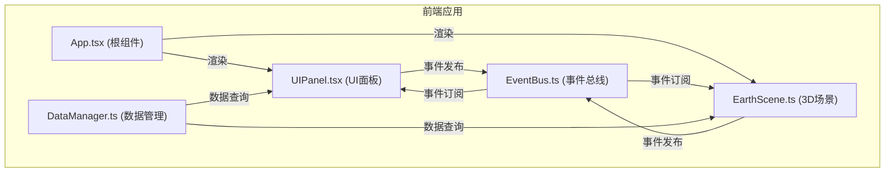

## 1. 架构设计



## 2. 技术描述

- **前端框架**：React@18 + TypeScript
- **构建工具**：Vite
- **3D渲染**：Three.js + @react-three/fiber + @react-three/drei
- **状态管理**：自定义 EventBus 事件总线
- **数据管理**：DataManager 单例类
- **样式方案**：内联样式 + CSS
- **图表**：自定义Canvas绘制

## 3. 文件结构

```
├── package.json
├── index.html
├── vite.config.js
├── tsconfig.json
└── src/
    ├── App.tsx           # 根组件，场景初始化，数据流管理
    ├── EarthScene.ts     # Three.js地球和数据点逻辑
    ├── UIPanel.tsx      # React UI面板组件
    ├── DataManager.ts   # 气象数据管理
    └── EventBus.ts      # 自定义事件总线
```

## 4. 事件总线定义

```typescript
// EventBus 事件类型
interface EventMap {
  'city:select': CityData;           // 选中城市
  'city:hover': CityData | null;      // 悬停城市
  'time:change': number;              // 时间月份变化
  'play:toggle': boolean;           // 播放状态切换
  'mode:color': ColorMode;        // 颜色模式切换
  'mode:display': DisplayMode;    // 显示模式切换
  'filter:aqi': [number, number];   // AQI筛选范围
  'speed:change': number;             // 播放速度变化
}
```

## 5. 数据模型

### 5.1 城市数据模型

```typescript
interface CityData {
  id: string;
  name: string;
  lat: number;
  lng: number;
  monthlyData: MonthlyData[];
}

interface MonthlyData {
  month: string;        // "2020-01"
  aqi: number;      // 0-500
  pm25: number;
  pm10: number;
  temperature: number;  // 摄氏度
  windSpeed: number; // m/s
}

type ColorMode = 'aqi' | 'temperature' | 'windSpeed';
type DisplayMode = 'bubble' | 'heatmap';
```

### 5.2 DataManager API

```typescript
class DataManager {
  static getInstance(): DataManager;
  getCities(): CityData[];
  getCityById(id: string): CityData | undefined;
  getMonthlyData(monthIndex: number): { city: CityData; data: MonthlyData }[];
  filterByAqiRange(min: number, max: number, monthIndex: number): CityData[];
  getGlobalStats(monthIndex: number): { avgAqi: number; cleanest: CityData; dirtiest: CityData };
  getCityTrend(cityId: string): MonthlyData[];
}
```
