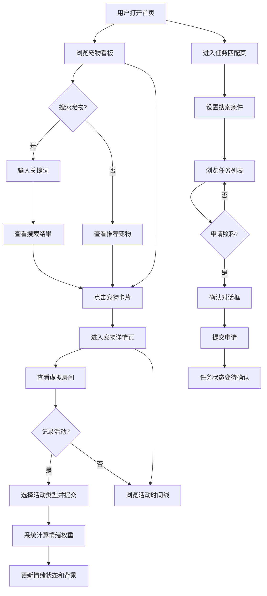

## 1. 产品概述

宠物互助站是一个虚拟宠物照料交换平台，让宠物主人能为宠物创建虚拟房间、记录活动日志和情绪变化，并通过搜索或随机匹配找到需要临时照料的宠物，申请成为临时照料者。

- 目标用户：宠物寄养社区的成员，拥有猫/狗/鸟/兔等宠物的主人
- 核心价值：解决宠物临时照料需求，建立社区互助机制，通过活动记录和情绪跟踪让照料者了解宠物状态

## 2. 核心功能

### 2.1 用户角色

| 角色 | 说明 | 核心权限 |
|------|------|----------|
| 宠物主人 | 登记宠物、发布照料任务 | 创建虚拟房间、发布任务、查看活动日志 |
| 临时照料者 | 搜索并申请照料任务 | 搜索任务、申请照料、记录活动、更新情绪 |

### 2.2 功能模块

1. **宠物看板页（首页）**：宠物卡片网格展示、搜索框、推荐宠物
2. **宠物详情页**：虚拟房间、基本信息、情绪状态、活动时间线
3. **任务匹配页**：任务搜索、照料申请、任务列表

### 2.3 页面详情

| 页面名称 | 模块名称 | 功能描述 |
|----------|----------|----------|
| 宠物看板页 | 搜索框 | 带搜索图标的输入框，支持按宠物名或种类模糊匹配，聚焦展开下拉面板显示搜索历史和匹配结果 |
| 宠物看板页 | 推荐宠物 | 基于用户最近3次照料过的宠物种类，随机推荐同种类但未被照料过的宠物，最多4张卡片 |
| 宠物看板页 | 宠物卡片网格 | 网格布局展示所有宠物卡片，每张含头像、名字、情绪表情、"浏览详情"按钮 |
| 宠物详情页 | 左栏-宠物信息 | 展示宠物头像、名字、种类、年龄、情绪状态（emoji+颜色），情绪颜色作为背景渐变 |
| 宠物详情页 | 右栏-活动时间线 | 垂直时间线展示活动记录，每条含事件图标、时间、描述，图标颜色按类型区分 |
| 宠物详情页 | 活动记录表单 | 选择活动类型（喂食/散步/玩耍/休息）并提交，提交后动态更新情绪 |
| 任务匹配页 | 搜索筛选 | 按日期范围和照料时长（1-24小时）搜索可照料任务 |
| 任务匹配页 | 任务列表 | 展示搜索结果，每项显示宠物名、照料时段、当前申请人数 |
| 任务匹配页 | 照料申请 | 点击"申请照料"按钮弹出确认对话框，提交后按钮变灰禁用 |

## 3. 核心流程

### 3.1 宠物登记流程
用户在首页查看宠物看板 → 点击浏览详情进入虚拟房间 → 查看宠物基本信息、情绪状态和活动日志

### 3.2 照料申请流程
用户进入任务匹配页 → 设置日期范围和照料时长 → 浏览任务列表 → 点击"申请照料" → 确认对话框确认 → 任务状态变为"待确认"

### 3.3 活动记录与情绪更新流程
照料者在宠物详情页 → 选择活动类型并提交 → 系统根据最近5条活动类型权重计算情绪 → 情绪emoji和颜色更新 → 背景渐变色更新

## 4. 用户界面设计

### 4.1 设计风格

- 主题：深色赛博朋克风格，温暖宠物元素
- 主色：深色背景 #0B0E27，卡片背景 #1A1A2E
- 强调色：青色 #4ECDC4（交互高亮）、绿色 #6BCB77（开心情绪）、红色 #FF6B6B（不开心/休息）、黄色 #FFD93D（喂食）
- 文字：主文字 #E0E0E0，辅助文字 #A0A0A0
- 卡片：圆角16px，1px #2A2A44边框，hover变#4ECDC4
- 头像：圆形60px直径，背景#2A2A44，四周柔和发光（颜色对应情绪）
- 情绪emoji：28px大小
- 搜索框：背景#1A1A2E，圆角20px，聚焦展开下拉面板
- 字体：使用 Outfit 作为主字体（现代几何感），搭配 Noto Sans SC 中文字体

### 4.2 页面设计概览

| 页面名称 | 模块名称 | UI元素 |
|----------|----------|--------|
| 宠物看板页 | 搜索栏 | 深色背景#1A1A2E，圆角20px，搜索图标，聚焦展开下拉面板（圆角12px，#1A1A2E背景，#3A3A5C边框） |
| 宠物看板页 | 推荐区域 | 横向滚动卡片，最多4张 |
| 宠物看板页 | 宠物网格 | 网格布局，每行最多4列，min-width 240px，卡片背景#1A1A2E，圆角16px |
| 宠物详情页 | 左栏 | 360px固定宽度，宠物头像（情绪发光），基本信息，情绪emoji+渐变背景 |
| 宠物详情页 | 右栏 | 剩余宽度，垂直时间线，活动图标（颜色按类型），淡入动画（0.3s，逐个延迟0.1s） |
| 任务匹配页 | 筛选区 | 日期范围选择器，时长滑块（1-24h），搜索按钮 |
| 任务匹配页 | 任务列表 | 列表卡片，每项含宠物名、时段、申请人数、"申请照料"按钮 |

### 4.3 响应式设计

- 桌面优先设计，最小宽度1024px
- 移动端（<768px）：宠物卡片变为单列布局，详情页左右栏切换为上下滚动布局
- 触摸优化：按钮最小44px点击区域，卡片可滑动

### 4.4 动画与交互

- 卡片hover：上移4px，增加阴影，边框变#4ECDC4
- 活动时间线：淡入动画（opacity 0→1，0.3s，逐个延迟0.1s）
- 情绪变化：颜色渐变过渡（0.5s）
- 申请确认：弹窗淡入（0.2s）
- 搜索下拉：展开动画（0.2s ease-out）
