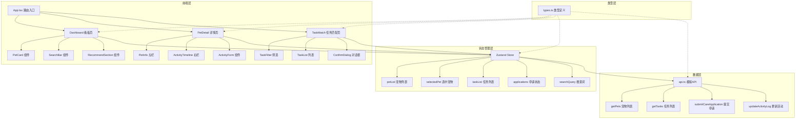
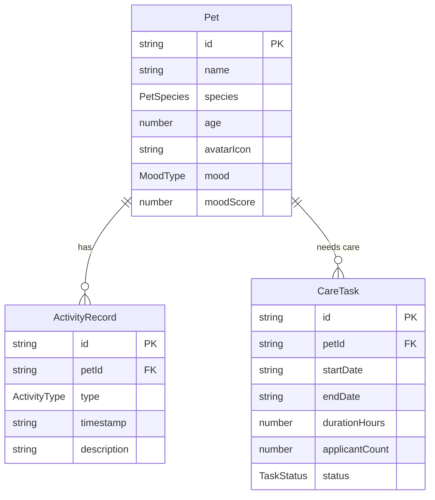

## 1. 架构设计



## 2. 技术说明

- 前端框架：React 18 + TypeScript
- 构建工具：Vite
- 状态管理：Zustand
- 路由：react-router-dom（HashRouter，无需后端支持）
- 样式方案：Tailwind CSS + CSS Modules（用于动画关键帧）
- 图标库：lucide-react
- 唯一ID生成：uuid
- 后端：无（纯前端，模拟API）
- 数据库：无（内存数据 + 模拟API返回Promise）

## 3. 路由定义

| 路由 | 用途 |
|------|------|
| `/` | 首页宠物看板，展示所有宠物卡片、搜索和推荐 |
| `/pet/:id` | 宠物详情页，展示虚拟房间、活动时间线、情绪状态 |
| `/tasks` | 任务匹配页，搜索和申请照料任务 |

## 4. API定义（模拟）

### 4.1 获取宠物列表
```typescript
getPets(): Promise<Pet[]>
```

### 4.2 获取任务列表
```typescript
getTasks(filters?: TaskFilter): Promise<CareTask[]>
```

### 4.3 提交照料申请
```typescript
submitCareApplication(taskId: string): Promise<{ success: boolean }>
```

### 4.4 更新活动记录
```typescript
updateActivityLog(petId: string, activity: ActivityType): Promise<ActivityRecord>
```

## 5. 数据模型

### 5.1 数据模型定义



### 5.2 枚举与类型定义

```typescript
enum PetSpecies { Cat, Dog, Bird, Rabbit }
enum ActivityType { Feeding, Walking, Playing, Resting }
enum MoodType { Happy, Calm, Unhappy }
enum TaskStatus { Open, Pending, Confirmed }
```

### 5.3 情绪计算规则
- 基于最近5条活动的类型权重：
  - 玩耍(Playing)：+2
  - 散步(Walking)：+1
  - 喂食(Feeding)：+0.5
  - 休息(Resting)：-0.5
- 总分 > 2 → 开心😊（#6BCB77）
- 总分 0~2 → 平静😌（#4ECDC4）
- 总分 < 0 → 不开心😢（#FF6B6B）

## 6. 文件结构

```
src/
├── types.ts          # 类型定义和枚举（被所有模块引用）
├── api.ts            # 模拟API模块（被store调用）
├── store.ts          # Zustand全局状态（被页面组件调用）
├── App.tsx           # 根组件+路由（调用store和页面组件）
├── index.css         # 全局样式+Tailwind指令+动画关键帧
├── main.tsx          # 入口文件
├── pages/
│   ├── Dashboard.tsx # 首页宠物看板（调用PetCard、SearchBar、RecommendSection）
│   ├── PetDetail.tsx # 宠物详情页（调用ActivityTimeline、ActivityForm）
│   └── TaskMatch.tsx # 任务匹配页（调用TaskFilter、TaskList、ConfirmDialog）
└── components/
    ├── PetCard.tsx       # 宠物卡片（接收Pet props）
    ├── SearchBar.tsx     # 搜索框+下拉面板
    ├── RecommendSection.tsx # 推荐宠物区域
    ├── ActivityTimeline.tsx # 活动时间线
    ├── ActivityForm.tsx  # 活动记录表单
    ├── TaskFilter.tsx    # 任务筛选器
    ├── TaskList.tsx      # 任务列表
    └── ConfirmDialog.tsx # 确认对话框
```

### 数据流向
1. `types.ts` 定义所有类型 → 被 `api.ts`、`store.ts`、所有组件引用
2. `api.ts` 模拟数据源 → 被 `store.ts` 的 actions 调用
3. `store.ts` 管理全局状态 → 被 `App.tsx` 和各页面组件订阅
4. 页面组件从 store 读取数据 → 传递给子组件作为 props
5. 子组件通过回调函数或直接调用 store actions 更新状态
