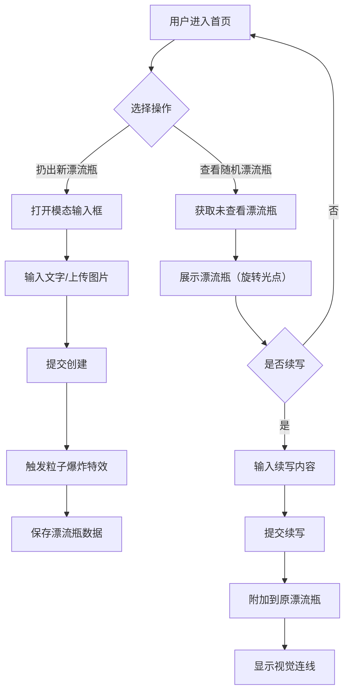

## 1. 产品概述

灵感漂流瓶是一款匿名创意分享应用，用户可以像扔漂流瓶一样匿名发布文字或图片灵感，这些内容会随机被其他用户发现并续写，形成灵感接力链。

- 核心目标：为用户提供一个匿名、轻松的创意分享平台，通过随机匹配和续写机制激发创作灵感
- 目标用户：所有希望记录灵感、分享创意或从他人想法中获得启发的互联网用户

## 2. 核心功能

### 2.1 功能模块

1. **首页**：波浪动画背景、中央主题卡片、操作按钮区
2. **创建漂流瓶**：模态输入框、文字/多图片上传、提交功能
3. **查看漂流瓶**：随机获取漂流瓶、内容展示、续写功能、光效动画
4. **特效系统**：粒子爆炸、闪烁光点、视觉连线

### 2.2 页面详情

| 页面名称 | 模块名称 | 功能描述 |
|-----------|-------------|---------------------|
| 首页 | 波浪背景 | 三层层叠正弦曲线，颜色渐变，4秒周期动画 |
| 首页 | 主题卡片 | 320px宽圆角卡片，展示漂流瓶内容或默认提示 |
| 首页 | 操作按钮 | 扔出新漂流瓶、查看随机漂流瓶两个按钮 |
| 创建模态框 | 输入区域 | 文字输入、多张图片上传（压缩至300px宽） |
| 漂流瓶卡片 | 续写区域 | 最多200字自适应高度输入框 |
| 特效层 | 粒子特效 | 30个圆形粒子向外扩散，1秒持续 |
| 特效层 | 旋转光点 | 8个暖黄色光点围绕卡片旋转，3秒周期 |
| 特效层 | 视觉连线 | 从卡片底部延伸至屏幕边缘的渐隐线条 |

## 3. 核心流程

用户进入首页看到波浪背景和中央卡片 → 选择"扔出新漂流瓶"打开模态框 → 输入文字/上传图片 → 提交后触发粒子爆炸特效并保存漂流瓶 → 或选择"查看随机漂流瓶" → 获取未查看过的漂流瓶并显示（带旋转光点）→ 用户可续写内容 → 提交后续写附加到原漂流瓶并显示视觉连线

## 4. 用户界面设计

### 4.1 设计风格

- **主色调**：深蓝 #0F1B2D（背景）、#1E293B（卡片）
- **点缀色**：湖蓝 #4ECDC4（按钮）、珊瑚红 #FF6B6B、暖黄 #FFD93D
- **渐变色**：波浪从 #1A3A5C 到 #2D5A8A，透明度 0.3-0.6
- **按钮风格**：圆角矩形，悬停变色并上移2px
- **圆角规范**：卡片16px，模态框12px
- **阴影规范**：卡片阴影半径24px，颜色 #00000055

### 4.2 页面设计概述

| 页面名称 | 模块名称 | UI元素 |
|-----------|-------------|-------------|
| 首页 | 波浪背景 | 三层正弦曲线、渐变填充、循环动画 |
| 首页 | 主题卡片 | 320px宽、16px圆角、边框1px #2D4A6C、阴影24px |
| 首页 | 操作按钮 | 背景#4ECDC4、悬停#6EE7E7、上移2px、间距16px |
| 创建模态框 | 容器 | 480px宽、12px圆角、淡入0.3秒 |
| 漂流瓶卡片 | 光点环绕 | 8个#FFD93D光点、4px大小、3秒旋转周期 |
| 特效层 | 粒子爆炸 | 30个3-6px圆形、颜色从#4ECDC4到#FF6B6B、扩散半径200px |
| 特效层 | 视觉连线 | 2px线宽、#4ECDC4渐隐、从卡片底部到屏幕边缘 |

### 4.3 响应式设计

- 桌面优先设计
- 视口宽度 < 768px 时：卡片宽度变为90%，按钮间距从16px调整为24px
- 所有交互元素支持触摸操作

### 4.4 动画规范

- 所有过渡动画：持续0.3-0.5秒，ease-out缓动函数
- 波浪动画：4秒周期，无限循环
- 粒子特效：1秒持续，向外扩散
- 光点旋转：3秒周期，无限循环
- 模态框：淡入动画0.3秒
