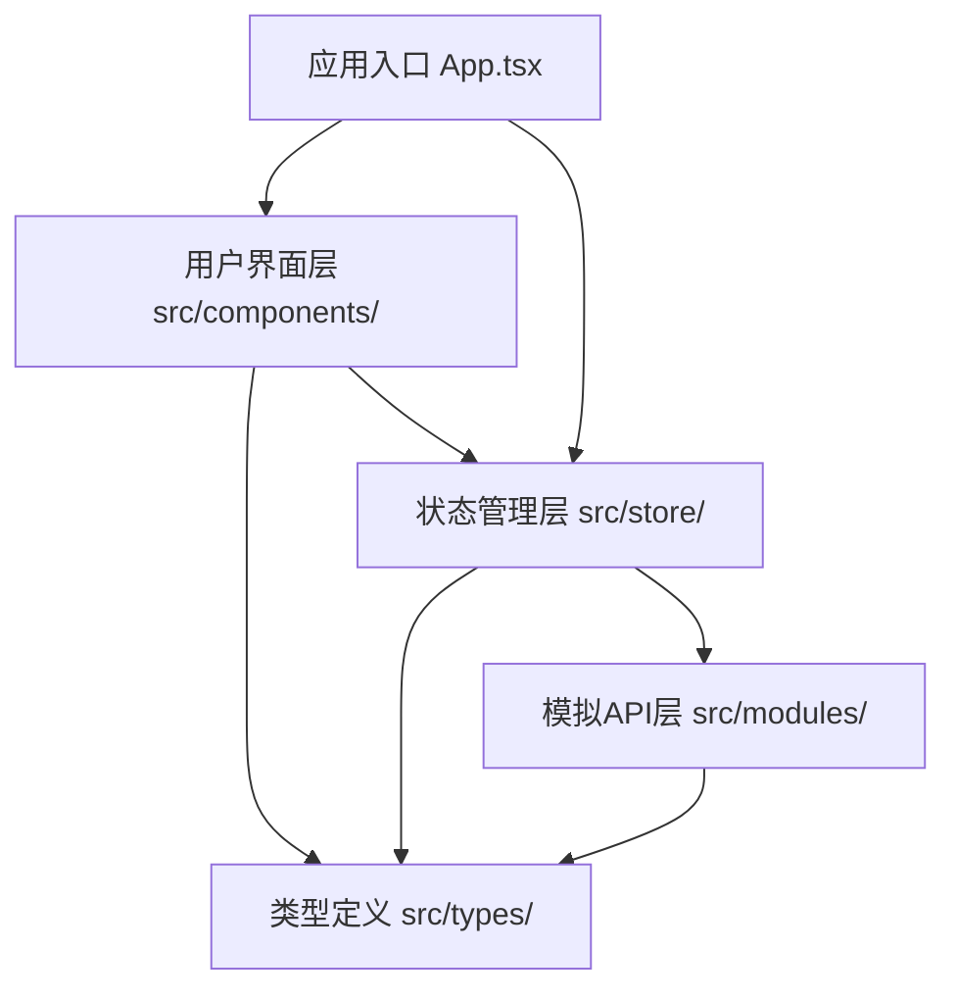
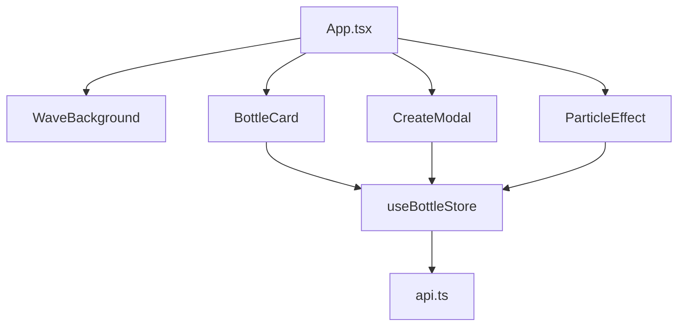

## 1. 架构设计



## 2. 技术描述

- **前端框架**：React 18 + TypeScript
- **构建工具**：Vite 5 + @vitejs/plugin-react
- **状态管理**：Zustand 4
- **其他依赖**：uuid（唯一ID生成）
- **样式方案**：原生 CSS（style标签内联样式，使用CSS变量管理主题色）
- **无后端架构**：使用 src/modules/api.ts 提供模拟数据和API

## 3. 文件结构定义

| 文件路径 | 用途 |
|----------|------|
| package.json | 项目依赖与脚本配置 |
| index.html | 应用入口HTML文件 |
| tsconfig.json | TypeScript配置 |
| vite.config.js | Vite构建配置 |
| src/types/index.ts | 漂流瓶和续写接口定义 |
| src/modules/api.ts | 模拟API，提供数据操作方法 |
| src/store/useBottleStore.ts | Zustand全局状态管理 |
| src/App.tsx | 应用根组件 |
| src/components/BottleCard.tsx | 漂流瓶展示卡片组件 |
| src/components/CreateModal.tsx | 新建漂流瓶模态框组件 |
| src/components/WaveBackground.tsx | 波浪动画背景组件 |
| src/components/ParticleEffect.tsx | 粒子特效组件 |

## 4. API 定义（模拟）

### 4.1 TypeScript 类型定义

```typescript
interface Continuation {
  id: string;
  content: string;
  createdAt: number;
}

interface Bottle {
  id: string;
  content: string;
  images: string[];
  continuations: Continuation[];
  createdAt: number;
  viewedBy: string[];
}
```

### 4.2 模拟API方法

| 方法 | 描述 | 参数 | 返回值 |
|------|------|------|--------|
| getRandomBottle | 获取随机漂流瓶 | excludeIds: string[]（已查看ID列表） | Promise\<Bottle \| null\> |
| createBottle | 创建新漂流瓶 | content: string, images: string[] | Promise\<Bottle\> |
| addContinuation | 添加续写 | bottleId: string, content: string | Promise\<Bottle\> |

## 5. 状态管理（Zustand Store）

| 状态字段 | 类型 | 描述 |
|----------|------|------|
| bottles | Bottle[] | 漂流瓶列表 |
| currentBottle | Bottle \| null | 当前展示的漂流瓶 |
| viewedIds | string[] | 当前用户已查看的漂流瓶ID |
| isCreateModalOpen | boolean | 创建模态框是否打开 |
| showParticleEffect | boolean | 是否显示粒子特效 |
| showConnectionLine | boolean | 是否显示视觉连线 |

| Action方法 | 描述 |
|-----------|------|
| fetchRandomBottle | 获取并设置随机漂流瓶 |
| createNewBottle | 创建新漂流瓶 |
| addBottleContinuation | 为当前漂流瓶添加续写 |
| openCreateModal | 打开创建模态框 |
| closeCreateModal | 关闭创建模态框 |
| triggerParticleEffect | 触发粒子特效 |
| triggerConnectionLine | 触发视觉连线 |

## 6. 性能指标

| 指标 | 目标值 |
|------|--------|
| 核心交互响应时间 | ≤ 200ms |
| 漂流瓶列表加载时间 | ≤ 500ms |
| 动画帧率 | ≥ 60fps |

## 7. 组件通信


