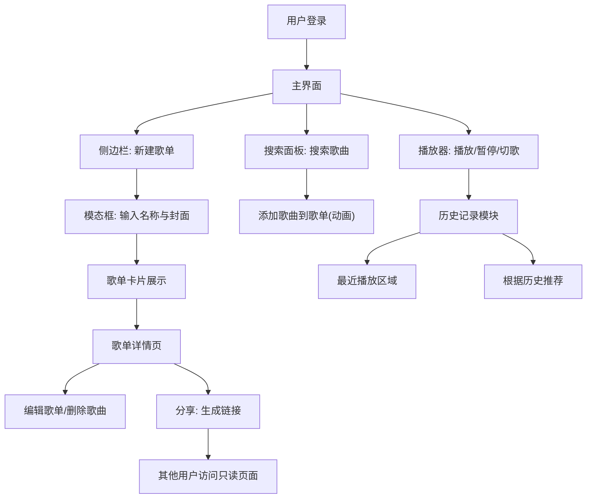

## 1. 产品概述

音乐播放列表管理与分享应用，帮助用户创建和编辑个人歌单，在不同设备间通过分享链接同步歌单，并以社交化方式向朋友展示自己的音乐品味。目标用户为热爱音乐、希望便捷管理歌单并分享的年轻群体。

## 2. 核心功能

### 2.1 用户角色

| 角色 | 注册方式 | 核心权限 |
|------|----------|----------|
| 登录用户 | 模拟登录 | 创建/编辑/分享歌单，播放歌曲，查看历史与推荐 |
| 访客 | 无需注册 | 通过分享链接查看歌单（只读），播放歌单歌曲 |

### 2.2 功能模块

1. **主界面**：侧边栏歌单管理 + 内容区展示 + 底部播放器
2. **歌单详情页**：歌曲列表展示、编辑歌名封面、删除歌曲、分享功能
3. **分享页面**：只读歌单浏览与播放

### 2.3 页面详情

| 页面名称 | 模块名称 | 功能描述 |
|----------|----------|----------|
| 主界面 | 侧边栏 | 歌单列表展示、新建歌单（模态框）、折叠/展开、最近播放区域、根据历史推荐 |
| 主界面 | 内容区 | 歌单卡片网格展示、卡片悬停播放/编辑按钮、搜索面板 |
| 主界面 | 搜索面板 | 右上角搜索框、实时搜索结果下拉、添加歌曲到当前歌单（带动画） |
| 主界面 | 新建歌单模态框 | 输入歌单名称、选择封面（本地上传或默认图标）、创建歌单 |
| 歌单详情页 | 歌曲列表 | 歌曲行（歌名、歌手、时长）、悬停高亮、播放全部、编辑歌名封面、删除歌曲 |
| 歌单详情页 | 分享功能 | 生成分享链接、复制到剪贴板、记录分享次数 |
| 分享页面 | 只读歌单 | 通过URL参数歌单ID获取数据、展示歌曲列表、固定顺序播放、不可编辑 |
| 主界面 | 底部播放器 | 当前歌曲封面/歌名/歌手、进度条（拖拽、时间提示）、播放/暂停/上下一首 |
| 主界面 | 历史与推荐 | 最近播放5首歌横向滚动卡片、根据历史推荐弹出面板（同流派3首歌） |

## 3. 核心流程

用户登录后进入主界面，在侧边栏新建歌单，通过搜索面板搜索歌曲并添加到歌单。点击歌单卡片进入详情页，可编辑歌单信息、删除歌曲、点击分享生成链接。其他用户通过链接访问只读歌单页面。播放器始终固定在底部，支持进度拖拽和切歌。每次播放记录到本地历史，侧边栏展示最近播放并支持基于历史的推荐。

## 4. 用户界面设计

### 4.1 设计风格

- 主色调：Spotify 风格绿色 `#1DB954`（按钮、进度条、选中状态）
- 背景：深色主题 `#121212`，次要背景 `#181818`，卡片背景 `#181818`
- 文字：主文字 `#FFFFFF`，次要文字 `#B3B3B3`
- 强调色：`#1DB954`（绿色），悬停背景 `#282828`
- 按钮风格：圆角按钮，悬停时背景 `#282828`，圆角 `50%`（控制按钮）或 `8px`（卡片）
- 字体：使用 DM Sans 作为 UI 字体，Sora 作为标题字体
- 布局：左右结构，左侧窄侧边栏（可折叠），右侧自适应内容区
- 圆角体系：侧边栏 `16px`，模态框 `12px`，卡片 `8px`，搜索框 `20px`，推荐面板 `16px`
- 动画：悬停背景过渡 `0.2s ease`，按钮涟漪效果（0→24px，0.4→0透明度，0.4s），添加歌曲图标旋转+变绿 `0.3s`

### 4.2 页面设计概览

| 页面名称 | 模块名称 | UI元素 |
|----------|----------|--------|
| 主界面 | 侧边栏 | 宽280px，背景#121212，圆角16px，歌单卡片240px宽，折叠时56px，最近播放区域高200px |
| 主界面 | 搜索面板 | 搜索框圆角20px背景#282828，聚焦边框#1DB954，下拉面板宽400px背景#1E1E1E |
| 主界面 | 新建歌单模态框 | 背景#1E1E1E，圆角12px，边框1px #333 |
| 主界面 | 底部播放器 | 高90px，背景#181818，封面64x64px，进度条60%宽4px高，滑块12px |
| 歌单详情页 | 歌曲列表 | 每行歌名/歌手/时长，悬停背景#282828 |
| 分享页面 | 只读歌单 | 歌曲列表固定播放顺序，无编辑按钮 |
| 主界面 | 推荐面板 | 居中宽360px，背景#1E1E1E，圆角16px |

### 4.3 响应式适配

- 桌面优先设计，宽度 ≥768px 时左右布局
- 宽度 <768px 时，侧边栏自动折叠为底部导航栏（高64px，横向排列图标，背景#181818，上边框1px #282828）
- 内容区自适应宽度
- 播放器条在移动端保持固定底部，高度可适当调整

### 4.4 性能要求

- 搜索输入防抖 500ms
- 历史记录本地存储不超过 200 条，超出自动淘汰最旧记录
- 播放器进度条更新频率不超过每秒 60 帧，使用 `requestAnimationFrame` 控制
