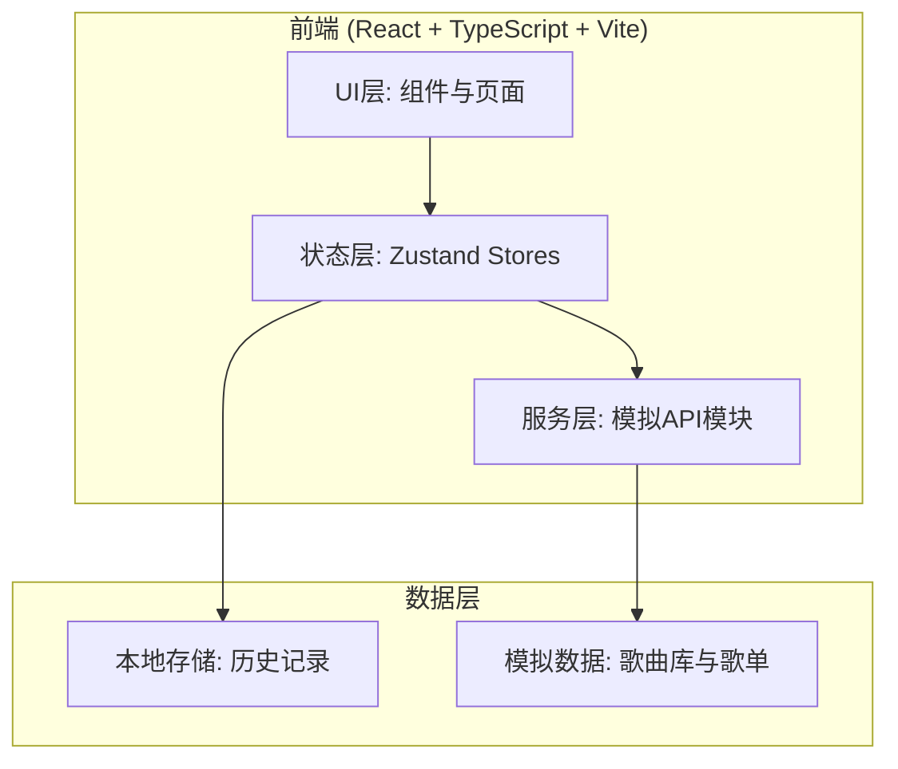
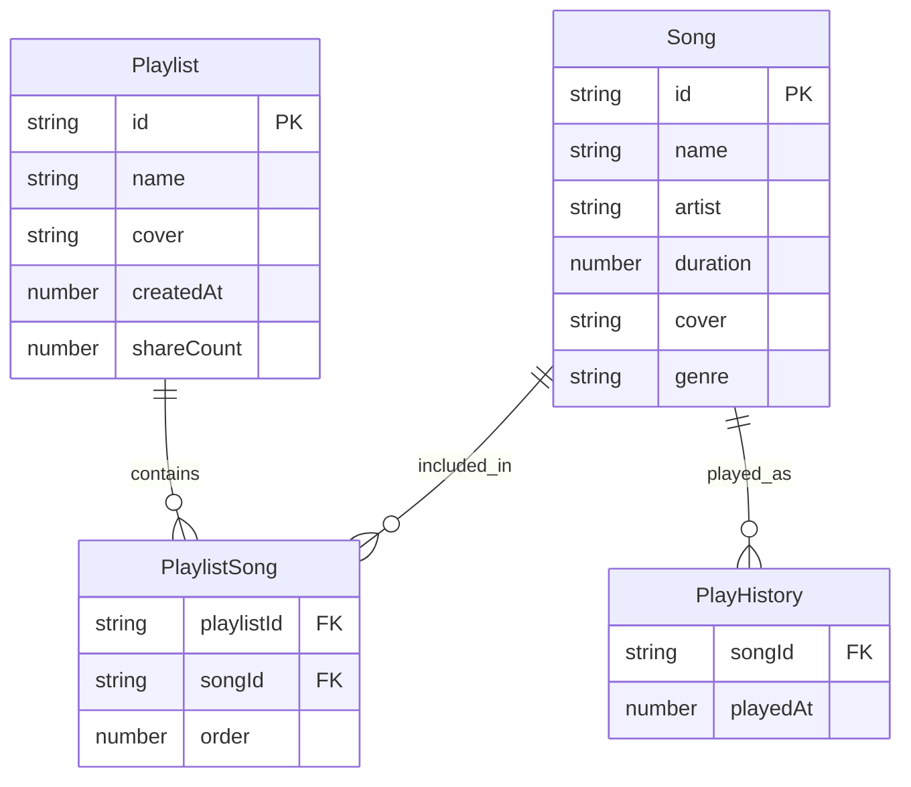

## 1. 架构设计



## 2. 技术说明

- 前端：React 18 + TypeScript + Vite
- 状态管理：Zustand（playerStore + playlistStore）
- 样式：CSS 全局样式 + CSS Modules（组件级样式）
- 构建工具：Vite + @vitejs/plugin-react
- 后端：无（纯前端，模拟API模块提供数据）
- 数据库：无（模拟数据 + localStorage 历史记录）
- 路由：React Router DOM（主界面、歌单详情、分享页面）

## 3. 路由定义

| 路由 | 用途 |
|------|------|
| `/` | 主界面，包含侧边栏、内容区、搜索面板、播放器 |
| `/playlist/:id` | 歌单详情页，展示歌曲列表，支持编辑和分享 |
| `/share/:id` | 分享页面，只读歌单浏览与播放 |

## 4. API 定义（模拟）

```typescript
interface Song {
  id: string;
  name: string;
  artist: string;
  duration: number;
  cover: string;
  genre: string;
}

interface Playlist {
  id: string;
  name: string;
  cover: string;
  songs: Song[];
  createdAt: number;
  shareCount: number;
}

interface SearchResult {
  songs: Song[];
}

interface RecommendationResult {
  songs: Song[];
}

// 模拟API接口
declare function searchSongs(keyword: string): Promise<SearchResult>;
declare function getPlaylist(id: string): Promise<Playlist | null>;
declare function getAllPlaylists(): Promise<Playlist[]>;
declare function createPlaylist(name: string, cover: string): Promise<Playlist>;
declare function updatePlaylist(id: string, data: Partial<Playlist>): Promise<Playlist>;
declare function deletePlaylist(id: string): Promise<void>;
declare function addSongToPlaylist(playlistId: string, songId: string): Promise<Playlist>;
declare function removeSongFromPlaylist(playlistId: string, songId: string): Promise<Playlist>;
declare function generateShareLink(playlistId: string): Promise<{ url: string }>;
declare function recordShare(playlistId: string): Promise<void>;
declare function getRecommendations(history: Song[]): Promise<RecommendationResult>;
```

## 5. 服务端架构

无后端服务，所有数据通过模拟 API 模块提供，歌单数据存储在内存中（Zustand store），历史记录持久化到 localStorage。

## 6. 数据模型

### 6.1 数据模型定义



### 6.2 文件组织

```
├── package.json
├── index.html
├── vite.config.ts
├── tsconfig.json
├── src/
│   ├── main.tsx
│   ├── App.tsx
│   ├── stores/
│   │   ├── playerStore.ts
│   │   └── playlistStore.ts
│   ├── services/
│   │   └── apiService.ts
│   ├── components/
│   │   ├── Sidebar.tsx
│   │   ├── PlayerBar.tsx
│   │   ├── PlaylistDetail.tsx
│   │   └── SearchPanel.tsx
│   ├── utils/
│   │   └── throttle.ts
│   └── styles/
│       └── global.css
```
