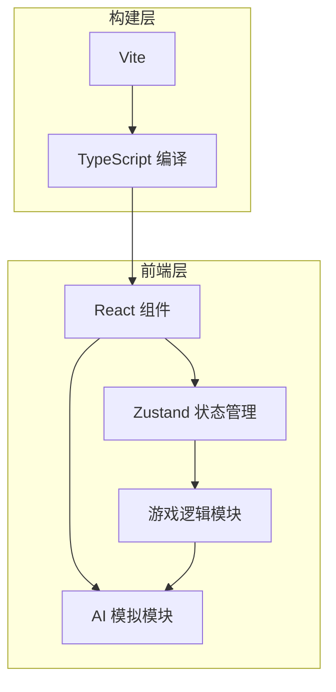

## 1. 架构设计



## 2. 技术说明

- 前端：React 18 + TypeScript + Zustand
- 构建工具：Vite
- 包管理：npm
- UI样式：原生CSS（无需Tailwind，按需求自定义样式）
- 状态管理：Zustand
- 唯一ID生成：uuid

## 3. 文件结构

```
d:\Pro\tasks\auto53\
├── package.json
├── index.html
├── tsconfig.json
├── vite.config.js
├── src/
│   ├── types.ts              # 类型定义
│   ├── store/
│   │   └── gameStore.ts      # Zustand 游戏状态管理
│   ├── components/
│   │   ├── GameBoard.tsx     # 战场主组件
│   │   └── Card.tsx          # 单张卡牌组件
│   ├── ai/
│   │   └── opponent.ts       # AI对手逻辑
│   ├── utils/
│   │   └── cards.ts          # 卡牌数据和工具函数
│   ├── App.tsx               # 主应用组件
│   ├── main.tsx              # 入口文件
│   └── index.css             # 全局样式
```

## 4. 数据模型

### 4.1 类型定义

```typescript
// 卡牌类型
type CardType = 'attack' | 'defense' | 'special';

// 特殊效果类型
type SpecialEffect = 'draw' | 'discard';

// 卡牌接口
interface Card {
  id: string;
  name: string;
  type: CardType;
  cost: number;
  value: number;
  effect?: SpecialEffect;
  description: string;
}

// 玩家接口
interface Player {
  id: string;
  name: string;
  avatar: string;
  health: number;
  maxHealth: number;
  armor: number;
  energy: number;
  maxEnergy: number;
  hand: Card[];
  deck: Card[];
  graveyard: Card[];
}

// 游戏状态
type GamePhase = 'playerTurn' | 'opponentTurn' | 'gameOver';

interface GameState {
  phase: GamePhase;
  turn: number;
  timeRemaining: number;
  player: Player;
  opponent: Player;
  battlefield: Card[];
  winner: string | null;
  isTransitioning: boolean;
}
```

## 5. Store 方法定义

```typescript
interface GameStore extends GameState {
  playCard: (cardId: string) => void;
  endTurn: () => void;
  startGame: () => void;
  resetGame: () => void;
  decrementTime: () => void;
  aiPlayCards: () => void;
}
```

## 6. 核心算法

### 6.1 AI出牌策略
1. 筛选出当前能量可支付的所有卡牌
2. 优先选择费用最高的攻击牌
3. 如无攻击牌，随机选择一张可用卡牌
4. 如无可用卡牌，结束回合

### 6.2 卡牌效果执行
- 攻击牌：`opponent.health -= max(0, card.value - opponent.armor)`，护甲优先吸收
- 防御牌：`player.armor += card.value`
- 抽牌效果：从牌库抽N张到手牌（不超过上限7张）
- 弃牌效果：对手随机弃N张手牌

### 6.3 回合管理
- 每回合开始：能量恢复至上限5，抽1张牌
- 30秒倒计时，每秒递减
- 时间到自动结束回合
