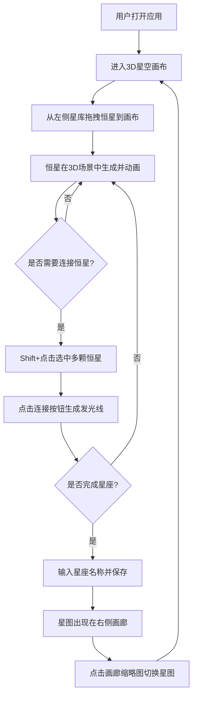

## 1. 产品概述

星座编织（Constellation Weaver）是一款基于3D空间的虚构星座图编辑器，用户可从星库中拖拽恒星到星空画布上，用发光线连接它们形成星座图案，并将完成的星座保存为独立星图在画廊中浏览切换。目标用户为创意爱好者、天文爱好者和数字艺术创作者。

## 2. 核心功能

### 2.1 功能模块

1. **星空画布页**：全屏3D星空场景、星库面板、画廊面板、底部工具栏
2. **星图编辑页（内嵌）**：恒星放置、选择、连接、命名保存

### 2.2 页面详情

| 页面名称 | 模块名称 | 功能描述 |
|-----------|-------------|---------------------|
| 星空画布页 | 3D星空场景 | 全屏Three.js场景，背景从深蓝#0A0A2A渐变到黑#000011，中央悬浮可旋转虚拟星空球体（半径500），鼠标拖拽旋转（阻尼0.95，惯性0.8），滚轮缩放（0.5x-3x） |
| 星空画布页 | 星库面板 | 左侧悬浮面板（宽280px），背景#151528，圆角16px，1px #2A2A44边框，毛玻璃效果，恒星卡片排列（120x100px，圆角12px，背景#1A1A30，悬停上移4px外发光#4ECDC4），显示恒星名称、颜色预览圆（直径20px）、亮度滑块 |
| 星空画布页 | 3D恒星放置 | 拖拽星卡到场景生成3D恒星球体（半径15-30px，颜色由星卡决定，发光强度随亮度变化），放置后自转（0.02rad/s）和浮沉（2px/3s） |
| 星空画布页 | 恒星选择与连接 | Shift+点击选中恒星（选中时外圈旋转光环，半径+8px，#00E5FF，0.5圈/秒），底部连接按钮（#4ECDC4背景，圆角8px，白色文字，悬停#5DDDD5），生成发光线（2px宽，混合色，线末端粒子沿路径移动，透明度随脉动同步变化） |
| 星空画布页 | 星座保存 | 输入名称保存星图，缩略图展示在右侧画廊面板（宽240px，背景#151528，圆角12px），缩略图为Canvas截图（180x120px，圆角8px，1px #2A2A44边框），画廊支持滚动，点击切换星图 |
| 星空画布页 | 底部工具栏 | 包含连接、保存、删除等操作按钮 |

## 3. 核心流程

## 4. 用户界面设计

### 4.1 设计风格

- 主色调：深蓝黑太空色系（#0A0A2A、#000011、#151528）
- 强调色：青绿色（#4ECDC4）、亮青色（#00E5FF）
- 恒星色彩：#FF6B6B（红）、#4ECDC4（青）、#FFD93D（金）、#6BCB77（绿）
- 按钮风格：圆角8px，半透明毛玻璃，悬停上移4px+阴影加深
- 字体：Orbitron（标题/数字，太空科技感）+ Noto Sans SC（中文正文）
- 布局：中央3D场景 + 左侧星库面板 + 右侧画廊面板 + 底部工具栏
- 毛玻璃效果：backdrop-filter: blur(10px)，所有面板统一使用

### 4.2 页面设计概览

| 页面名称 | 模块名称 | UI要素 |
|-----------|-------------|---------------------|
| 星空画布页 | 3D场景容器 | 全屏、渐变背景、星空球体、鼠标交互旋转缩放 |
| 星空画布页 | 星库面板 | 280px宽、#151528背景、16px圆角、1px #2A2A44边框、毛玻璃、恒星卡片网格 |
| 星空画布页 | 恒星卡片 | 120x100px、12px圆角、#1A1A30背景、悬停上移+发光、名称+颜色圆+滑块 |
| 星空画布页 | 画廊面板 | 240px宽、#151528背景、12px圆角、毛玻璃、缩略图列表可滚动 |
| 星空画布页 | 缩略图卡片 | 180x120px、8px圆角、1px #2A2A44边框、场景快照 |
| 星空画布页 | 底部工具栏 | 水平按钮组、连接/保存/删除、#4ECDC4按钮、悬停#5DDDD5 |

### 4.3 响应式适配

- 桌面端（≥768px）：左侧星库面板 + 右侧画廊面板 + 底部工具栏
- 移动端（<768px）：星库和画廊面板折叠为底部抽屉（60px高度），点击展开（上滑动画0.3s）

### 4.4 3D场景指引

- 环境：深空背景，从#0A0A2A渐变到#000011，中央星空球体（半径500单位）
- 光照：环境光（低强度，营造太空氛围）+ 点光源（恒星自发光，emissive材质）
- 相机：透视相机，鼠标拖拽旋转（OrbitControls风格，阻尼0.95，惯性0.8），滚轮缩放0.5x-3x
- 交互：拖拽放置恒星、Shift+点击选中、连接线生成
- 动画：恒星自转0.02rad/s、浮沉2px/3s、选中光环旋转0.5圈/秒、连接线粒子流动、脉动透明度变化
- 后处理：恒星发光效果（UnrealBloomPass或自定义glow）、连接线发光
- 性能预算：300颗恒星45+FPS，最多50条连接线

### 4.5 过渡动效

- 星图切换：场景淡入淡出过渡（持续0.5秒）
- 面板展开/折叠：上滑动画0.3秒
- 按钮悬停：上移4px + 阴影加深（#00000055）
- 恒星卡片悬停：上移4px + 外发光#4ECDC4
