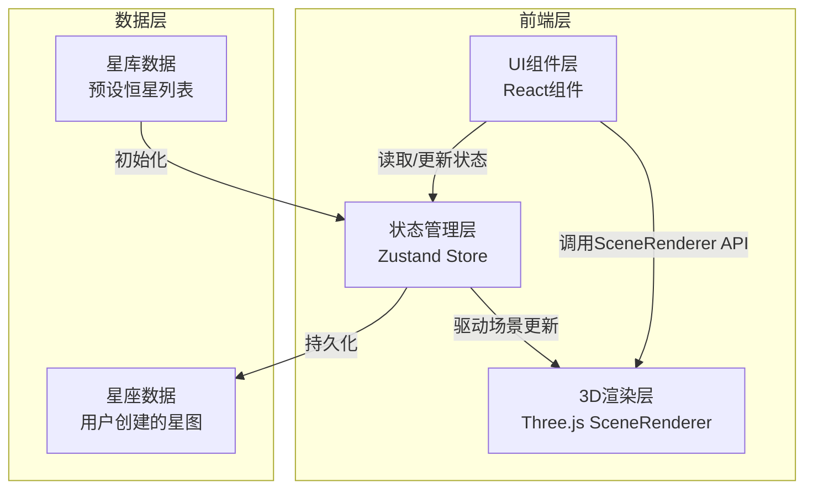
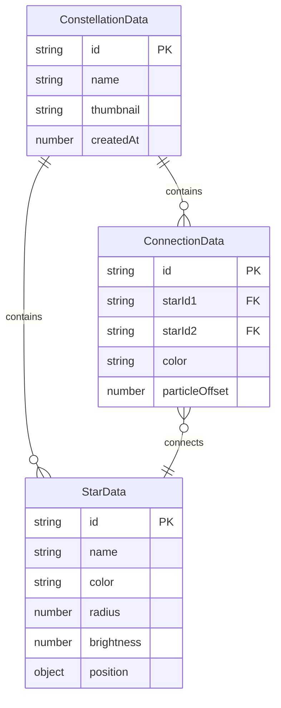

## 1. 架构设计



## 2. 技术说明

- 前端：React@18 + TypeScript + Three.js + Zustand + Vite
- 初始化工具：vite-init (react-ts 模板)
- 样式：CSS Modules + CSS变量（太空主题色系）
- 后端：无（纯前端，数据存储在localStorage）
- 数据库：无（使用Zustand + localStorage持久化）

## 3. 路由定义

| 路由 | 用途 |
|-------|---------|
| / | 星空画布主页面（唯一页面，所有功能内嵌） |

## 4. 文件结构

```
src/
├── types/
│   └── index.ts            # 类型定义：StarData, ConnectionData, ConstellationData等
├── modules/
│   ├── SceneRenderer.ts    # Three.js场景封装（渲染器、相机、场景、光照、恒星/连接线管理）
│   └── DataManager.ts      # Zustand Store（星库数据、画布恒星、连接线、星座列表管理）
├── components/
│   ├── StarLibrary.tsx     # 左侧星库面板
│   ├── StarCard.tsx        # 恒星卡片组件
│   ├── GalleryPanel.tsx    # 右侧画廊面板
│   ├── GalleryItem.tsx     # 画廊缩略图项
│   ├── Toolbar.tsx         # 底部工具栏
│   └── SceneCanvas.tsx     # 3D场景容器组件
├── App.tsx                 # 主应用组件
└── main.tsx                # 入口文件
```

## 5. 核心接口定义

### 5.1 类型系统

```typescript
interface StarData {
  id: string;
  name: string;
  color: string;
  radius: number;
  brightness: number;
  position: { x: number; y: number; z: number };
}

interface ConnectionData {
  id: string;
  starIds: [string, string];
  color: string;
  particleOffset: number;
}

interface ConstellationData {
  id: string;
  name: string;
  stars: StarData[];
  connections: ConnectionData[];
  thumbnail: string;
  createdAt: number;
}

interface SceneRendererAPI {
  addStar(star: StarData): void;
  removeStar(id: string): void;
  addConnection(connection: ConnectionData): void;
  removeConnection(id: string): void;
  setView(options: { damping?: number; inertia?: number; zoom?: number }): void;
  captureSnapshot(): string;
  dispose(): void;
}
```

### 5.2 Store设计

```typescript
interface StarStore {
  libraryStars: StarData[];
  canvasStars: StarData[];
  selectedStarIds: string[];
  addStarToCanvas: (star: StarData, position: {x,y,z}) => void;
  removeStarFromCanvas: (id: string) => void;
  toggleStarSelection: (id: string) => void;
  clearSelection: () => void;
  updateStarBrightness: (id: string, brightness: number) => void;
}

interface ConstellationStore {
  constellations: ConstellationData[];
  activeConstellationId: string | null;
  connections: ConnectionData[];
  addConnection: (starIds: [string, string]) => void;
  removeConnection: (id: string) => void;
  saveConstellation: (name: string, thumbnail: string) => void;
  loadConstellation: (id: string) => void;
  deleteConstellation: (id: string) => void;
}
```

## 6. 数据模型

### 6.1 数据模型图



### 6.2 数据持久化

- 使用localStorage存储星座数据
- 键名格式：`constellation_weaver_constellations`
- 缩略图以Base64 DataURL存储
