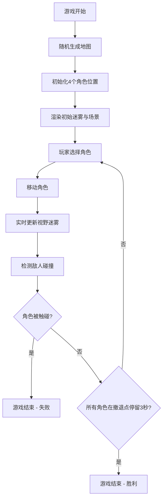

## 1. 产品概述

暗界视野是一款基于视线与地形动态演变的2D迷雾战场策略游戏原型。玩家控制一个由指挥官和侦察兵组成的小队，在随机生成的战场地图上探索、驱散迷雾、躲避敌人并抵达撤退点。

- 核心目的：提供具有沉浸感和战术深度的迷雾战场探索体验
- 目标用户：策略游戏爱好者、战术游戏玩家
- 市场价值：展示动态迷雾系统在策略游戏中的创新应用，为后续完整游戏开发提供技术验证

## 2. 核心功能

### 2.1 用户角色

| 角色 | 注册方式 | 核心权限 |
|------|----------|----------|
| 玩家 | 无需注册，直接游玩 | 控制角色移动、切换角色、执行撤退指令、重置游戏 |

### 2.2 功能模块

1. **主游戏场景**：Three.js渲染的3D等距视角战场，包含地形网格、迷雾遮罩、单位精灵
2. **迷雾引擎**：基于角色视野和地形遮挡的动态迷雾计算与渐变消融动画
3. **地形生成器**：基于随机种子的32x32网格地图生成（树木/高地/废墟/开阔地）
4. **单位控制系统**：4个角色（1指挥官+3侦察兵）的移动、转向、碰撞检测与状态管理
5. **UI控制面板**：角色切换、小队状态显示、撤退按钮、视野覆盖率指示
6. **敌人AI系统**：巡逻单位的随机移动与视野检测
7. **胜负判定**：撤退点停留3秒获胜/触碰敌人游戏结束

### 2.3 页面详情

| 页面名称 | 模块名称 | 功能描述 |
|----------|----------|----------|
| 游戏主界面 | 3D战场渲染 | Three.js场景，45度等距视角，显示地形、角色、迷雾 |
| 游戏主界面 | 左侧控制面板 | 角色头像切换按钮（4个，带生命值环）、撤退按钮 |
| 游戏主界面 | 右上角状态区 | 视野覆盖率圆环指示器、剩余敌人数量 |
| 游戏主界面 | 左上角迷你雷达 | 150x150px小地图，显示可见区域缩略图与角色位置 |
| 游戏主界面 | 顶部状态栏 | 当前角色视野覆盖率百分比、操作延迟显示 |

## 3. 核心流程

游戏开始时随机生成地图和单位位置，玩家通过键盘/鼠标控制选中角色移动，实时计算并渲染视野迷雾，切换角色以探索不同区域，躲避敌人巡逻，最终带领所有角色抵达撤退点获胜。

## 4. 用户界面设计

### 4.1 设计风格

- 主色调：暗黑科技蓝紫调（#00E5FF 青蓝色，#FF6B6B 橙红色，#151528 深蓝背景）
- 背景色：#0A0A0A 纯黑主背景，底部渐变至#1A1A2E
- 按钮风格：圆角胶囊形，悬停缩放1.05倍，按压动画0.1秒
- 字体：现代无衬线字体，数字使用等宽字体
- 布局：固定45度等距视角，左侧悬浮控制面板，右上角状态指示，左上角迷你雷达
- 图标/风格：简洁几何图形，科技感发光边框，渐变指示条

### 4.2 页面设计概述

| 页面名称 | 模块名称 | UI元素 |
|----------|----------|--------|
| 游戏主界面 | 3D战场 | 45度俯仰视角，地形色块，角色发光精灵，黑色渐变迷雾，地平线渐变 |
| 游戏主界面 | 左侧控制面板 | 半透明背景(280px宽)，圆角12px，边框1px，角色头像按钮(56x56px)带4px宽生命值环，撤退按钮(220x48px)红色渐变 |
| 游戏主界面 | 右上角状态 | 视野覆盖率圆环(直径60px，6px宽)，剩余敌人数量文字 |
| 游戏主界面 | 迷你雷达 | 150x150px半透明黑底，圆角8px，扫描线动画，角色位置小圆点 |
| 游戏主界面 | 顶部状态栏 | 视野覆盖率百分比(颜色红到绿渐变)，操作延迟ms显示 |

### 4.3 响应式设计

- 桌面优先设计（宽度>=768px）
- 移动设备（宽度<768px）：控制面板宽度缩小至200px，按钮高度增加至56px，迷你雷达缩小至100x100px
- 触控优化：按钮可点击区域增大，滚动响应式

### 4.4 3D场景指导

- 环境：纯黑背景，底部轻微地平线渐变（#0A0A0A→#1A1A2E）
- 光照：主方向光模拟顶部天光，角色自身发光材质，选中角色外发光#00E5FF
- 相机：45度固定俯仰角，俯视角度，旋转中心点为当前选中角色，切换角色时0.3秒ease-in-out平滑过渡
- 构图：战场居中显示，UI元素悬浮于场景之上
- 交互：点击地面移动角色，角色选中高亮带跟随指示环
- 后期效果：迷雾透明度渐变消融，战斗时屏幕红色闪烁0.2秒
- 性能：迷雾纹理更新频率<=10次/秒，帧率<30fps时自动降低迷雾分辨率
