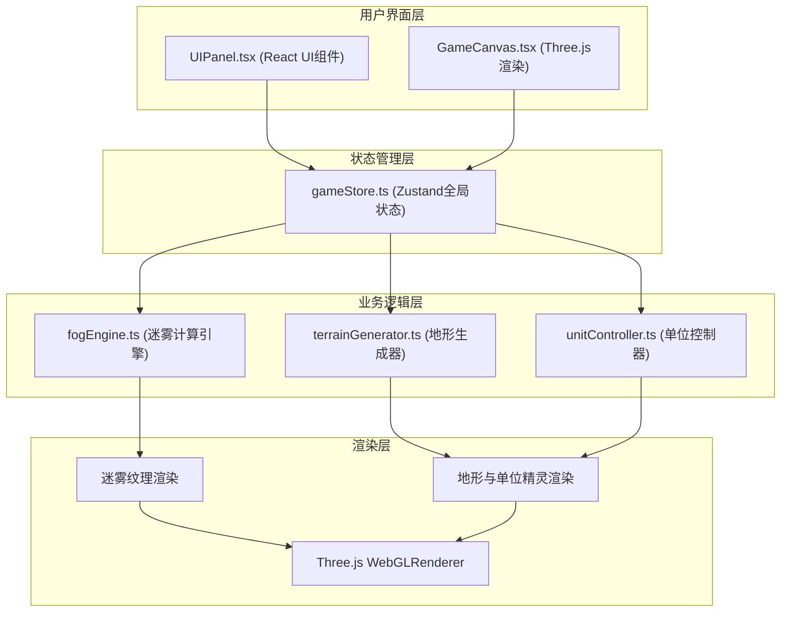
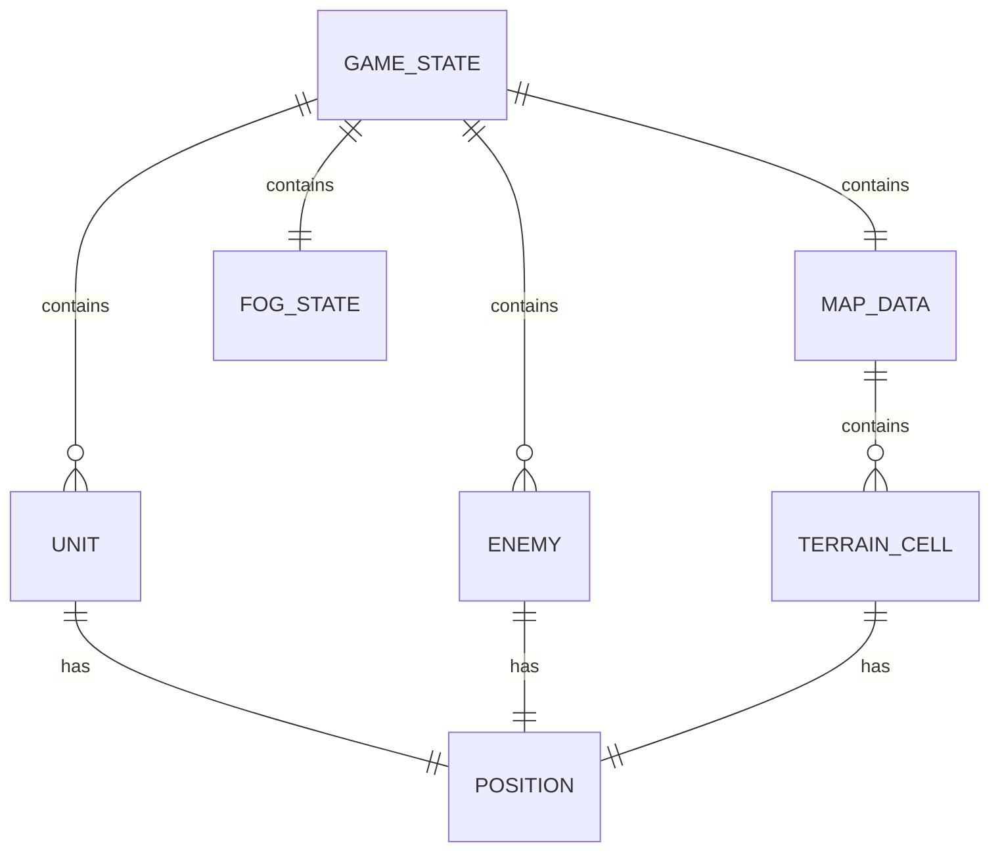

## 1. 架构设计



## 2. 技术说明

- 前端框架：React@18 + TypeScript
- 构建工具：Vite@5 + @vitejs/plugin-react
- 状态管理：Zustand@4
- 3D渲染引擎：Three.js
- 唯一ID生成：uuid
- 项目初始化：Vite react-ts 模板
- 后端：无（纯前端游戏原型）
- 数据库：无（内存状态管理）

## 3. 路由定义

| 路由 | 用途 |
|------|------|
| / | 游戏主界面，包含完整战场渲染与UI控制面板 |

## 4. API定义

本项目为纯前端游戏，无后端API接口。内部模块间通过Zustand store进行数据通信。

### 内部数据类型定义

```typescript
// 地形类型
enum TerrainType {
  OPEN = 'open',      // 开阔地
  TREE = 'tree',      // 树木
  HIGHLAND = 'highland', // 高地
  RUIN = 'ruin'       // 废墟
}

// 角色类型
enum UnitType {
  COMMANDER = 'commander', // 指挥官
  SCOUT = 'scout'          // 侦察兵
}

// 游戏阶段
enum GamePhase {
  PLAYING = 'playing',
  WIN = 'win',
  LOSE = 'lose'
}

// 坐标
interface Position {
  x: number;
  y: number;
}

// 角色单位
interface Unit {
  id: string;
  type: UnitType;
  position: Position;
  hp: number;
  maxHp: number;
  visionRadius: number;
  visionAngle: number; // 扇形视野张角（0表示圆形）
  moveSpeed: number;
  isSelected: boolean;
  facing: number; // 朝向角度（弧度）
}

// 敌人单位
interface Enemy {
  id: string;
  position: Position;
  visionRadius: number;
  moveSpeed: number;
  patrolTarget: Position;
}

// 地形格子
interface TerrainCell {
  type: TerrainType;
  height: number;
  blockRate: number; // 视线遮挡率 0-1
}

// 地图数据
interface MapData {
  width: number;
  height: number;
  grid: TerrainCell[][];
  extractionPoint: Position;
}

// 迷雾状态
interface FogState {
  visibleCells: Set<string>; // "x,y"格式的可见格子集合
  texture: HTMLCanvasElement | null; // 迷雾纹理
  coverage: number; // 视野覆盖率 0-100
}

// 游戏状态
interface GameState {
  phase: GamePhase;
  mapData: MapData | null;
  units: Unit[];
  enemies: Enemy[];
  fogState: FogState;
  selectedUnitId: string | null;
  extractionProgress: number; // 撤退进度 0-100
  fps: number;
  lastFrameTime: number;
}
```

## 5. 服务端架构

本项目为纯前端游戏原型，无服务端架构。

## 6. 数据模型

### 6.1 数据模型关系图



### 6.2 文件调用关系与数据流向

| 文件 | 输入数据来源 | 输出数据去向 | 核心职责 |
|------|-------------|-------------|----------|
| terrainGenerator.ts | 游戏难度、地图尺寸参数 | gameStore.mapData | 基于种子随机生成32x32地形网格与撤退点 |
| fogEngine.ts | gameStore.units, gameStore.mapData | gameStore.fogState | 计算角色视野遮罩，生成迷雾纹理与可见区域 |
| unitController.ts | 键盘/鼠标输入事件, gameStore.mapData | gameStore.units | 管理角色移动、碰撞检测、转向与状态更新 |
| gameStore.ts | 所有模块 | 所有组件与模块 | Zustand全局状态管理，统一存储游戏数据 |
| GameCanvas.tsx | gameStore (订阅) | Three.js场景渲染 | 渲染3D战场场景、迷雾遮罩、地形与单位精灵 |
| UIPanel.tsx | gameStore (订阅) | gameStore (调用setter) | 渲染UI控制面板、处理角色切换与撤退指令 |

### 6.3 关键数据流时序

1. **初始化流程**：
   - App启动 → terrainGenerator生成地图 → gameStore存入mapData → unitController初始化角色 → gameStore存入units → fogEngine计算初始迷雾 → gameStore存入fogState → GameCanvas渲染首帧

2. **游戏主循环**（每帧执行）：
   - requestAnimationFrame → unitController更新角色位置（处理输入）→ fogEngine重新计算视野 → enemies AI巡逻移动 → 碰撞检测 → GameCanvas渲染更新

3. **角色切换流程**：
   - UIPanel点击头像 → gameStore设置selectedUnitId → GameCanvas相机0.3秒平滑过渡到新角色 → 新角色高亮显示

4. **胜负判定流程**：
   - unitController更新位置后 → 检测敌人碰撞（游戏失败）/检测所有角色在撤退点（3秒后游戏胜利）→ gameStore更新phase
