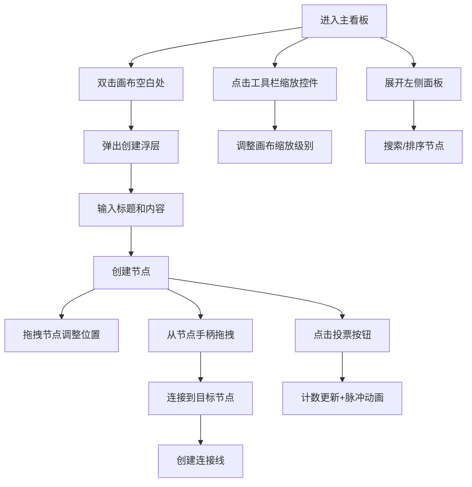

## 1. 产品概述
思维轨迹是一款面向团队协作的头脑风暴与想法可视化工具，帮助团队成员实时创建、连接和筛选想法，形成可交互的思维导图，提升创意协作效率。

- 核心价值：将分散的想法结构化，通过可视化连接和投票筛选，快速收敛高质量创意
- 目标用户：产品团队、设计团队、研发团队等需要头脑风暴的协作群体

## 2. 核心功能

### 2.1 用户角色
| 角色 | 注册方式 | 核心权限 |
|------|----------|----------|
| 团队成员 | 无需注册（本地模拟） | 创建/编辑/删除想法节点、创建连接、投票筛选 |

### 2.2 功能模块
1. **主看板页面**：SVG画布、节点渲染、连接线层、工具栏、节点列表面板
2. **节点编辑模块**：创建浮层、编辑面板、删除确认、投票功能
3. **连接管理模块**：拖拽创建连接、连接线渲染、连接删除
4. **画布交互模块**：拖拽平移、滚轮缩放、触控板手势支持

### 2.3 页面详情
| 页面名称 | 模块名称 | 功能描述 |
|----------|----------|----------|
| 主看板 | SVG画布 | 全屏可拖拽平移的画布，支持滚轮缩放（0.25x-2x），网格背景 |
| 主看板 | 工具栏 | 新建节点按钮、全屏切换、缩放控制滑动条 |
| 主看板 | 节点列表面板 | 左侧可展开面板，带搜索框和排序功能 |
| 主看板 | 节点组件 | 圆角矩形卡片，显示标题、内容、投票计数，支持拖拽、选中、删除 |
| 主看板 | 连接层 | SVG连接线渲染，支持从节点手柄拖拽创建连接 |
| 节点编辑 | 创建浮层 | 双击空白处弹出，包含标题和内容输入 |
| 节点编辑 | 删除确认 | 删除前弹出确认浮层，防止误操作 |
| 投票系统 | 投票按钮 | 每个节点支持赞成/反对投票，带脉冲动画反馈 |

## 3. 核心流程
用户进入主看板后，可通过双击空白处创建想法节点，拖拽节点调整位置，从节点右下角手柄拖拽到其他节点创建连接，点击投票按钮筛选优质想法，通过左侧面板搜索和管理所有节点。

## 4. 用户界面设计

### 4.1 设计风格
- 主色调：深色主题，背景#1A1A2E，辅助背景#252545
- 强调色：#7C7CFF（紫蓝）、#4ECDC4（青绿）
- 警告色：#FF6B6B（珊瑚红）
- 字体：采用现代无衬线字体，标题16px粗体，正文14px常规
- 卡片风格：圆角16px，1px边框，悬停发光效果
- 动画：节点淡入淡出0.3秒，投票脉冲0.3秒，面板滑入0.3秒

### 4.2 页面设计概述
| 页面名称 | 模块名称 | UI元素 |
|----------|----------|--------|
| 主看板 | 工具栏 | 高度56px，背景#1E1E3A，下边框2px #2A2A44，新建按钮、全屏按钮、缩放滑动条 |
| 主看板 | SVG画布 | 背景#1A1A2E，网格线#2A2A44，间距40px |
| 主看板 | 节点卡片 | 宽240px，圆角矩形，背景#252545，边框1.5px #4A4A6A，悬停边框#7C7CFF+外发光 |
| 主看板 | 连接线 | 颜色#7C7CFF，线宽2px，两端圆点直径8px |
| 主看板 | 左侧面板 | 宽度300px，背景#1E1E3A，圆角12px，滑入动画 |
| 节点编辑 | 创建浮层 | 宽度320px，背景#1E1E3A，圆角16px，边框1px #3A3A5C |
| 节点编辑 | 删除确认 | 背景#2A1A1A，圆角12px，#FF6B6B确认按钮 |
| 投票系统 | 投票计数 | 赞成#4ECDC4，反对#FF6B6B，14px字体 |

### 4.3 响应式设计
- 桌面端（≥768px）：标准布局，节点宽240px，工具栏高56px，左侧面板固定宽度300px
- 移动端（<768px）：节点宽180px，工具栏高48px，左侧面板变为底部抽屉，顶部圆角16px

## 5. 性能要求
- 同时支持50个节点和80条连接线流畅渲染
- 帧率不低于50fps
- 拖拽、缩放、连接创建等交互无明显卡顿
