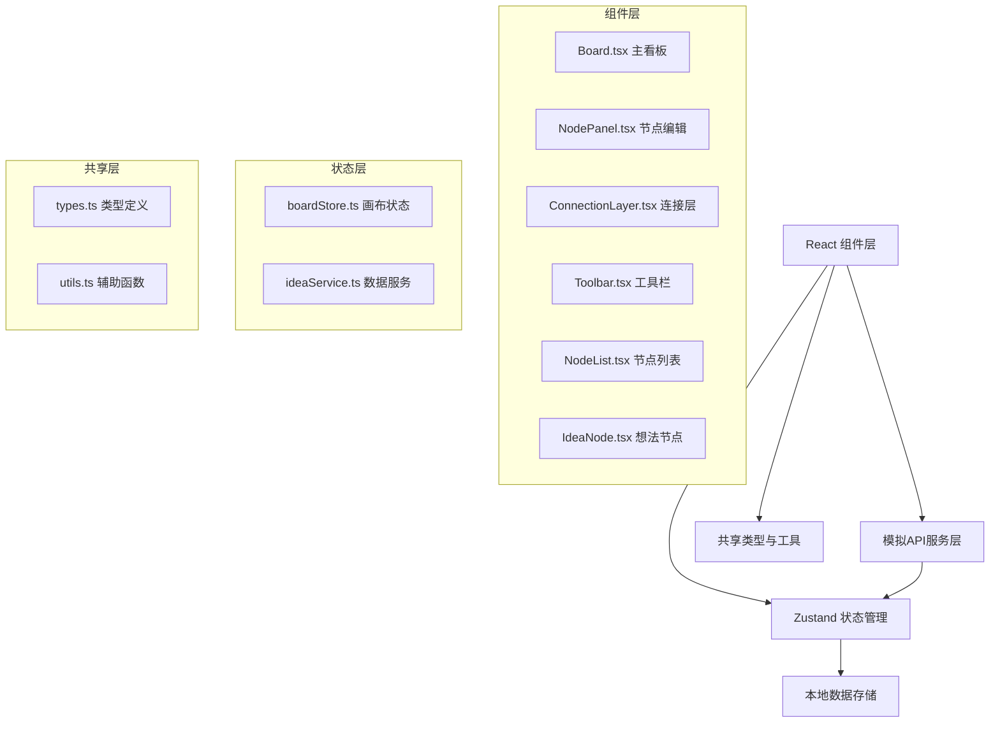

## 1. 架构设计



## 2. 技术描述
- **前端框架**：React 18 + TypeScript
- **构建工具**：Vite 5 + @vitejs/plugin-react
- **状态管理**：Zustand 4
- **唯一ID生成**：uuid
- **无后端**：使用Zustand store管理本地模拟数据
- **渲染方式**：SVG画布渲染节点和连接线

## 3. 目录结构
```
src/
├── components/
│   ├── Board.tsx              # 主看板组件
│   ├── NodePanel.tsx          # 节点编辑面板
│   ├── ConnectionLayer.tsx    # 连接线渲染层
│   ├── Toolbar.tsx            # 顶部工具栏
│   ├── NodeList.tsx           # 左侧节点列表面板
│   └── IdeaNode.tsx           # 单个想法节点组件
├── services/
│   └── ideaService.ts         # 模拟API服务
├── store/
│   └── boardStore.ts          # Zustand全局状态
├── shared/
│   ├── types.ts               # 类型定义
│   └── utils.ts               # 辅助函数
├── App.tsx                    # 应用入口
├── main.tsx                   # React挂载
└── index.css                  # 全局样式
```

## 4. 数据模型

### 4.1 类型定义

```typescript
// src/shared/types.ts
export interface IdeaNode {
  id: string;
  title: string;
  content: string;
  x: number;
  y: number;
  width: number;
  height: number;
  votes: {
    up: number;
    down: number;
  };
  createdAt: number;
}

export interface Connection {
  id: string;
  fromNodeId: string;
  toNodeId: string;
  createdAt: number;
}

export interface BoardState {
  nodes: IdeaNode[];
  connections: Connection[];
  selectedNodeId: string | null;
  zoom: number;
  pan: { x: number; y: number };
  isDragging: boolean;
  isCreatingConnection: boolean;
  connectionStart: { nodeId: string; x: number; y: number } | null;
  connectionEnd: { x: number; y: number } | null;
}

export interface CreateNodeInput {
  title: string;
  content: string;
  x: number;
  y: number;
}

export interface UpdateNodeInput {
  id: string;
  title?: string;
  content?: string;
  x?: number;
  y?: number;
}

export interface VoteInput {
  nodeId: string;
  type: 'up' | 'down';
}
```

### 4.2 Store 状态结构

```typescript
// src/store/boardStore.ts
interface BoardStore {
  // 画布状态
  zoom: number;
  pan: { x: number; y: number };
  selectedNodeId: string | null;
  
  // 交互状态
  isDragging: boolean;
  dragOffset: { x: number; y: number };
  isCreatingConnection: boolean;
  tempConnection: { fromId: string; startX: number; startY: number; endX: number; endY: number } | null;
  
  // 面板状态
  showNodePanel: boolean;
  panelNodeId: string | null;
  panelPosition: { x: number; y: number };
  showDeleteConfirm: boolean;
  deleteNodeId: string | null;
  showNodeList: boolean;
  
  // 操作方法
  setZoom: (zoom: number) => void;
  setPan: (pan: { x: number; y: number }) => void;
  selectNode: (id: string | null) => void;
  toggleNodeList: () => void;
}
```

## 5. 核心组件职责

### 5.1 Board.tsx
- 渲染SVG画布和网格背景
- 处理画布平移、缩放交互
- 渲染IdeaNode组件列表
- 渲染ConnectionLayer组件
- 处理双击创建节点
- 处理键盘Delete删除

### 5.2 IdeaNode.tsx
- 渲染单个想法节点卡片
- 处理节点拖拽移动
- 处理节点选中状态
- 渲染投票按钮和计数
- 渲染连接手柄
- 处理连接手柄拖拽

### 5.3 ConnectionLayer.tsx
- 渲染所有连接线
- 处理临时连接线渲染
- 计算贝塞尔曲线路径
- 渲染连接端点圆点

### 5.4 NodePanel.tsx
- 节点创建/编辑表单
- 标题和内容输入验证
- 调用ideaService保存数据

### 5.5 Toolbar.tsx
- 新建节点按钮
- 全屏切换按钮
- 缩放控制滑动条
- 显示当前缩放比例

### 5.6 NodeList.tsx
- 节点搜索功能
- 节点排序（时间、投票数）
- 点击定位到节点
- 滑入/滑出动画

## 6. API 接口（模拟）

```typescript
// src/services/ideaService.ts
export const ideaService = {
  // 节点CRUD
  getNodes: () => Promise<IdeaNode[]>,
  createNode: (input: CreateNodeInput) => Promise<IdeaNode>,
  updateNode: (input: UpdateNodeInput) => Promise<IdeaNode>,
  deleteNode: (id: string) => Promise<void>,
  
  // 连接管理
  getConnections: () => Promise<Connection[]>,
  createConnection: (fromId: string, toId: string) => Promise<Connection>,
  deleteConnection: (id: string) => Promise<void>,
  
  // 投票
  vote: (input: VoteInput) => Promise<IdeaNode>,
};
```

## 7. 性能优化策略
1. **React.memo**：对IdeaNode、ConnectionLayer等频繁渲染的组件进行记忆化
2. **useCallback**：缓存事件处理函数，避免不必要的重渲染
3. **SVG分层**：将连接线、节点、临时连接分为不同的SVG层
4. **requestAnimationFrame**：缩放、拖拽等高频操作使用RAF优化
5. **节流/防抖**：搜索输入、缩放更新使用防抖处理
6. **CSS transform**：节点移动使用transform而非top/left，提升渲染性能
7. **will-change**：对频繁变换的元素添加will-change提示
