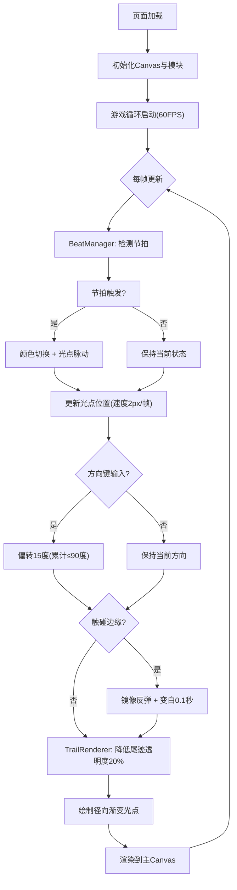

## 1. 产品概述
弹幕织造是一款音画合一的交互式节奏视觉艺术应用。玩家在音乐节拍中操控光点，在画布上绘制出随时间演变的动态抽象弹幕图案，尾迹逐渐淡出形成流动的色彩痕迹，最终呈现一幅不断变化的动态画作。
- 目标用户：音乐可视化爱好者、创意编程玩家、交互艺术探索者
- 核心价值：以极简操控实现音画合一的沉浸式视觉体验

## 2. 核心功能

### 2.1 功能模块
1. **主画面（全屏Canvas）**: 光点运动、尾迹渲染、节拍色彩变化、边缘反弹
2. **控制面板（叠加UI）**: BPM微调滑块、重置按钮、节拍计数器

### 2.2 页面详情
| 页面名称 | 模块名称 | 功能描述 |
|----------|----------|----------|
| 主画面 | 游戏循环 | 60FPS主循环，每帧更新光点位置与尾迹像素数据 |
| 主画面 | 节拍管理 | 从BPM120节拍数据读取节拍，每拍触发颜色切换与光点脉动 |
| 主画面 | 尾迹渲染 | 离屏缓冲区管理，每帧降低尾迹透明度20%，绘制径向渐变光点 |
| 主画面 | 用户控制 | 方向键偏转光点15度，累计最大90度后重置，边缘反弹变白 |
| 主画面 | 视觉配置 | 集中管理背景色、光点样式、衰减速率、颜色序列 |
| 控制面板 | BPM滑块 | 范围60-180，默认120，实时调整节拍速度 |
| 控制面板 | 重置按钮 | 重置光点位置与尾迹 |
| 控制面板 | 节拍计数 | 显示当前节拍数 |

## 3. 核心流程

用户打开页面后，全屏Canvas以#0A0A1A为背景渲染。光点以2px/帧速度自动运动，BPM120驱动每拍颜色切换（#FF6B6B → #4ECDC4 → #FFD93D循环，过渡0.2秒）与半径脉动（8px → 14px → 8px）。玩家按方向键偏转光点方向（每键15度，累计上限90度后重置）。光点碰边缘时镜像反弹并瞬间变白0.1秒。尾迹通过离屏缓冲区每帧降低20%透明度实现流动残影。

## 4. 用户界面设计

### 4.1 设计风格
- 主色调：深空黑(#0A0A1A)背景 + 霓虹色系光点(#FF6B6B红、#4ECDC4青、#FFD93D金)
- 控制面板：半透明暗色(#1A1A2E) + 细边框(#2A2A44) + 圆角12px
- 字体：系统无衬线字体，白色14px
- 布局：全屏Canvas，左上角叠加控制面板
- 动效：光点脉动、颜色渐变过渡、尾迹流动残影

### 4.2 页面设计概览
| 页面名称 | 模块名称 | UI元素 |
|----------|----------|--------|
| 主画面 | 全屏Canvas | 背景#0A0A1A，宽高自适应窗口，光点径向渐变渲染 |
| 控制面板 | BPM滑块 | 宽200px，背景#1A1A2E，1px边框#2A2A44，圆角12px；滑块轨道高4px色#2A2A44，圆形直径16px色#4ECDC4 |
| 控制面板 | 重置按钮 | 圆形直径36px色#FF6B6B，悬停放大到40px+发光阴影 |
| 控制面板 | 节拍计数 | 白色14px字体 |

### 4.3 响应式
- 桌面优先，Canvas自适应窗口尺寸
- 窗口resize时重新计算画布尺寸
- 键盘操控为主（方向键）

### 4.4 性能要求
- 游戏循环稳定55-60FPS
- 尾迹缓冲区更新不造成明显卡顿
- 离屏Canvas缓冲区避免每帧全量重绘
