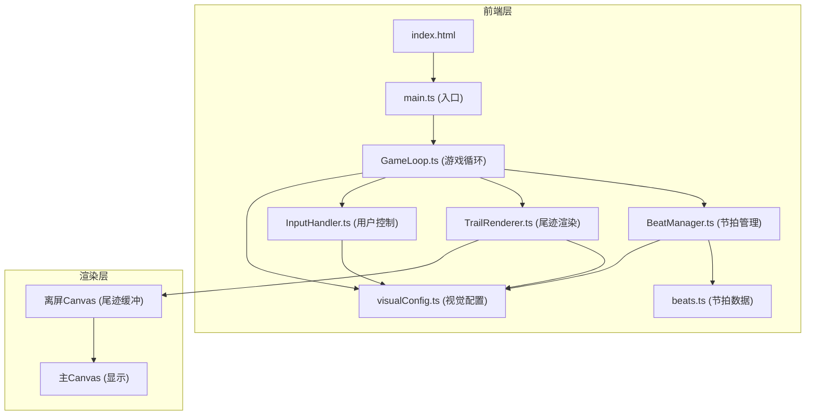

## 1. 架构设计



## 2. 技术说明
- 前端：TypeScript + 原生Canvas API + Vite
- 初始化工具：Vite
- 后端：无
- 数据库：无
- 核心依赖：typescript, vite

## 3. 路由定义
| 路由 | 用途 |
|------|------|
| / | 全屏Canvas主页面，含控制面板 |

## 4. 文件结构
```
├── package.json
├── index.html
├── vite.config.js
├── tsconfig.json
└── src/
    ├── main.ts
    ├── config/
    │   └── visualConfig.ts
    ├── data/
    │   └── beats.ts
    ├── game/
    │   ├── GameLoop.ts
    │   └── BeatManager.ts
    ├── effects/
    │   └── TrailRenderer.ts
    └── input/
        └── InputHandler.ts
```

## 5. 模块职责

### GameLoop.ts
- 管理requestAnimationFrame 60FPS游戏循环
- 每帧协调各模块更新：BeatManager检测节拍、更新光点位置、InputHandler处理输入、TrailRenderer渲染
- 帧率监控与稳定

### BeatManager.ts
- 从beats.ts读取BPM数据
- 计算节拍间隔（60000/BPM毫秒）
- 每拍触发颜色切换（#FF6B6B → #4ECDC4 → #FFD93D循环，0.2秒过渡）
- 光点半径脉动（8px → 14px → 8px）
- 颜色插值计算

### TrailRenderer.ts
- 维护离屏Canvas缓冲区
- 每帧降低尾迹透明度20%（drawImage + globalAlpha）
- 在光点新位置绘制径向渐变圆
- 将离屏缓冲区渲染到主Canvas

### InputHandler.ts
- 监听键盘方向键（上、下、左、右）
- 每按一次偏转光点速度方向15度
- 累计偏转最大90度，超过后重置
- 碰边缘反弹（镜像角度 + 变白0.1秒）

### visualConfig.ts
- 画布背景色(#0A0A1A)
- 光点基础样式（颜色序列、半径范围）
- 尾迹衰减速率(0.2)
- 颜色循环序列
- 光点速度(2px/帧)

### beats.ts
- 预置节拍数据，默认BPM 120

### main.ts
- 初始化Canvas与各模块
- 绑定resize事件
- 创建控制面板UI
- 启动游戏循环
