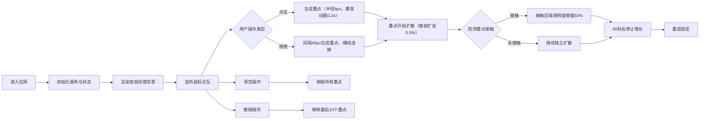

## 1. 产品概述

墨韵流变是一款为非营利博物馆开发的交互式水墨扩散模拟应用，致力于将古籍中的动态墨迹与书法笔触数字化，让访客通过网页交互体验水墨晕染与扩散的艺术魅力。

- 主要目的：通过数字化技术还原中国传统水墨艺术的自然晕染效果，为博物馆访客提供沉浸式的书法艺术交互体验
- 目标用户：博物馆访客、书法艺术爱好者、文化教育工作者
- 市场价值：传承和创新传统书法艺术，让古老的墨迹以数字化形式焕发新生

## 2. 核心功能

### 2.1 用户角色

| 角色 | 注册方式 | 核心权限 |
|------|----------|----------|
| 访客用户 | 无需注册 | 自由使用画布进行水墨创作，体验墨迹扩散效果 |

### 2.2 功能模块

1. **主画布模块**：全屏水墨画布，支持点击/拖拽交互，实时渲染墨迹晕染效果
2. **墨迹扩散引擎**：基于物理规则的墨迹扩散模拟，支持多墨点融合效果
3. **操作控制模块**：清空画布、撤销操作功能
4. **性能监控模块**：实时帧率显示，确保流畅的交互体验

### 2.3 页面详情

| 页面名称 | 模块名称 | 功能描述 |
|----------|----------|----------|
| 主画布页面 | 水墨画布 | 全屏Canvas画布，鼠标点击/拖拽生成墨点，墨点自然晕染扩散 |
| 主画布页面 | 操作控制条 | 顶部悬浮半透明操作条，包含清空、撤销按钮 |
| 主画布页面 | 性能监控 | 右下角实时帧率显示，监控应用运行状态 |

## 3. 核心流程

用户进入应用后，看到全屏宣纸纹理背景画布，可通过鼠标点击或拖拽在画布上创作墨迹。每个墨点会随时间自然向外晕染扩散，相邻墨迹会产生融合效果。用户可随时清空画布或撤销最近的操作。

## 4. 用户界面设计

### 4.1 设计风格

- **主色调**：宣纸米白 (#F5F0E1) 作为背景色，墨色 (#1A1A1A) 作为主色，古铜金 (#D4C5A9) 作为文字强调色
- **辅助色**：深灰 (#333) 用于按钮正常态，中灰 (#555) 用于悬停态，浅灰 (#666) 用于禁用态，棕褐 (#8B7355) 用于辅助文字
- **按钮风格**：圆角矩形，书法字体，轻微按压动效，背景半透明深色
- **字体**：优先使用楷体 (STKaiti, KaiTi)，搭配衬线字体作为后备，营造古风氛围
- **布局风格**：全屏沉浸式画布，顶部悬浮操作条，无多余装饰，突出水墨艺术主体
- **纹理**：佩林噪声生成的宣纸纹理，叠加低透明度，增强真实感

### 4.2 页面设计概述

| 页面名称 | 模块名称 | UI 元素 |
|----------|----------|----------|
| 主画布页面 | 水墨画布 | 全屏Canvas，宣纸纹理背景，#F5F0E1 底色，支持鼠标交互 |
| 主画布页面 | 操作控制条 | 高度56px，背景 #1A1A2EDD，圆角12px，内边距8px 20px，顶部居中 |
| 主画布页面 | 操作按钮 | 书法字体，字号16px，文字 #D4C5A9，间距16px，按压动效 |
| 主画布页面 | 帧率显示 | 字号12px，颜色 #8B7355，右下角定位 |
| 主画布页面 | 墨点效果 | 中心 #1A1A1A，边缘渐变透明，爆发动画，融合效果 |

### 4.3 响应式设计

- **桌面端优先**：操作条水平布局，按钮横排，高度56px
- **移动端适配**：当视口宽度小于768px时，按钮变为图标+文字竖排布局，操作条高度调整为72px
- **画布自适应**：使用ResizeObserver监听窗口尺寸变化，自动重置Canvas分辨率，保持清晰渲染
- **触摸优化**：支持触摸事件，确保在触控设备上也能流畅创作

### 4.4 动效设计

- **墨点爆发动画**：0.2秒内半径从0快速膨胀到8px，模拟墨滴落下的瞬间
- **墨点扩散动画**：每帧按当前半径的0.5%扩张，持续30秒，模拟水墨在宣纸上的自然晕染
- **墨点融合动画**：接触区域透明度增强50%，模拟墨迹相互渗透效果
- **按钮交互动效**：悬停色变为#555，点击时transform: translateY(1px)，transition 0.15s，营造按压触感
