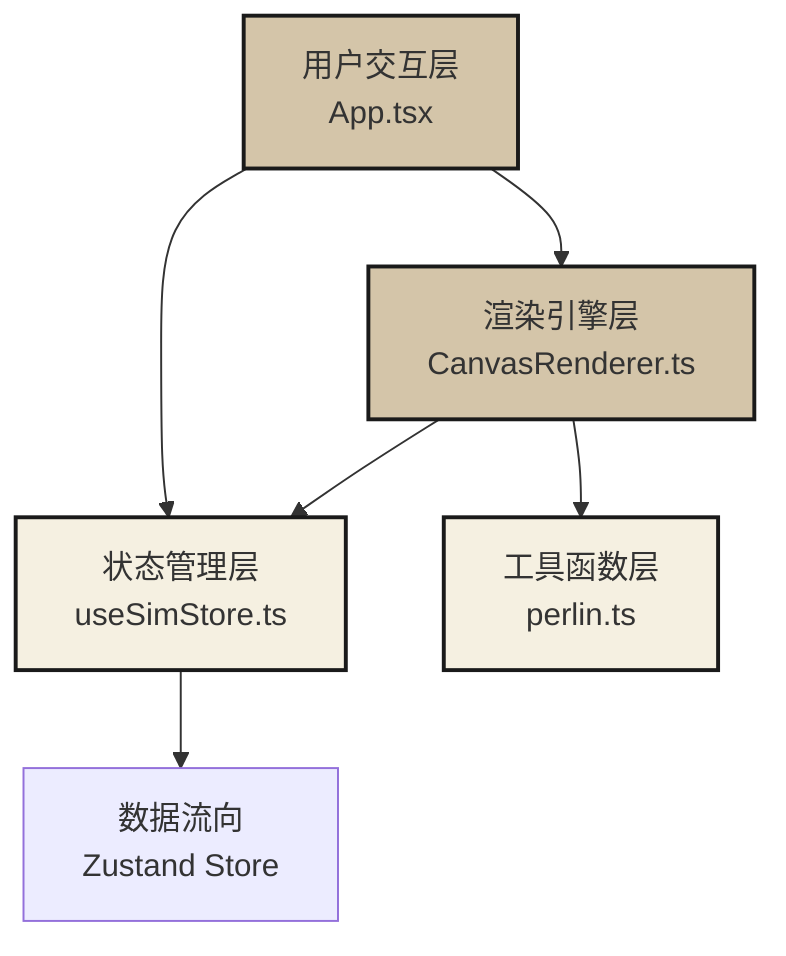

## 1. 架构设计

本项目采用分层架构设计，遵循关注点分离原则，将状态管理、渲染引擎、工具函数和UI组件明确分离。



### 调用关系与数据流向

1. **状态数据流向**：Zustand store → App.tsx → CanvasRenderer
2. **事件触发流向**：用户交互 → App.tsx → useSimStore actions → 状态更新 → CanvasRenderer 重渲染
3. **渲染循环流向**：requestAnimationFrame → CanvasRenderer → 调用 store 扩散 action → 更新墨点数据 → 绘制到 Canvas

## 2. 技术描述

- **前端框架**：React 18 + TypeScript
- **构建工具**：Vite 5
- **状态管理**：Zustand 4
- **渲染技术**：HTML5 Canvas API + requestAnimationFrame
- **开发服务器端口**：5173
- **路径别名**：`@` 指向 `src` 目录

### 依赖说明

| 依赖包 | 版本 | 用途 |
|--------|------|------|
| react | ^18.2.0 | 用户界面构建 |
| react-dom | ^18.2.0 | DOM 渲染 |
| zustand | ^4.5.0 | 状态管理 |
| typescript | ^5.4.0 | 类型安全 |
| vite | ^5.2.0 | 构建与开发服务器 |
| @vitejs/plugin-react | ^4.2.0 | Vite React 插件 |

## 3. 项目文件结构

```
d:\Pro\tasks\auto59/
├── .trae/documents/          # 项目文档目录
│   ├── PRD.md               # 产品需求文档
│   └── 技术架构.md          # 技术架构文档
├── src/
│   ├── App.tsx              # 主应用组件，初始化画布和状态
│   ├── main.tsx             # 应用入口
│   ├── index.css            # 全局样式
│   ├── store/
│   │   └── useSimStore.ts   # Zustand 状态管理
│   ├── engine/
│   │   └── CanvasRenderer.ts # Canvas 渲染引擎
│   └── utils/
│       └── perlin.ts        # 佩林噪声生成工具
├── index.html               # HTML 入口
├── package.json             # 项目依赖配置
├── vite.config.js           # Vite 构建配置
└── tsconfig.json            # TypeScript 配置
```

### 文件职责与调用关系

| 文件 | 职责 | 调用者 | 被调用者 |
|------|------|--------|----------|
| `index.html` | 提供根挂载点，配置全屏Canvas样式 | 浏览器 | - |
| `src/main.tsx` | React应用入口，挂载App组件 | 浏览器 | App.tsx |
| `src/App.tsx` | 主组件，初始化Canvas Ref，传递给渲染引擎，处理用户交互，渲染操作条和帧率显示 | main.tsx | useSimStore.ts, CanvasRenderer.ts |
| `src/store/useSimStore.ts` | Zustand store，管理墨点数组、画布尺寸、模拟状态，提供添加墨点、推进扩散、清空、撤销等actions | App.tsx, CanvasRenderer.ts | - |
| `src/engine/CanvasRenderer.ts` | 核心渲染引擎，接收Canvas上下文和墨点数据，每帧绘制墨点晕染，调用扩散actions更新数据，处理宣纸纹理渲染 | App.tsx | useSimStore.ts, perlin.ts |
| `src/utils/perlin.ts` | 生成佩林噪声纹理，用于宣纸效果 | CanvasRenderer.ts | - |

### 数据流详细说明

1. **初始化流程**：
   - App.tsx 创建 CanvasRef 并获取 2D 上下文
   - App.tsx 调用 store 的 setCanvasSize 初始化画布尺寸
   - App.tsx 实例化 CanvasRenderer，传入 ctx 和 store
   - CanvasRenderer 调用 perlin.ts 生成宣纸纹理

2. **交互流程**：
   - 用户点击/拖拽 → App.tsx 监听鼠标事件 → 调用 store.addInkPoint()
   - store 更新 inkPoints 数组 → CanvasRenderer 在下一帧检测到变化并绘制

3. **渲染循环**：
   - CanvasRenderer 启动 requestAnimationFrame 循环
   - 每帧调用 store.advanceDiffusion() 更新所有墨点的半径和状态
   - 检测墨点间的碰撞，更新融合区域透明度
   - 清空画布 → 绘制宣纸纹理 → 绘制连接线 → 绘制所有墨点

4. **控制操作**：
   - 点击清空按钮 → App.tsx 调用 store.clearAll()
   - 点击撤销按钮 → App.tsx 调用 store.undoLast(10)

## 4. 数据模型

### 4.1 墨点数据结构

```typescript
interface InkPoint {
  id: string;
  x: number;
  y: number;
  radius: number;
  maxRadius: number;
  targetRadius: number;
  birthTime: number;
  explosionDuration: number;
  diffusionDuration: number;
  isGrowing: boolean;
  opacity: number;
  connectedTo: string | null;
}
```

| 字段 | 类型 | 说明 |
|------|------|------|
| id | string | 墨点唯一标识 |
| x | number | 墨点中心X坐标 |
| y | number | 墨点中心Y坐标 |
| radius | number | 当前半径 |
| maxRadius | number | 最大扩散半径（30秒后的最终半径） |
| targetRadius | number | 当前目标半径（用于动画） |
| birthTime | number | 生成时间戳（ms） |
| explosionDuration | number | 爆发动画时长（200ms） |
| diffusionDuration | number | 扩散总时长（30000ms） |
| isGrowing | boolean | 是否处于增长状态 |
| opacity | number | 基础不透明度（1.0） |
| connectedTo | string | 连接的前一个墨点ID，用于绘制拖拽轨迹 |

### 4.2 Store 状态结构

```typescript
interface SimState {
  inkPoints: InkPoint[];
  canvasWidth: number;
  canvasHeight: number;
  isSimulating: boolean;
  maxInkPoints: number;
  
  // Actions
  addInkPoint: (x: number, y: number, connectedTo?: string) => void;
  advanceDiffusion: (deltaTime: number) => void;
  setCanvasSize: (width: number, height: number) => void;
  clearAll: () => void;
  undoLast: (count: number) => void;
}
```

## 5. 性能优化策略

### 5.1 渲染性能
- 使用 `requestAnimationFrame` 驱动渲染循环，与显示器刷新率同步
- 每帧最多更新所有墨点一次，避免重复计算
- 墨点数量超过500个时自动忽略新增墨点，防止内存溢出和帧率下降
- 预生成宣纸纹理（512x512），每帧直接平铺绘制，避免实时计算噪声

### 5.2 交互性能
- 拖拽时每间隔40px才生成新墨点，避免过密点导致性能下降
- 使用事件委托和被动事件监听器，减少事件处理开销
- 鼠标位置缓存，避免重复计算

### 5.3 内存管理
- 停止增长的墨点不再参与扩散计算，只参与渲染
- 撤销操作时清理对应的墨点数据
- 清空操作时重置整个状态数组，触发垃圾回收

## 6. 核心算法

### 6.1 墨点扩散算法
```
每帧更新：
  对于每个墨点：
    如果已停止增长，跳过
    计算已存活时间
    如果在爆发期（<200ms）：
      radius = 初始半径 * (已存活时间 / 200ms)
    否则如果在扩散期（<30s）：
      radius *= 1.005 （每帧增长0.5%）
    否则：
      isGrowing = false
```

### 6.2 墨点融合检测
```
对于每对墨点(i, j)：
  计算中心距离 dist = sqrt((xi-xj)² + (yi-yj)²)
  如果 dist < ri + rj：
    计算重叠程度 overlap = (ri + rj - dist) / min(ri, rj)
    两个墨点在接触区域的透明度增强 50% * overlap
```

### 6.3 佩林噪声纹理生成
- 使用改进的佩林噪声算法生成 512x512 的灰度图
- 灰度值范围映射到 0.1-0.3
- 生成离屏 Canvas 缓存纹理，每帧使用 `createPattern` 平铺绘制
