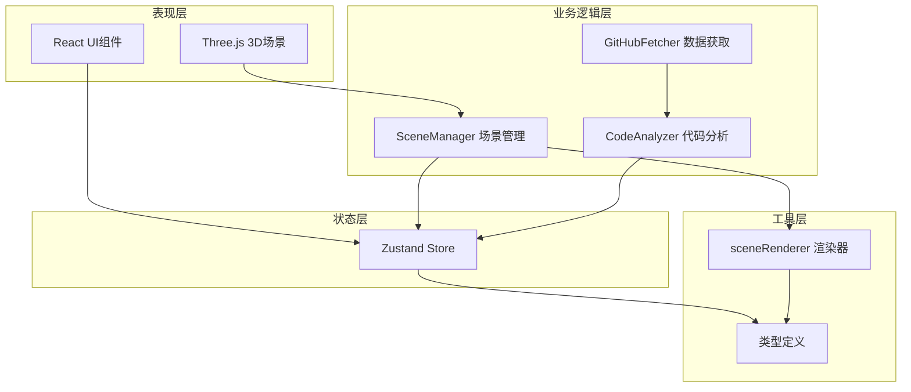

## 1. 架构设计



## 2. 技术栈描述

- **前端框架**：React 18 + TypeScript
- **构建工具**：Vite
- **状态管理**：Zustand
- **3D渲染**：Three.js
- **开发服务器**：Vite Dev Server（端口3000）
- **唯一ID生成**：uuid

## 3. 目录结构

```
src/
├── main.tsx              # React入口
├── types.ts              # 全局类型定义
├── store/
│   └── useAppStore.ts    # Zustand全局状态
├── modules/
│   ├── scene/
│   │   ├── SceneManager.ts    # 场景管理器
│   │   └── sceneRenderer.ts   # 场景渲染器
│   ├── analyzer/
│   │   └── CodeAnalyzer.ts    # 代码分析器
│   └── github/
│       └── GitHubFetcher.ts   # GitHub数据获取
└── components/
    ├── Panel.tsx         # 控制面板
    └── InfoCard.tsx      # 信息卡片
```

## 4. 数据模型

### 4.1 核心类型定义

```typescript
interface CodeNode {
  id: string;
  name: string;
  type: 'function' | 'class' | 'module';
  moduleType: 'util' | 'business' | 'ui';
  code: string;
  position: { x: number; y: number; z: number };
  callCount: number;
}

interface CodeEdge {
  id: string;
  source: string;
  target: string;
  weight: number;
}

interface AppState {
  nodes: CodeNode[];
  edges: CodeEdge[];
  selectedNode: CodeNode | null;
  isPlaying: boolean;
  speed: number;
  isLoading: boolean;
}
```

## 5. 核心模块说明

### 5.1 SceneManager
- 职责：Three.js场景初始化、相机控制、射线拾取、事件监听
- 依赖：sceneRenderer、useAppStore
- 关键方法：init()、update()、onNodeClick()、dispose()

### 5.2 sceneRenderer
- 职责：节点和连接线的几何体、材质创建、动画更新
- 依赖：类型定义
- 关键方法：createNode()、createEdge()、updateAnimation()

### 5.3 CodeAnalyzer
- 职责：静态分析代码片段，提取函数、类、模块及调用关系
- 依赖：类型定义
- 关键方法：analyze()、extractFunctions()、buildCallGraph()

### 5.4 GitHubFetcher
- 职责：从GitHub API获取仓库文件列表和内容
- 依赖：CodeAnalyzer
- 关键方法：fetchRepo()、fetchFileContent()

## 6. 状态管理

使用Zustand管理全局状态，包含：
- 节点和连接数据
- 选中节点状态
- 播放/暂停状态
- 动画速度
- 加载状态

## 7. 性能优化策略

- 节点几何体复用（InstancedMesh）
- 动画帧节流
- 代码分析Web Worker化（预留接口）
- 场景对象池管理
