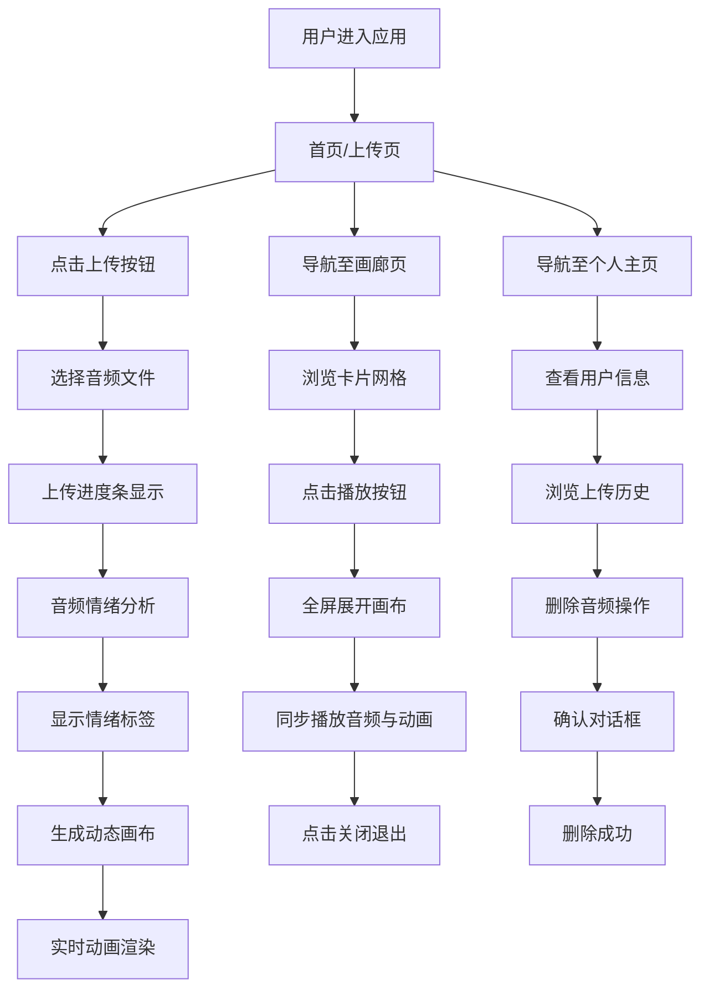

## 1. 产品概述

声音画廊是一款社交型音乐情绪分享应用，用户可上传30秒内的短音频，系统自动分析情绪基调并生成联动动态抽象画，其他用户浏览时可同步聆听音频与观看画布动画。

- 核心目标：让音乐与视觉艺术结合，创造独特的情绪分享体验
- 目标用户：音乐爱好者、视觉艺术爱好者、社交分享用户
- 产品价值：通过 AI 情绪分析将声音可视化，打造沉浸式的音乐情绪社交平台

## 2. 核心功能

### 2.1 用户角色

| 角色 | 注册方式 | 核心权限 |
|------|----------|----------|
| 普通用户 | 默认访客身份 | 上传音频、浏览画廊、播放音频、查看个人主页、删除自己的音频 |

### 2.2 功能模块

1. **首页/上传页面**：音频上传、情绪分析展示、动态画布预览
2. **画廊页面**：音频卡片网格、播放交互、全屏画布动画
3. **个人主页**：用户信息展示、上传历史列表、删除操作

### 2.3 页面详情

| 页面名称 | 模块名称 | 功能描述 |
|----------|----------|----------|
| 首页/上传页 | 上传区域 | 支持 wav/mp3 格式，最长30秒，进度条显示上传进度 |
| 首页/上传页 | 情绪分析结果 | 显示情绪类型标签（快乐/悲伤/愤怒/平静）及强度 |
| 首页/上传页 | 动态画布 | 根据情绪生成实时动画的 Canvas 画布 |
| 画廊页面 | 卡片网格 | 每行3个卡片，响应式布局，悬停交互效果 |
| 画廊页面 | 播放控制 | 点击播放按钮全屏展开，同步播放音频与画布动画 |
| 个人主页 | 用户信息 | 头像、昵称展示 |
| 个人主页 | 音频列表 | 标题、情绪标签、播放次数、创建日期、删除按钮 |

## 3. 核心流程

### 3.1 上传与分析流程

用户点击上传按钮 → 选择音频文件 → 上传进度条显示 → 自动调用音频分析模块 → 返回情绪类型与强度 → 显示情绪标签 → 触发生成动态抽象画布 → 画布实时渲染动画

### 3.2 画廊播放流程

用户进入画廊页面 → 浏览音频卡片网格 → 点击播放按钮 → 卡片全屏展开 → 画布动画激活 → 音频同步播放 → 画布根据实时频谱动态调整 → 点击关闭退出全屏

### 3.3 个人主页流程

用户进入个人主页 → 查看头像与昵称 → 浏览上传历史列表 → 可播放音频 → 可点击删除 → 弹出确认对话框 → 确认后删除音频

## 4. 用户界面设计

### 4.1 设计风格

- **主色调**：深色科技风，主背景 #0B0E17，辅助色 #6C63FF
- **情绪色彩映射**：
  - 快乐：#FFD93D（黄色）
  - 悲伤：#4D96FF（蓝色）
  - 愤怒：#FF6B6B（红色）
  - 平静：#6BCB77（绿色）
- **按钮风格**：圆角8px，背景 #6C63FF，文字白色，悬停变 #4A42D1，过渡 0.2s
- **卡片风格**：圆角12px，背景 #1A1A2E，1px #2A2A44 边框，阴影 8px #00000033
- **字体**：现代无衬线字体，标题粗体，正文常规
- **布局风格**：居中布局，最大宽度1200px，内容区左右留白20px

### 4.2 页面设计概览

| 页面名称 | 模块名称 | UI 元素 |
|----------|----------|---------|
| 导航栏 | 顶部导航 | Logo 文字、导航链接（首页/画廊/个人主页）、下划线悬停动画 |
| 首页/上传页 | 上传区域 | 800px 宽居中、上传按钮、进度条、情绪标签 |
| 首页/上传页 | 动态画布 | Canvas 全屏、渐变色背景、粒子动画 |
| 画廊页面 | 卡片网格 | 每行3个卡片、响应式布局、播放按钮、画布预览缩略图 |
| 画廊页面 | 全屏播放器 | 全屏 Canvas、音频播放控制、关闭按钮 |
| 个人主页 | 用户信息区 | 圆形头像（80px直径）、昵称、阴影效果 |
| 个人主页 | 音频列表 | 标题、情绪标签、播放次数、日期、删除按钮、确认对话框 |

### 4.3 响应式设计

- 桌面端优先，移动端自适应
- 画廊网格：桌面3列，平板2列，移动端1列（<768px 为2列）
- 上传页面：移动端高度自适应，宽度占满屏幕
- 画布粒子数：桌面120个，移动端60个，保证帧率
- 触摸优化：按钮点击区域放大，手势操作支持

### 4.4 交互动效

- 按钮波纹反馈：点击处扩散圆形，半径0→200px，透明度0.5→0，持续0.5s
- 导航链接下划线：宽度0→100%，过渡0.3s
- 卡片悬停：阴影加深，轻微上浮
- 播放按钮悬停：放大1.1倍，过渡0.3s
- 页面切换：平滑过渡效果
- 对话框弹出：缩放+淡入动画
