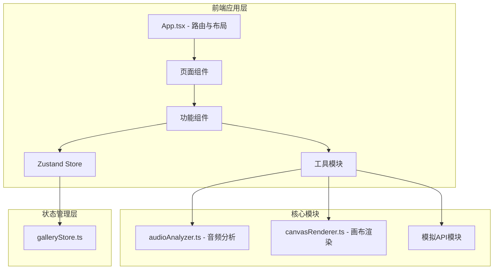

## 1. 架构设计



## 2. 技术描述

- **前端框架**：React 18 + TypeScript
- **构建工具**：Vite 5 + @vitejs/plugin-react
- **状态管理**：Zustand 4
- **路由管理**：React Router DOM（轻量级 Hash 路由或简单状态切换）
- **图标库**：lucide-react
- **工具库**：uuid
- **音频处理**：Web Audio API（原生）
- **图形渲染**：Canvas 2D API（原生）
- **后端**：无，使用模拟 API 模块
- **数据**：前端模拟数据 + localStorage 持久化

## 3. 路由定义

| 路由 | 页面 | 用途 |
|------|------|------|
| / | 首页/上传页 | 音频上传与情绪分析、动态画布展示 |
| /gallery | 画廊页面 | 音频卡片网格浏览、播放交互 |
| /profile | 个人主页 | 用户信息、上传历史、删除操作 |

## 4. 数据模型

### 4.1 音频条目 (AudioItem)

```typescript
interface AudioItem {
  id: string;
  title: string;
  emotion: 'happy' | 'sad' | 'angry' | 'calm';
  intensity: number; // 0-1
  duration: number; // 秒
  playCount: number;
  createdAt: number; // 时间戳
  userId: string;
  audioUrl?: string; // 临时 URL 或 base64
  thumbnailData?: string; // 缩略图 dataURL
}
```

### 4.2 用户信息 (UserInfo)

```typescript
interface UserInfo {
  id: string;
  nickname: string;
  avatar: string; // 头像 URL 或 base64
}
```

### 4.3 情绪分析结果 (EmotionResult)

```typescript
interface EmotionResult {
  emotion: 'happy' | 'sad' | 'angry' | 'calm';
  intensity: number; // 0-1
  spectrumData?: Float32Array; // 实时频谱数据
}
```

### 4.4 播放状态 (PlayState)

```typescript
interface PlayState {
  isPlaying: boolean;
  currentAudioId: string | null;
  isFullscreen: boolean;
}
```

## 5. 核心模块说明

### 5.1 audioAnalyzer 模块

- 输入：ArrayBuffer 音频数据
- 输出：EmotionResult（情绪类型 + 强度）
- 功能：使用 Web Audio API 分析音频特征（节奏、音调、能量等），映射为四种情绪
- 不依赖 React，纯函数模块

### 5.2 canvasRenderer 模块

- 输入：情绪类型、强度、Canvas 上下文、可选实时频谱数据
- 输出：Canvas 渲染（通过 requestAnimationFrame 循环）
- 功能：根据情绪类型绘制不同风格的动态抽象画
- 四种情绪视觉风格：
  - 快乐：彩色圆形平移，碰撞融合
  - 悲伤：纵向流线条，透明度渐变
  - 愤怒：红色尖角旋转闪烁
  - 平静：柔和圆形漂移，边缘光晕
- 支持粒子数量配置（桌面/移动端）

### 5.3 galleryStore (Zustand)

- 管理音频列表
- 管理当前播放状态
- 管理上传状态
- 管理用户信息
- 提供增删改查 actions

## 6. 文件结构

```
src/
├── main.tsx                 # 应用入口
├── App.tsx                  # 路由与布局
├── store/
│   └── galleryStore.ts      # Zustand 状态管理
├── modules/
│   ├── audioAnalyzer.ts     # 音频分析模块
│   └── canvasRenderer.ts    # 画布渲染模块
├── components/
│   ├── AudioUploader.tsx    # 上传组件
│   ├── GalleryCard.tsx      # 画廊卡片组件
│   ├── Navbar.tsx           # 导航栏组件
│   ├── EmotionTag.tsx       # 情绪标签组件
│   └── RippleButton.tsx     # 波纹按钮组件
├── pages/
│   ├── HomePage.tsx         # 首页/上传页
│   ├── GalleryPage.tsx      # 画廊页面
│   └── ProfilePage.tsx      # 个人主页
├── api/
│   └── mockApi.ts           # 模拟 API 模块
├── types/
│   └── index.ts             # 类型定义
└── utils/
    └── helpers.ts           # 工具函数
```

## 7. 性能指标

- 音频分析：30秒音频 ≤ 2秒
- 画布动画：桌面 60FPS，移动端 ≥ 30FPS
- 响应式：<768px 自动调整布局与粒子数
- 脱耦设计：audioAnalyzer 和 canvasRenderer 不依赖 React
