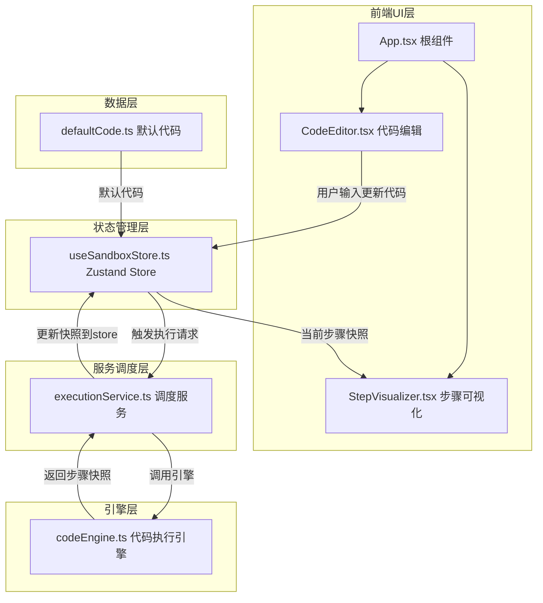

## 1. 架构设计



**数据流向**：
1. CodeEditor → Store：用户输入代码更新store.code
2. Store → executionService：运行请求触发调度
3. executionService → codeEngine：调用引擎解析执行
4. codeEngine → executionService → Store：步骤快照写入store
5. Store → StepVisualizer：当前步骤索引对应快照驱动渲染

## 2. 技术说明

- 前端：React@18 + TypeScript + Vite + TailwindCSS + Zustand
- 初始化工具：vite-init (react-ts模板)
- 后端：无
- 数据库：无
- 代码解析：基于AST模拟执行，不依赖外部解析库，自行实现简易解析器

## 3. 路由定义

| 路由 | 用途 |
|------|------|
| / | 主页面，包含代码编辑区和步骤可视化区 |

## 4. API定义

无后端API，全部前端本地执行。

核心类型定义：

```typescript
interface StepSnapshot {
  lineNumber: number;
  variables: Record<string, { type: string; value: string }>;
  consoleOutput: { timestamp: string; text: string }[];
}

interface SandboxState {
  code: string;
  steps: StepSnapshot[];
  currentStepIndex: number;
  isRunning: boolean;
  setCode: (code: string) => void;
  runCode: () => void;
  setStepIndex: (index: number) => void;
  nextStep: () => void;
  prevStep: () => void;
  reset: () => void;
}
```

## 5. 文件结构

```
├── package.json
├── index.html
├── tsconfig.json
├── vite.config.ts
├── src/
│   ├── main.tsx                    # React应用入口，挂载App
│   ├── App.tsx                     # 根组件，布局框架
│   ├── modules/
│   │   └── codeEngine.ts           # 代码执行引擎，解析AST模拟执行
│   ├── services/
│   │   └── executionService.ts     # 调度服务，连接UI与引擎
│   ├── stores/
│   │   └── useSandboxStore.ts      # Zustand状态管理
│   ├── components/
│   │   ├── CodeEditor.tsx          # 代码编辑区组件
│   │   └── StepVisualizer.tsx      # 步骤可视化组件
│   └── data/
│       └── defaultCode.ts          # 默认代码示例
```

**文件间调用关系**：
- `App.tsx` → `CodeEditor.tsx`, `StepVisualizer.tsx`（组件组合）
- `CodeEditor.tsx` → `useSandboxStore.ts`（读写代码状态）
- `StepVisualizer.tsx` → `useSandboxStore.ts`（读取步骤快照和索引）
- `useSandboxStore.ts` → `executionService.ts`（通过runCode调用调度服务）
- `executionService.ts` → `codeEngine.ts`（调用引擎获取步骤快照）
- `useSandboxStore.ts` → `defaultCode.ts`（初始化默认代码）
