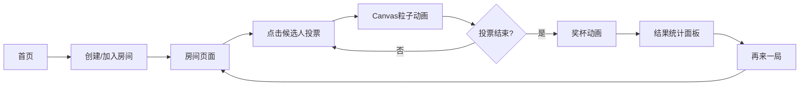

## 1. 产品概述

幻境投票机是一个实时视觉票选互动应用，通过粒子动画可视化投票过程，让投票变得有趣且富有视觉冲击力。用户可以创建房间发起主题投票，参与者实时投票并在Canvas画布上看到粒子花朵/星形图案随票数演化。

- 核心价值：将枯燥的投票过程转化为沉浸式视觉体验
- 目标用户：活动主持人、社群运营者、团队协作者

## 2. 核心功能

### 2.1 功能模块

1. **首页**：房间创建与加入入口，输入房间ID，动画入场效果
2. **房间页面**：候选人列表 + Canvas粒子画布，实时投票与动画展示
3. **结果展示**：投票结束后奖杯动画与得票统计面板

### 2.2 页面详情

| 页面名称 | 模块名称 | 功能描述 |
|---------|---------|---------|
| 首页 | 输入框 | 输入/输出房间ID，支持创建或加入 |
| 首页 | 创建房间按钮 | 生成唯一房间ID，跳转房间页面 |
| 首页 | 加入房间按钮 | 验证房间ID，跳转房间页面 |
| 房间页面 | 候选人列表 | 展示所有候选选项，点击卡片投票 |
| 房间页面 | Canvas画布 | 粒子系统动画，随投票演化图案 |
| 房间页面 | 结果面板 | 投票结束后展示得票数与百分比 |

## 3. 核心流程

用户进入首页 → 输入房间ID或创建新房间 → 进入房间 → 点击候选人投票 → Canvas粒子实时演化 → 投票结束 → 展示奖杯动画与结果统计 → 再来一局

## 4. 用户界面设计

### 4.1 设计风格

- **主色调**：深紫渐变背景 #1A0530 → #2D1B69
- **强调色**：创建房间 #6BCB77，加入房间 #4ECDC4
- **粒子颜色池**：#FF6B6B、#4ECDC4、#FFD93D、#6BCB77
- **卡片背景**：#1A1A2E，边框 #2A2A44
- **按钮样式**：圆角8px，悬停上浮2px加深阴影
- **布局风格**：左侧候选人列表(240px) + 右侧Canvas画布
- **字体**：现代无衬线字体，白色为主

### 4.2 页面设计概览

| 页面名称 | 模块名称 | UI元素 |
|---------|---------|--------|
| 首页 | 入场动画 | 淡入效果0.6s，从透明到不透明 |
| 首页 | 输入框 | 宽320px，圆角12px，#1E1E2E背景 |
| 首页 | 按钮 | 140×44px，圆角8px，悬停上浮 |
| 房间页面 | 候选人卡片 | 220px宽，脉冲光效点击反馈 |
| 房间页面 | Canvas画布 | 深色背景#0B0E27，粒子连线效果 |
| 房间页面 | 结果面板 | 300px宽，百分比条12px高，圆角6px |

### 4.3 响应式设计

- 桌面端优先设计
- Canvas区域自适应剩余宽度
- 候选人列表固定宽度240px

### 4.4 动画设计

- 首页入场：元素淡入0.6秒
- 投票粒子过渡：0.8秒平滑动画
- 点击卡片：脉冲光效
- 结果奖杯动画：1.5秒正弦曲线运动
- 按钮悬停：向上平移2px加深阴影
