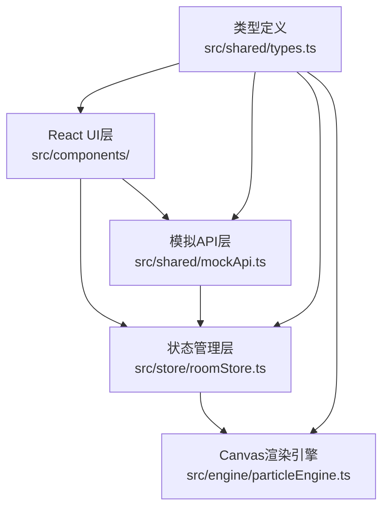

## 1. 架构设计



## 2. 技术说明

- **前端框架**：React 18 + TypeScript
- **构建工具**：Vite
- **状态管理**：Zustand
- **Canvas渲染**：原生Canvas 2D API自定义粒子引擎
- **路由**：React状态路由（无需额外路由库）
- **依赖**：react, react-dom, zustand, typescript, vite, @vitejs/plugin-react, uuid

## 3. 路由定义

| 视图 | 触发条件 | 说明 |
|------|---------|------|
| HomePage | 初始状态 / 无roomId | 首页，创建或加入房间 |
| RoomPage | Zustand store中存在有效roomId | 房间内投票与Canvas展示 |

## 4. 数据模型

### 4.1 类型定义

```typescript
interface Candidate {
  id: string;
  name: string;
  emoji: string;
  color: string;
  votes: number;
}

interface Room {
  id: string;
  title: string;
  candidates: Candidate[];
  status: 'voting' | 'ended';
  totalVotes: number;
}

interface VoteRecord {
  candidateId: string;
  timestamp: number;
}

interface Particle {
  x: number;
  y: number;
  targetX: number;
  targetY: number;
  color: string;
  size: number;
  speed: number;
}
```

## 5. 模块职责

| 模块 | 文件 | 职责 |
|------|------|------|
| UI组件 | src/components/HomePage.tsx | 首页创建/加入房间界面 |
| UI组件 | src/components/RoomPage.tsx | 房间页候选人列表与Canvas布局 |
| 状态管理 | src/store/roomStore.ts | Zustand状态：房间ID、候选人、投票记录、结果 |
| 渲染引擎 | src/engine/particleEngine.ts | 粒子系统初始化、更新、绘制、投票动画、结果展示 |
| 类型定义 | src/shared/types.ts | Candidate、Room、Particle等类型 |
| 模拟API | src/shared/mockApi.ts | 创建房间、提交投票、获取结果的模拟接口 |
| 应用入口 | src/main.tsx | React渲染入口 |
| 根组件 | src/App.tsx | 根据store状态切换HomePage/RoomPage |
