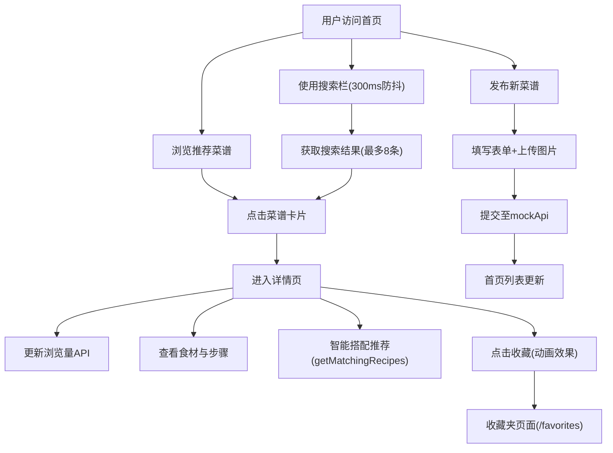

## 1. 产品概述
餐桌灵感库是一个面向美食爱好者的创意菜谱分享与智能搭配平台，解决用户"有食材不知道做什么"和"想分享美食作品"的痛点。
- 主要目的：让用户分享和发现创意菜品，通过智能食材匹配推荐新菜谱
- 目标用户：家庭厨师、美食爱好者、社交媒体内容创作者
- 市场价值：填补菜谱分享与智能搭配结合的空白，建立美食爱好者社群

## 2. 核心功能

### 2.1 用户角色
| 角色 | 注册方式 | 核心权限 |
|------|----------|----------|
| 普通用户 | 无需注册（演示版本） | 浏览菜谱、搜索筛选、收藏菜谱、发布新菜谱、查看智能推荐 |

### 2.2 功能模块
1. **首页**：搜索栏、推荐菜谱卡片网格、导航栏
2. **菜谱详情页**：大图展示、食材列表、制作步骤、智能搭配推荐区
3. **发布页面**：菜品信息表单、图片上传、食材步骤填写
4. **收藏夹页面**：已收藏菜谱网格展示、取消收藏

### 2.3 页面详情
| 页面名称 | 模块名称 | 功能描述 |
|----------|----------|----------|
| 首页 | 搜索栏 | 300ms防抖搜索，模糊匹配菜名和食材，展示8条结果 |
| 首页 | 菜谱卡片网格 | 每行3列（移动端1列），卡片悬停动画，点赞收藏按钮 |
| 菜谱详情页 | 详情展示 | 大图、食材标签、步骤有序列表、浏览量统计 |
| 菜谱详情页 | 智能搭配区 | 背景#F5F0EB，匹配度评分算法（主食材+30/调料+10），Top10推荐 |
| 发布页面 | 表单提交 | 名称/描述/食材(逗号分隔)/步骤(富文本)/图片上传(≤5MB) |
| 收藏夹页面 | 收藏网格 | 移动端2列/桌面端4列，点击取消收藏 |

## 3. 核心流程
用户打开首页 → 浏览推荐菜谱或搜索关键词 → 点击卡片进入详情页 → 查看食材和步骤 → 浏览智能搭配推荐 → 收藏喜欢的菜谱 → 或进入发布页创建新菜谱 → 新菜谱出现在首页列表

## 4. 用户界面设计
### 4.1 设计风格
- **主色调**：陶土红 #C87A5A（标题、按钮）
- **辅助色**：橄榄绿 #7A9E6B（成功提示、食材标签）
- **背景色**：米白色 #FCFAF7
- **卡片阴影**：0px 4px 12px rgba(0,0,0,0.08)，悬停时扩大至 0px 8px 24px rgba(0,0,0,0.15)
- **按钮反馈**：点击时 transform: scale(0.95)
- **圆角**：统一12px
- **字体**：暖色系友好字体，标题使用有衬线字体增强温馨感

### 4.2 页面设计概述
| 页面名称 | 模块名称 | UI元素 |
|----------|----------|--------|
| 首页 | 导航栏 | 暖色系导航，Logo居中，菜单：首页/发布/收藏夹 |
| 首页 | 搜索框 | 宽400px，圆角24px，边框1px #D4C9B8，背景#FCFAF7 |
| 首页 | 菜谱卡片 | 280px宽，12px圆角，渐变占位符→淡入图片，悬停上移4px |
| 详情页 | 智能搭配区 | 背景#F5F0EB，圆角12px，Top10卡片标注匹配度% |
| 收藏按钮 | 心形图标 | 空心#B0A090 → 填充#E74C3C，放大1.2倍动画(0.2s) |

### 4.3 响应式设计
- **桌面端(≥768px)**：首页3列网格，收藏夹4列，浮动面板固定宽度
- **移动端(<768px)**：卡片单列布局，浮动面板全屏覆盖，收藏夹2列
- **图片**：懒加载，滚动60FPS帧率

### 4.4 动效与微交互
- 图片加载：渐变色占位符(#ECE9E0→#F5F0EB)→加载完成淡入0.5s
- 卡片悬停：上移4px + 阴影扩大，过渡0.3s ease
- 收藏按钮：scale(1.2)放大动画，持续0.2s
- 搜索结果：实时显示，流畅出现动画
