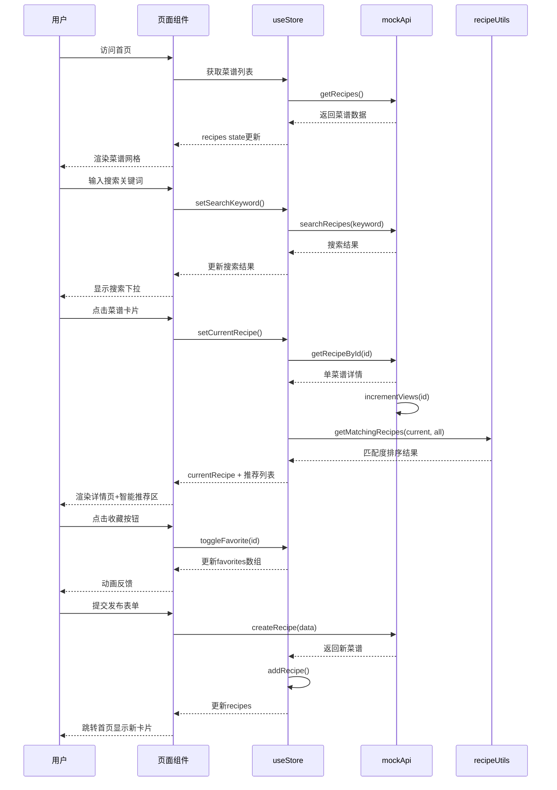

## 1. 架构设计

```mermaid
graph TD
    subgraph "前端应用层"
        A["App.tsx - 主应用入口
        A --> B["页面层 (Pages)"]
        A --> C["组件层 (Components)"]
        A --> D["状态管理层 (Store)"]
    end

    subgraph "业务逻辑层"
        D --> E["模拟API层 (mockApi)"]
        C --> F["共享逻辑层 (shared)"]
    end

    subgraph "数据与工具层"
        E --> G["types.ts - 类型定义"]
        F --> H["recipeUtils.ts - 食材搭配算法"]
    end

    B --> I["HomePage 首页"]
    B --> J["RecipeDetailPage 详情页"]
    B --> K["PublishPage 发布页"]
    B --> L["FavoritesPage 收藏页"]
    C --> M["RecipeCard 菜谱卡片"]
    C --> N["SearchBar 搜索栏"]
    D --> O["useStore Zustand仓库"]
    E --> P["getRecipes / getRecipeById"]
    E --> Q["searchRecipes / createRecipe"]
    F --> R["getMatchingRecipes 智能匹配"]
```

## 2. 技术描述
- **前端框架**：React 18 + TypeScript 5
- **构建工具**：Vite 5
- **状态管理**：Zustand 4
- **路由**：React Router DOM 6
- **样式**：原生CSS（CSS Modules）
- **工具库**：uuid（生成唯一ID
- **后端**：无后端，使用模拟API

## 3. 路由定义
| 路由路径 | 页面组件 | 用途 |
|-----------|----------|------|
| / | HomePage | 首页，展示推荐菜谱和搜索 |
| /recipe/:id | RecipeDetailPage | 单个菜谱详情页 |
| /publish | PublishPage | 发布新菜谱页面 |
| /favorites | FavoritesPage | 收藏夹页面 |

## 4. 类型定义 (src/shared/types.ts)

```typescript
interface User {
  id: string;
  name: string;
  avatar: string;
}

interface Ingredient {
  name: string;
  amount: string;
  category: 'meat' | 'vegetable' | 'seasoning' | 'other';
}

interface Recipe {
  id: string;
  title: string;
  description: string;
  image: string;
  ingredients: Ingredient[];
  steps: string[];
  author: User;
  likes: number;
  views: number;
  createdAt: string;
}

interface StoreState {
  recipes: Recipe[];
  currentRecipe: Recipe | null;
  searchKeyword: string;
  favorites: string[];
  setRecipes: (recipes: Recipe[]) => void;
  setCurrentRecipe: (recipe: Recipe | null) => void;
  setSearchKeyword: (keyword: string) => void;
  toggleFavorite: (recipeId: string) => void;
  addRecipe: (recipe: Recipe) => void;
}
```

## 5. 数据流说明

### 5.1 数据流向图


## 6. 文件结构与职责
```
auto65/
├── package.json
├── vite.config.ts
├── tsconfig.json
├── index.html
└── src/
│   ├── App.tsx                    # 主应用，路由配置路由和全局Provider
│   ├── main.tsx                 # 应用入口
│   ├── index.css               # 全局样式
│   ├── pages/
│   │   ├── HomePage.tsx        # 首页：搜索+网格渲染
│   │   ├── RecipeDetailPage.tsx # 详情页：大图+食材+步骤+推荐
│   │   ├── PublishPage.tsx    # 发布页：表单+图片上传
│   │   └── FavoritesPage.tsx # 收藏页：收藏网格
│   ├── components/
│   │   ├── RecipeCard.tsx     # 菜谱卡片（memo优化）
│   │   ├── Navbar.tsx         # 导航栏
│   │   └── SearchBar.tsx     # 搜索栏（防抖）
│   ├── store/
│   │   └── useStore.ts       # Zustand全局仓库
│   ├── data/
│   │   └── mockApi.ts        # 模拟异步API
│   └── shared/
│       ├── types.ts            # TS类型定义
│       └── recipeUtils.ts  # 食材解析+搭配算法
```

## 7. 性能优化策略
1. **React.memo**：RecipeCard使用memo避免不必要重渲染
2. **图片懒加载**：原生loading="lazy" + IntersectionObserver
3. **搜索防抖**：300ms debounce减少API调用
4. **CSS动画**：优先transform/opacity实现GPU加速
5. **懒加载图片**：渐变色占位→淡入显示
6. **列表虚拟化**：长列表优化（预留接口）
