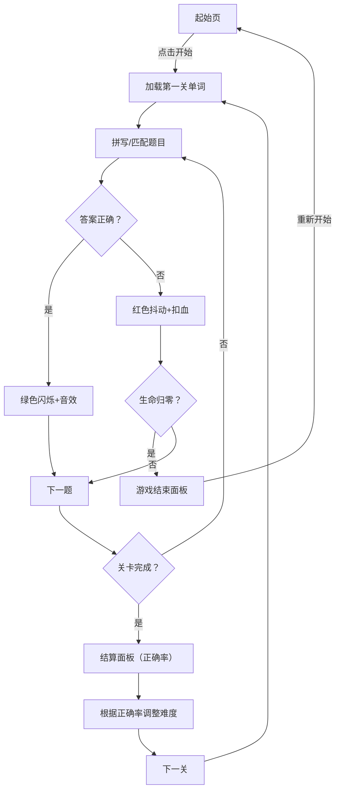

## 1. 产品概述
单词方舟是一款交互式英语单词学习与记忆应用，通过拼写闯关和词义匹配两种游戏模式帮助用户巩固词汇。采用深色海洋主题，营造沉浸式学习氛围，通过生命系统、难度分级和即时反馈机制提升学习动力。
- 核心功能：拖拽拼写、词义匹配、难度自适应、生命闯关系统
- 目标用户：英语学习者，尤其是需要通过游戏化方式提升词汇量的用户

## 2. 核心功能

### 2.1 用户角色
| 角色 | 注册方式 | 核心权限 |
|------|----------|----------|
| 普通用户 | 无需注册 | 体验完整游戏流程，查看学习进度 |

### 2.2 功能模块
1. **起始页面**：品牌展示、开始游戏按钮、背景渐变动画
2. **导航栏**：品牌Logo、生命值心形图标显示
3. **游戏主界面**：
   - 拼写模式：中文提示、字母卡片拖拽区、输入放置区、提交按钮
   - 匹配模式：英文单词、四个中文释义选项、确认按钮
4. **进度条**：关卡进度可视化、当前题目脉冲标记
5. **关卡结算**：环形进度条显示正确率、得分统计、下一关按钮
6. **游戏结束**：总得分统计、最远关卡记录、重新开始按钮

### 2.3 页面详情
| 页面名称 | 模块名称 | 功能描述 |
|----------|----------|----------|
| 起始页 | 品牌区 | 展示"单词方舟"Logo和简介文案 |
| 起始页 | 开始按钮 | 点击启动游戏，加载第一关单词 |
| 游戏页 | 导航栏 | 显示品牌Logo和剩余生命值（心形图标） |
| 游戏页 | 拼写区 | 中文释义提示、拖拽字母卡片、放置区排序 |
| 游戏页 | 匹配区 | 英文单词展示、四选一中文释义选择 |
| 游戏页 | 反馈区 | 正确/错误的视觉和音效反馈 |
| 结算页 | 统计面板 | 正确率环形图、得分、难度调整提示 |
| 结束页 | 总结面板 | 总得分、最远关卡、重新开始入口 |

## 3. 核心流程
用户进入应用 → 点击开始按钮 → 随机抽取10个单词（根据当前难度）→ 逐题作答（第5、10题为词义匹配，其余为拼写）→ 答对获得正确反馈，答错扣生命值 → 完成10题后显示关卡结算和统计 → 根据正确率调整下一关难度 → 生命归零后游戏结束，显示总得分和最远关卡

## 4. 用户界面设计

### 4.1 设计风格
- **主色调**：深蓝渐变色背景（#0F2027 → #203A43），营造海洋/方舟的沉浸感
- **强调色**：青绿色 #4ECDC4（操作元素）、绿色 #6BCB77（正确反馈）、红色 #FF6B6B（错误反馈）、黄色 #FFD93D（警告/拖拽提示）
- **字体**：正文字体 - 现代无衬线字体；品牌Logo - 自定义艺术字体（24px，青绿色）
- **按钮样式**：圆角设计，悬停时亮度+10%并上移2px，过渡0.15秒缓出
- **布局风格**：居中卡片式布局，最大宽度960px，左右安全边距20px
- **动画效果**：卡片悬停微交互、拖拽缩放、正确闪烁、错误抖动、脉冲进度标记

### 4.2 页面设计概览
| 页面名称 | 模块名称 | UI元素 |
|----------|----------|--------|
| 起始页 | 品牌区 | 渐变背景、大号艺术字Logo（24px+）、副标题说明 |
| 起始页 | 开始按钮 | 200×50px，圆角25px，#4ECDC4背景，悬停效果 |
| 游戏页 | 导航栏 | 60px高度，左侧Logo，右侧3个心形图标（24px，间距12px） |
| 游戏页 | 拼写字母卡 | 48×54px，圆角8px，#2D4A6C背景，22px白色文字，手风琴flex-wrap布局，间距8px |
| 游戏页 | 放置区 | 48px高度，虚线#4ECDC4边框，圆角8px，拖拽目标位置虚线#FFD93D轮廓 |
| 游戏页 | 匹配选项 | 140×40px按钮，圆角8px，#1A3A5C背景，悬停#2D5A8A |
| 进度条 | 进度标记 | 100%宽度，8px高度，#E0E0E0背景，填充#4ECDC4，圆点标记题目，当前题12px脉冲动画，0.3秒缓出过渡 |
| 结算页 | 环形图 | 320×面板，#0F2027背景，圆角12px，8px环宽，#4ECDC4颜色，中央百分比 |
| 结束页 | 结束面板 | 400px宽，#1E293B背景，圆角16px，总得分+最远关卡 |

### 4.3 响应式设计
- 桌面优先设计，主游戏区最大宽度960px居中
- 移动端自适应：字母卡片尺寸和间距根据屏幕宽度调整
- 触摸优化：拖拽操作支持touch事件，最小点击区域44px

### 4.4 性能优化
- 拖拽操作使用requestAnimationFrame实现60FPS流畅度
- CSS动画优先，避免频繁重排重绘
- 单次提交反馈动画总时长≤0.8秒
- 字母卡片使用transform和opacity实现动画，避免布局抖动
