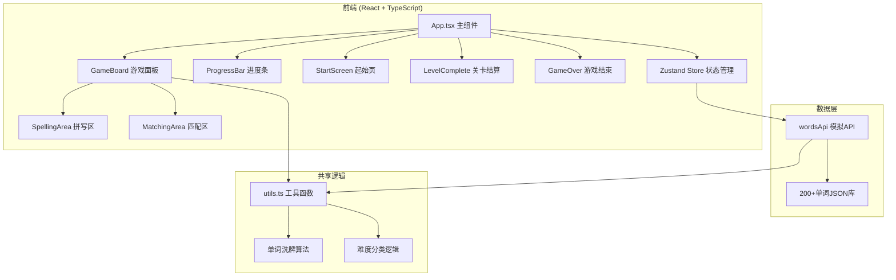

## 1. 架构设计


## 2. 技术描述
- **前端框架**：React@18 + TypeScript（严格模式，target ES2020，moduleResolution bundler）
- **构建工具**：Vite（@vitejs/plugin-react，开发服务器默认端口5173）
- **状态管理**：Zustand（轻量级状态管理，管理游戏全局状态）
- **唯一ID生成**：uuid
- **后端**：无，使用模拟API（Promise封装的本地JSON数据）
- **样式方案**：原生CSS + CSS Modules，使用CSS变量管理主题色

## 3. 路由/页面结构
本应用为单页应用，通过Zustand状态切换视图，无需路由库。页面状态流转：
| 状态 | 触发条件 | 展示组件 |
|------|----------|----------|
| start | 初始状态/重新开始 | StartScreen 起始页 |
| playing | 点击开始/下一关 | GameBoard + ProgressBar |
| levelComplete | 完成当前关10题 | LevelComplete 结算面板 |
| gameOver | 生命值归零 | GameOver 结束面板 |

## 4. 模块与数据定义

### 4.1 数据类型定义
```typescript
interface Word {
  id: string;
  word: string;
  meaning: string;
  partOfSpeech: string;
  difficulty: '初级' | '中级' | '高级';
  example: string;
}

interface GameState {
  screen: 'start' | 'playing' | 'levelComplete' | 'gameOver';
  currentLevel: number;
  currentDifficulty: '初级' | '中级' | '高级';
  lives: number;
  totalCorrect: number;
  totalAnswered: number;
  currentWordIndex: number;
  currentWords: Word[];
  levelCorrect: number;
  userInputHistory: Array<{ wordId: string; correct: boolean; mode: 'spelling' | 'matching' }>;
  farLevel: number;
  totalScore: number;
}
```

### 4.2 文件结构
```
d:\Pro\tasks\auto67/
├── package.json
├── index.html
├── tsconfig.json
├── vite.config.js
└── src/
    ├── App.tsx                 # 主组件，全局布局和状态切换
    ├── main.tsx                # React入口
    ├── index.css               # 全局样式，主题变量
    ├── store/
    │   └── gameStore.ts        # Zustand状态管理
    ├── api/
    │   └── wordsApi.ts         # 模拟API，200+单词库
    ├── shared/
    │   └── utils.ts            # 共享逻辑（洗牌、难度分类）
    └── components/
        ├── GameBoard.tsx       # 核心游戏面板
        ├── ProgressBar.tsx     # 底部进度条
        ├── StartScreen.tsx     # 起始页
        ├── LevelComplete.tsx   # 关卡结算
        └── GameOver.tsx        # 游戏结束
```

### 4.3 Zustand Store Actions
| Action | 描述 | 参数 |
|--------|------|------|
| startGame | 开始新游戏，重置所有状态 | 无 |
| nextLevel | 加载下一关单词 | 无 |
| submitAnswer | 提交答案，更新生命值/正确率 | wordId: string, correct: boolean, mode: string |
| adjustDifficulty | 根据正确率调整难度 | correctRate: number |
| goToScreen | 切换页面状态 | screen: string |

### 4.4 模拟API
| 函数 | 描述 | 返回值 |
|------|------|--------|
| fetchWords | 根据难度异步获取单词，随机抽取10个 | Promise<Word[]> |
| getAllWords | 获取全部200+单词库 | Word[] |

### 4.5 共享工具函数
| 函数 | 描述 | 参数 | 返回值 |
|------|------|------|--------|
| shuffleArray | Fisher-Yates洗牌算法 | array: T[] | T[] |
| extractLetters | 提取并打乱单词字母（添加干扰字母凑够6个） | word: string | string[] |
| classifyDifficulty | 根据正确率返回新难度 | currentDiff, correctRate | 难度等级 |
| playSound | 使用Web Audio API播放音效 | frequency, duration | void |
