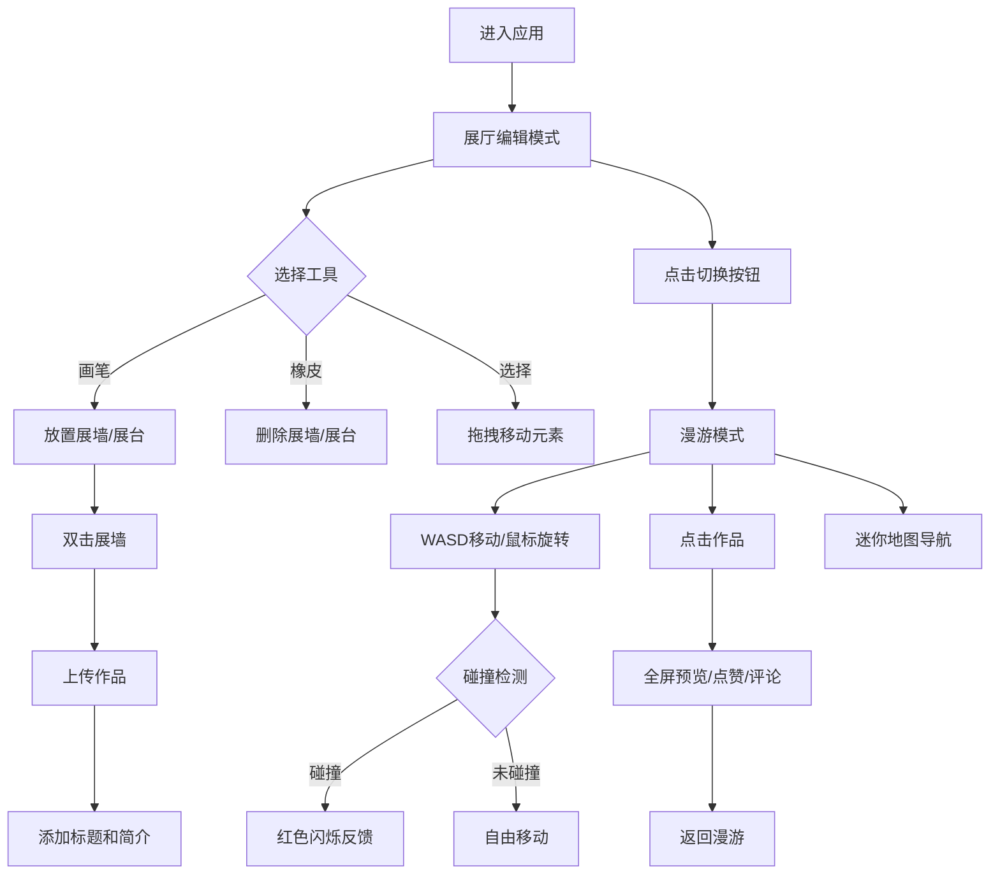

## 1. 产品概述

互动式虚拟画廊是一个让艺术家布置私人3D风格虚拟展厅、访客自由漫游并互动的Web应用。解决传统线上作品展示缺乏沉浸感和个性化探索体验的问题，目标用户为数字艺术家、策展人和艺术爱好者。

- 艺术家可以创建和编辑展厅，放置展墙、展台，上传作品并标注
- 访客可以第一人称视角漫游展厅，点赞评论作品，查看统计数据

## 2. 核心功能

### 2.1 用户角色

| 角色 | 注册方式 | 核心权限 |
|------|----------|----------|
| 艺术家 | 邮箱注册 | 创建展厅、编辑布局、上传作品、管理展厅 |
| 访客 | 邮箱注册 | 浏览展厅、漫游探索、点赞评论、查看统计 |

### 2.2 功能模块

1. **展厅编辑器页面**: 2.5D俯视网格画布、顶部工具栏、展墙/展台放置与编辑、右键菜单操作
2. **访客漫游页面**: 第一人称视角、WASD移动、鼠标旋转、迷你地图、碰撞反馈

### 2.3 页面详情

| 页面名称 | 模块名称 | 功能描述 |
|----------|----------|----------|
| 展厅编辑器 | 网格画布 | 100x100px格子画布，支持放置展墙(80x200px)和展台(圆形半径20px)，拖拽调整位置 |
| 展厅编辑器 | 工具栏 | 画笔/橡皮/选择三种模式，画笔放置、橡皮删除、选择移动 |
| 展厅编辑器 | 右键菜单 | 删除或旋转已放置的展墙/展台 |
| 展厅编辑器 | 作品上传 | 双击展墙弹出模态框，支持URL粘贴或拖拽上传，自动缩放适配 |
| 展厅编辑器 | 作品标注 | 作品标题(14px白色)和简介(12px #A0A0B0)，点击全屏预览 |
| 展厅编辑器 | 互动面板 | 心形点赞按钮(缩放动画)、评论输入框(回车提交)、评论列表 |
| 展厅编辑器 | 统计信息 | 访客计数器(14px #FFD93D)、作品总数(白色14px) |
| 访客漫游 | 第一人称视角 | WASD移动(200px/s)、鼠标拖动旋转(阻尼0.9)、碰撞红色闪烁反馈(0.3s) |
| 访客漫游 | 迷你地图 | 120x120px半透明悬浮地图，白点标记位置 |
| 全局 | 模式切换 | 右上角切换按钮(#FF6B6B，悬停#FF4757)，编辑/漫游模式切换 |

## 3. 核心流程

用户打开应用后进入展厅编辑模式，可通过工具栏选择画笔模式在网格上放置展墙和展台，双击展墙上传作品并添加标题简介。编辑完成后点击切换按钮进入漫游模式，以第一人称视角在展厅中自由行走，碰撞展墙时出现红色闪烁反馈。漫游中可点击作品查看全屏预览、点赞和评论。

## 4. 用户界面设计

### 4.1 设计风格

- 主背景色: #0D0D1A（深色太空主题）
- 卡片/面板背景: #1A1A2E
- 展墙背景: #1E1E2E，边框2px #5A5A7A
- 展台背景: #3D3D5C
- 网格背景: #2D2D44，网格线1px #4A4A6A
- 按钮/成功色: #6BCB77
- 高亮色: #4ECDC4（工具栏激活状态）
- 警告/点赞色: #FF6B6B，悬停#FF4757
- 访客计数器: #FFD93D
- 文字: 默认白色，辅助文字#A0A0B0
- 按钮悬停效果: translateY(-2px)，过渡0.2s
- 模态框: 背景#1A1A2E，圆角12px，边框1px #3A3A5C
- 评论输入框: 背景#1E1E2E，圆角8px，边框1px #3A3A5C
- 字体: 系统字体栈，标题14px白色，简介12px #A0A0B0

### 4.2 页面设计概览

| 页面名称 | 模块名称 | UI元素 |
|----------|----------|--------|
| 展厅编辑器 | 网格画布 | 深色太空背景，网格线分隔，展墙为深色矩形带边框，展台为圆形 |
| 展厅编辑器 | 工具栏 | 顶部固定栏，三个模式按钮(#6BCB77，激活#4ECDC4)，悬停上移效果 |
| 展厅编辑器 | 作品上传模态框 | 深色半透明遮罩，居中模态框，URL输入框和拖拽区域 |
| 展厅编辑器 | 作品标注 | 作品缩略图(圆角4px)，标题白色14px，简介灰蓝12px |
| 展厅编辑器 | 互动面板 | 心形点赞按钮(灰→红动画)，评论数白色12px，评论输入框和列表 |
| 展厅编辑器 | 统计区域 | 左上角访客计数器金色14px，作品总数白色14px |
| 访客漫游 | 迷你地图 | 左侧悬浮120x120px，半透明黑色背景，白色点标记 |
| 全局 | 模式切换按钮 | 右上角#FF6B6B按钮，悬停#FF4757，过渡0.2s |

### 4.3 响应式适配

- 桌面优先设计
- 宽度 < 768px 时：网格格子和展墙等比例缩小50%，工具栏变为底部固定栏(高度60px)
- 触屏设备：支持触摸拖拽放置和双指缩放

### 4.4 3D场景指导

- 2.5D俯视视角用于编辑模式，第一人称视角用于漫游模式
- 深色太空氛围，暗色调环境
- 碰撞反馈使用红色闪烁效果(持续0.3s)
- 漫游视角旋转阻尼0.9，移动速度200px/s
- 编辑模式帧率目标60FPS(帧耗时<16ms)，漫游模式30FPS(帧耗时<33ms)
