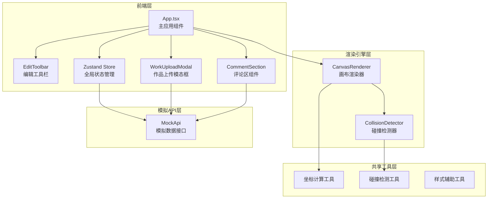
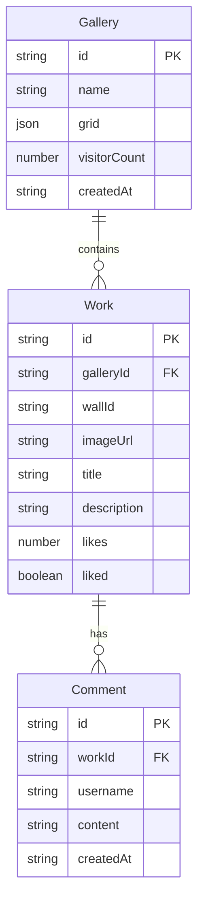

## 1. 架构设计



## 2. 技术说明

- 前端: React 18 + TypeScript + Zustand + Canvas API
- 构建工具: Vite
- 初始化工具: vite-init (react-ts模板)
- 后端: 无（纯前端，使用MockApi模拟）
- 数据库: 无（使用内存状态 + MockApi模拟数据）
- CSS方案: Tailwind CSS + CSS Modules（局部样式）

## 3. 路由定义

| 路由 | 用途 |
|------|------|
| / | 主展厅编辑器页面（包含编辑模式和漫游模式切换） |

## 4. API定义

### 4.1 数据类型

```typescript
interface Gallery {
  id: string;
  name: string;
  grid: CellType[][];
  visitorCount: number;
  createdAt: string;
}

interface Work {
  id: string;
  galleryId: string;
  wallId: string;
  imageUrl: string;
  title: string;
  description: string;
  likes: number;
  liked: boolean;
  comments: Comment[];
}

interface Comment {
  id: string;
  workId: string;
  username: string;
  content: string;
  createdAt: string;
}

type CellType = 'empty' | 'wall' | 'platform';
type ToolMode = 'brush' | 'eraser' | 'select';
type ViewMode = 'edit' | 'roam';
```

### 4.2 模拟API接口

| 方法 | 接口 | 描述 | 延迟 |
|------|------|------|------|
| GET | getGalleries() | 返回展厅列表 | 500ms |
| GET | getWorksByGallery(galleryId) | 返回展厅作品列表 | 500ms |
| POST | postComment(workId, content) | 提交评论 | 500ms |
| POST | postLike(workId) | 点赞/取消点赞 | 300ms |

## 5. 数据模型

### 5.1 数据模型定义



## 6. 文件组织结构

```
├── package.json
├── index.html
├── vite.config.ts
├── tsconfig.json
├── src/
│   ├── App.tsx                    # 主应用组件
│   ├── store.ts                   # Zustand全局状态
│   ├── main.tsx                   # 入口文件
│   ├── index.css                  # 全局样式
│   ├── engine/
│   │   ├── CanvasRenderer.ts      # 画布渲染引擎
│   │   └── CollisionDetector.ts   # 碰撞检测模块
│   ├── api/
│   │   └── MockApi.ts             # 模拟API
│   ├── components/
│   │   ├── EditToolbar.tsx        # 编辑工具栏
│   │   ├── WorkUploadModal.tsx    # 作品上传模态框
│   │   └── CommentSection.tsx     # 评论区组件
│   └── shared/
│       ├── coord.ts               # 坐标计算工具
│       ├── collision.ts           # 碰撞检测工具
│       └── styles.ts              # 样式辅助常量
```
