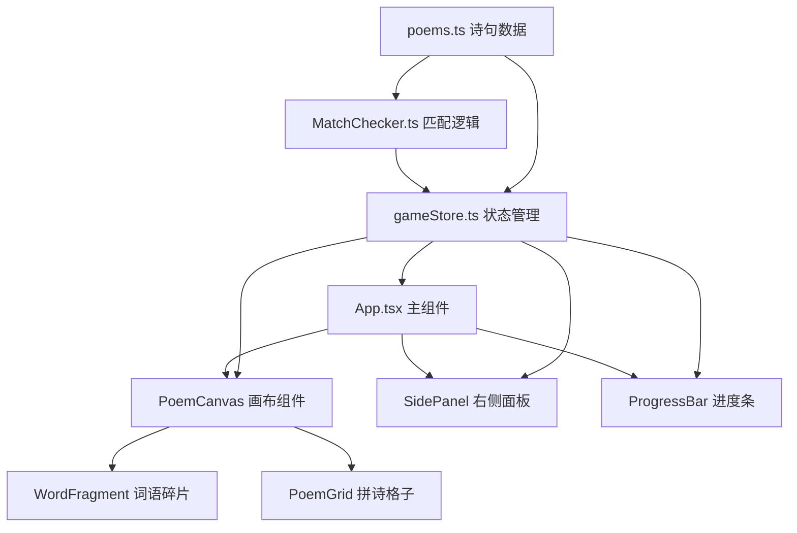

## 1. 架构设计



## 2. 技术描述
- **前端框架**：React 18 + TypeScript
- **构建工具**：Vite 5
- **状态管理**：Zustand 4
- **ID 生成**：uuid 9
- **样式方案**：原生 CSS + CSS Variables（无 Tailwind）
- **动画方案**：CSS Transitions + Keyframes + requestAnimationFrame
- **拖拽实现**：原生 React 拖拽事件 + 自定义 hooks

## 3. 文件结构定义
| 文件路径 | 用途 |
|---------|------|
| `package.json` | 项目依赖和脚本配置 |
| `index.html` | 入口 HTML，加载书法字体 |
| `tsconfig.json` | TypeScript 严格模式配置 |
| `vite.config.js` | Vite 基础配置 |
| `src/App.tsx` | 主组件，组合画布、面板和进度条 |
| `src/data/poems.ts` | 诗句数据，包含完整诗句和碎片列表 |
| `src/logic/MatchChecker.ts` | 匹配逻辑，检测碎片组合 |
| `src/state/gameStore.ts` | Zustand 全局状态管理 |
| `src/components/PoemCanvas.tsx` | 宣纸画布主组件 |
| `src/components/WordFragment.tsx` | 可拖拽词语碎片组件 |
| `src/components/PoemGrid.tsx` | 拼诗格子容器组件 |
| `src/components/SidePanel.tsx` | 右侧辅助面板组件 |
| `src/components/ProgressBar.tsx` | 底部进度条组件 |
| `src/components/ParticleEffect.tsx` | 粒子动画效果组件 |
| `src/hooks/useDrag.ts` | 拖拽逻辑自定义 hook |
| `src/types/index.ts` | TypeScript 类型定义 |
| `src/styles/global.css` | 全局样式和 CSS 变量 |

## 4. 数据模型

### 4.1 诗句数据模型
```typescript
interface Poem {
  id: string;
  title: string;
  author: string;
  lines: PoemLine[];
}

interface PoemLine {
  id: string;
  text: string;
  fragments: string[];
  characterCount: 5 | 7;
}
```

### 4.2 游戏状态模型
```typescript
interface GameState {
  currentPoemId: string;
  currentLineIndex: number;
  placedFragments: (string | null)[];
  availableFragments: Fragment[];
  completedLines: string[];
  score: number;
  combo: number;
  hintsRemaining: number;
  elapsedTime: number;
  lastActionTime: number;
  isComplete: boolean;
  highlightedFragmentId: string | null;
}

interface Fragment {
  id: string;
  text: string;
  x: number;
  y: number;
  isUsed: boolean;
}
```

## 5. 核心 API 定义

### 5.1 MatchChecker API
```typescript
interface MatchResult {
  isMatch: boolean;
  matchedLineIndex: number | null;
  matchedText: string | null;
}

function checkMatch(
  placedFragments: (string | null)[],
  poemLines: PoemLine[]
): MatchResult;
```

### 5.2 GameStore Actions
```typescript
interface GameActions {
  placeFragment: (gridIndex: number, fragmentId: string) => void;
  removeFragment: (gridIndex: number) => void;
  updateFragmentPosition: (fragmentId: string, x: number, y: number) => void;
  shuffleFragments: () => void;
  useHint: () => void;
  resetCombo: () => void;
  nextLine: () => void;
  updateTime: () => void;
  resetGame: () => void;
}
```

## 6. 性能优化策略

### 6.1 拖拽性能
- 使用 `transform: translate()` 而非 `top/left` 实现定位
- 开启 GPU 加速：`will-change: transform`
- 拖拽更新使用 `requestAnimationFrame` 节流
- 避免拖拽过程中触发重排重绘

### 6.2 动画性能
- 粒子动画使用 CSS transforms 和 opacity
- 限制粒子数量为 30 个
- 动画使用 `ease-out` 缓动函数
- 组件使用 `React.memo` 避免不必要重渲染

### 6.3 状态更新
- Zustand 选择器精确订阅所需状态
- 状态更新批量处理
- 避免在拖拽过程中频繁更新全局状态

## 7. 响应式断点
| 断点 | 格子尺寸 | 碎片尺寸 | 布局 |
|------|----------|----------|------|
| ≥ 768px | 40px × 50px | 60-80px × 40px | 画布 + 右侧面板 |
| < 768px | 30px × 38px | 50px × 32px | 自适应单列布局 |
