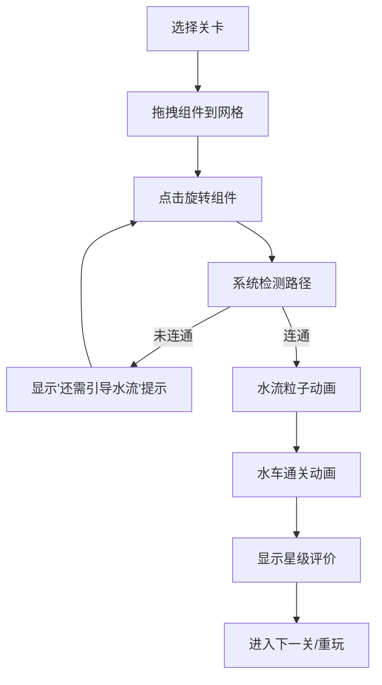

## 1. 产品概述

渡槽迷城是一款以古罗马水渠为灵感的策略解谜游戏，玩家通过放置和旋转水渠组件将水流从水塔引导到水神庙。

- **核心玩法**：玩家利用引水槽、阀门和分流器连接水源与目标，每关地形和布局不同
- **目标用户**：休闲解谜游戏爱好者，适合各年龄段玩家
- **产品价值**：通过有趣的水流模拟和古罗马主题，提供轻松而富有挑战性的解谜体验

---

## 2. 核心功能

### 2.1 用户角色
| 角色 | 注册方式 | 核心权限 |
|------|----------|----------|
| 玩家 | 无需注册 | 选择关卡、放置组件、旋转组件、查看得分 |

### 2.2 功能模块
1. **主游戏场景**：Canvas 渲染网格、水渠组件、水流粒子动画
2. **UI控制面板**：组件工具栏、步数统计、星级评价、重置按钮
3. **关卡系统**：5个难度递增的关卡，网格从6x6到12x12
4. **水流模拟**：路径连通检测、粒子流动画、水车通关动画

### 2.3 页面详情
| 页面名称 | 模块名称 | 功能描述 |
|----------|----------|----------|
| 游戏主界面 | 游戏画布 | 60fps Canvas渲染，绘制网格、组件、水流粒子 |
| 游戏主界面 | 顶部状态栏 | 显示关卡名称、当前步数、星级评价区域 |
| 游戏主界面 | 底部工具栏 | 可拖拽的水渠组件按钮（直管、弯管、三通、阀门） |
| 游戏主界面 | 提示区域 | 显示连通状态提示和通关动画 |

---

## 3. 核心流程

玩家选择关卡 → 从工具栏拖拽组件到网格 → 点击已放置组件旋转 → 系统检测路径连通性 → 连通后水流动画播放 → 显示水车通关动画和星级评价

---

## 4. 用户界面设计

### 4.1 设计风格
- **配色方案**：古罗马风格，主背景浅米色#F5E6D3，深棕色#8B5E3C网格线，地形从浅绿#A3D977到沙黄#E8D5A4渐变
- **UI控件**：仿石材质感，rgba(255,248,230,0.9)背景，2px #C8A96E描边，圆角8px
- **工具栏**：半透明深色#1E293B背景，圆角12px，按钮间距8px
- **字体**：选择具有古典感的衬线字体作为标题，简洁无衬线字体作为正文
- **动画**：组件旋转200ms ease-out，按钮点击150ms弹性上弹，60fps水流粒子动画

### 4.2 页面设计详情
| 页面名称 | 模块名称 | UI元素 |
|----------|----------|--------|
| 游戏主界面 | 游戏画布 | 居中展示，90%视口宽度，最大1200px，左右20px边距，12x12网格 |
| 游戏主界面 | 顶部状态栏 | 关卡名称（左侧）、步数计数（中间）、星级评价（右侧，16x16px金色星星） |
| 游戏主界面 | 底部工具栏 | 48x48px SVG组件按钮，白色描边#94A3B8，手机端36x36px两行排列 |
| 游戏主界面 | 提示文字 | 12px #FF6B6B红色文字，画面中央上方，2秒后渐隐 |

### 4.3 响应式设计
- **桌面端**：组件按钮48x48px，单行排列
- **移动端**：组件按钮36x36px，两行排列，触摸区域优化
- **整体布局**：游戏画面始终居中，宽度自适应，最大1200px

### 4.4 视觉特效
- **水流粒子**：蓝色#3B82F6到#06B6D4渐变，直径4px，速度每帧2px，路径节点处分叉
- **路径光晕**：blur 8px，水流颜色透明度0.3，沿管道边缘散射
- **水车动画**：8个叶片，直径60px，旋转周期1秒，白色半透明水花粒子2-5px，持续2秒
- **未连通路径**：灰色虚线显示

---
