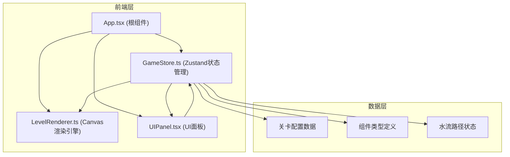

## 1. 架构设计



**数据流向说明：**
1. `GameStore.ts` → `LevelRenderer.ts`：游戏状态、网格数据、组件列表、水流路径
2. `GameStore.ts` → `UIPanel.tsx`：关卡信息、步数、得分、可用组件
3. `UIPanel.tsx` → `GameStore.ts`：用户操作（放置组件、旋转、重置）
4. `LevelRenderer.ts` → `GameStore.ts`：鼠标交互（点击网格、拖拽放置）

---

## 2. 技术选型

| 类别 | 技术 | 版本 | 用途 |
|------|------|------|------|
| 框架 | React | 18.x | 前端UI框架 |
| 语言 | TypeScript | 5.x | 类型安全 |
| 构建工具 | Vite | 5.x | 开发构建 |
| 状态管理 | Zustand | 4.x | 全局状态管理 |
| 渲染 | Canvas 2D | - | 游戏画面渲染 |

**依赖包：**
- `react`、`react-dom`：React核心库
- `zustand`：轻量级状态管理
- `typescript`：类型系统
- `vite`、`@vitejs/plugin-react`：构建工具

---

## 3. 目录结构

```
auto7/
├── package.json          # 项目依赖配置
├── index.html            # 入口HTML
├── vite.config.js        # Vite配置
├── tsconfig.json         # TypeScript配置
├── src/
│   ├── App.tsx           # 根组件，集成游戏场景和UI
│   ├── game/
│   │   ├── GameStore.ts  # Zustand全局状态管理
│   │   ├── LevelRenderer.ts  # Canvas渲染引擎
│   │   └── types.ts      # 类型定义
│   └── ui/
│       └── UIPanel.tsx   # UI控制面板
```

**文件调用关系：**
1. [App.tsx](file:///d:/Pro/tasks/auto7/src/App.tsx) → 加载 [GameStore](file:///d:/Pro/tasks/auto7/src/game/GameStore.ts) 状态，渲染 [LevelRenderer](file:///d:/Pro/tasks/auto7/src/game/LevelRenderer.ts) 和 [UIPanel](file:///d:/Pro/tasks/auto7/src/ui/UIPanel.tsx)
2. [GameStore.ts](file:///d:/Pro/tasks/auto7/src/game/GameStore.ts) → 管理所有游戏状态，提供操作方法
3. [LevelRenderer.ts](file:///d:/Pro/tasks/auto7/src/game/LevelRenderer.ts) → 订阅GameStore，Canvas渲染，处理鼠标交互
4. [UIPanel.tsx](file:///d:/Pro/tasks/auto7/src/ui/UIPanel.tsx) → 订阅GameStore，显示UI，发送用户操作到GameStore

---

## 4. 核心数据模型

### 4.1 组件类型定义

```typescript
// 水渠组件类型
type PipeType = 'straight' | 'curve' | 'tee' | 'valve';

// 方向：上、右、下、左
type Direction = 0 | 1 | 2 | 3;

// 网格单元格
interface GridCell {
  x: number;
  y: number;
  pipeType: PipeType | null;
  rotation: Direction;  // 0-3 对应 0°, 90°, 180°, 270°
  isWaterSource: boolean;  // 是否是水塔
  isTarget: boolean;  // 是否是水神庙
  terrainType: 'grass' | 'sand';
}

// 水流粒子
interface WaterParticle {
  id: number;
  x: number;
  y: number;
  targetX: number;
  targetY: number;
  progress: number;  // 0-1 路径进度
  pathIndex: number;  // 当前在路径中的节点索引
  color: string;
}

// 关卡配置
interface LevelConfig {
  id: number;
  name: string;
  gridSize: number;  // 6-12
  waterSource: { x: number; y: number };
  target: { x: number; y: number };
  availablePipes: PipeType[];
  maxSteps: number;  // 达标步数限制
  starThresholds: [number, number, number];  // 3星、2星、1星的步数阈值
}

// 游戏状态
interface GameState {
  currentLevel: number;
  grid: GridCell[][];
  placedPipes: { x: number; y: number; type: PipeType; rotation: Direction }[];
  steps: number;
  waterPath: { x: number; y: number }[];  // 连通时的水流路径
  particles: WaterParticle[];
  isWaterFlowing: boolean;
  isLevelComplete: boolean;
  stars: number;  // 0-3
  showHint: boolean;
  hintText: string;
  selectedPipe: PipeType | null;  // 工具栏选中的组件
}
```

---

## 5. 核心算法

### 5.1 路径连通检测算法

```
1. 从水塔位置开始，使用BFS遍历
2. 对每个单元格，根据管道类型和旋转方向计算出入口方向
3. 检查相邻单元格是否有对应方向的入口
4. 如果到达水神庙位置，路径连通
5. 记录完整路径用于水流动画
```

**管道连接规则：**
- `straight`（直管）：方向0/2 → 上下连通；方向1/3 → 左右连通
- `curve`（弯管）：方向0 → 上+右；方向1 → 右+下；方向2 → 下+左；方向3 → 左+上
- `tee`（三通）：方向0 → 左+右+下；方向1 → 上+下+左；方向2 → 左+右+上；方向3 → 上+下+右
- `valve`（阀门）：同直管，但可控制开关

### 5.2 性能优化策略

1. **Canvas渲染优化**：
   - 使用 `requestAnimationFrame` 实现60fps动画
   - 每帧只重绘变化区域
   - 离屏Canvas预渲染静态元素（网格、地形）

2. **状态更新优化**：
   - UI更新使用 `useRef` 防抖，限制30fps
   - Zustand 选择器订阅局部状态，避免不必要重渲染

3. **粒子系统优化**：
   - 限制最大粒子数量（≤200）
   - 对象池复用粒子，避免频繁GC

---

## 6. 性能约束

| 指标 | 约束值 | 实现方式 |
|------|--------|----------|
| 渲染帧率 | 稳定60fps | requestAnimationFrame，Canvas 2D |
| 单帧渲染耗时 | ≤0.5ms | 离屏缓存，分层渲染 |
| UI更新频率 | ≤30fps | useRef 防抖节流 |
| 网格单元格数 | ≤2048 | 最大12x12=144 |
| 粒子数量 | ≤200 | 粒子池复用 |

---
