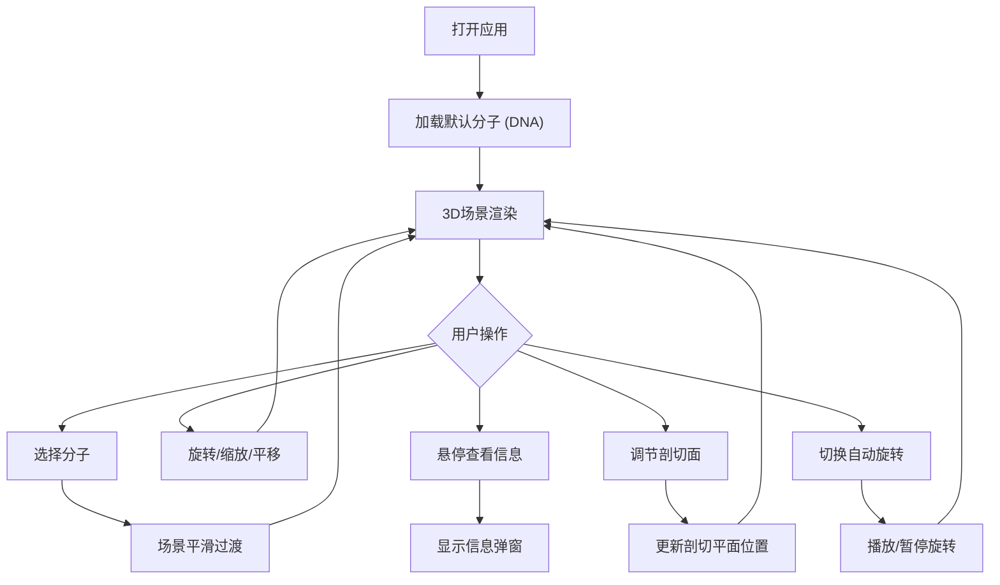

## 1. 产品概述

分子探针是一款面向非专业人士的交互式3D分子可视化应用，旨在让用户直观探索蛋白质、DNA等分子的三维空间构型，理解其组成单元的空间排布关系。
- 解决传统分子可视化工具门槛高、交互单一的痛点，提供沉浸式、低门槛的分子结构浏览体验
- 面向生物技术实验室的科普展示、教学演示等场景，具有科学传播与教育价值

## 2. 核心功能

### 2.1 用户角色
| 角色 | 注册方式 | 核心权限 |
|------|----------|----------|
| 访客 | 无需注册 | 浏览分子模型库、交互探索3D分子、查看原子/键信息、使用剖切功能 |

### 2.2 功能模块
1. **3D分子场景页**：分子模型渲染、旋转缩放平移、原子/键悬停信息弹窗、剖切模式、自动旋转
2. **分子模型库面板**：预设分子图标卡选择、场景平滑过渡

### 2.3 页面详情
| 页面名称 | 模块名称 | 功能描述 |
|----------|----------|----------|
| 3D分子场景页 | 分子模型库面板 | 右侧浮动面板展示5个预设分子（DNA双螺旋、胰岛素、水分子、咖啡因、乙醇），点击切换分子 |
| 3D分子场景页 | 3D场景交互 | 鼠标拖拽旋转（阻尼0.9/惯性0.7）、滚轮缩放（0.2-4倍）、右键拖拽平移 |
| 3D分子场景页 | 原子/键信息弹窗 | 悬停显示浮动卡片，包含原子符号/类型/位置或键长/键角 |
| 3D分子场景页 | 剖切模式 | 底部滑块控制半透明剖切面沿Y轴移动，隐藏剖切面以下原子和键 |
| 3D分子场景页 | 自动旋转 | 默认2°/秒绕Y轴旋转，播放/暂停按钮切换 |
| 3D分子场景页 | 控制条 | 半透明底部控制条，包含剖切滑块和播放/暂停按钮 |

## 3. 核心流程

用户打开应用 → 查看3D分子场景（默认加载DNA双螺旋）→ 从右侧面板选择分子 → 场景平滑过渡到新分子 → 拖拽旋转/缩放/平移探索 → 悬停原子或键查看信息 → 使用剖切滑块观察内部结构 → 切换自动旋转状态

## 4. 用户界面设计

### 4.1 设计风格
- 主色调：深色科幻风（背景 #0A0A1A，面板 #1A1A2E，控件 #0F0F1F）
- 强调色：#4ECDC4（剖切面/滑块）、#6BCB77（播放按钮）、#E0E0FF（文字）
- 按钮风格：圆形播放/暂停按钮（直径40px），圆角分子卡片
- 字体：sans-serif，12px信息文字，颜色 #E0E0FF
- 布局风格：全屏3D场景 + 右侧浮动面板 + 底部半透明控制条
- 图标风格：简洁线条图标（lucide-react）

### 4.2 页面设计概览
| 页面名称 | 模块名称 | UI元素 |
|----------|----------|--------|
| 3D分子场景页 | 3D画布 | 全屏Canvas，深色背景0x0A0A1A，原子高光球体，键半透明圆柱 |
| 3D分子场景页 | 分子模型库面板 | 右侧浮动，宽240px，背景#1A1A2E，圆角12px，边框1px #2A2A44，5个图标卡100x80px，悬停放大1.05倍 |
| 3D分子场景页 | 信息弹窗 | 浮动卡片，宽200px，背景#1E1E2E，圆角8px，边框1px #4A4A6A，白色12px文字 |
| 3D分子场景页 | 控制条 | 居中，高60px，背景#0F0F1F透明度0.85，圆角16px，剖切滑块300x6px轨道#2D2D44滑块20px #4ECDC4 |
| 3D分子场景页 | 播放/暂停按钮 | 圆形直径40px，背景#6BCB77悬停#5BBF6A，0.2s过渡 |

### 4.3 响应式设计
- 桌面优先（≥768px）：右侧浮动面板 + 底部水平控制条
- 移动端（<768px）：面板移至底部，控制条改为竖向排列

### 4.4 3D场景指导
- 环境氛围：深色科幻太空感，微弱环境光
- 灯光设置：环境光（低强度）+ 方向光（主光源）+ 点光源（原子高光/库伯鲁斯效果）
- 相机设置：透视相机，默认距离分子中心6单位，FOV 60°
- 交互与动画：阻尼旋转、惯性、0.5秒分子切换淡入、2°/秒自动旋转
- 后处理效果：原子发光（emissive）、剖切面网格线
- 性能预算：60FPS，原子≤500无卡顿，交互响应<50ms
