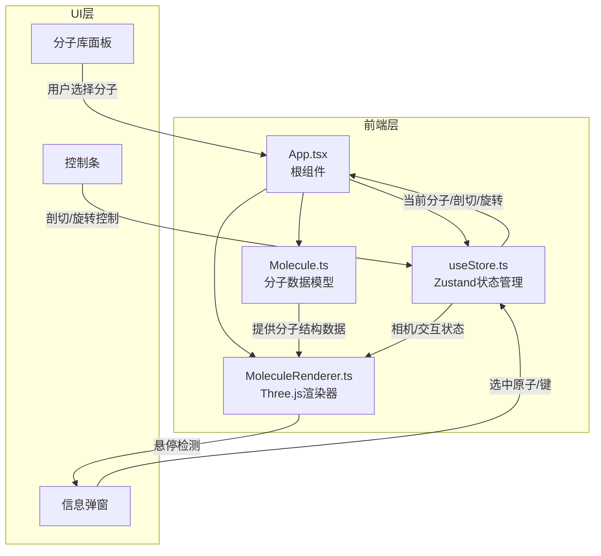
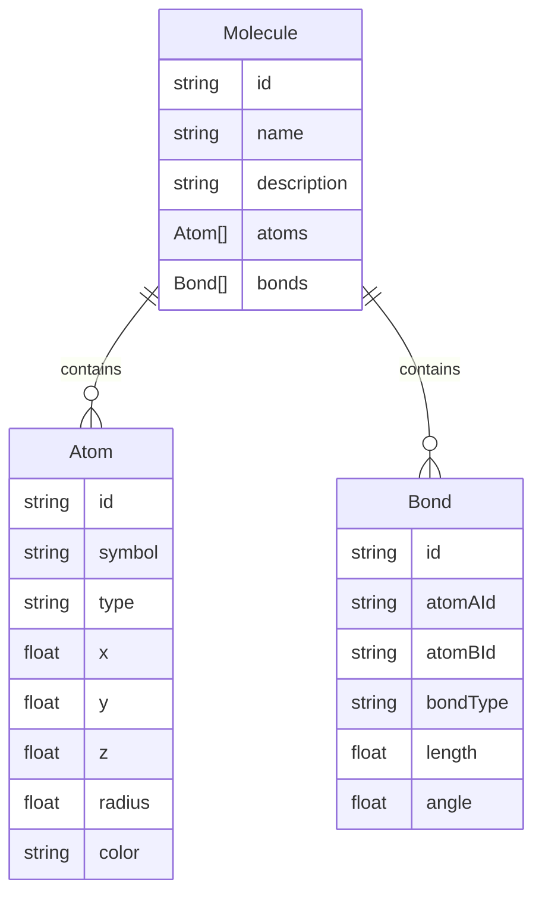

## 1. 架构设计



## 2. 技术说明
- 前端：React@18 + TypeScript + Three.js + Zustand + Vite
- 初始化工具：vite-init（react-ts模板）
- 后端：无
- 数据库：无（预设分子数据硬编码在 Molecule.ts 中）

## 3. 路由定义
| 路由 | 用途 |
|------|------|
| / | 单页应用，包含3D分子查看器的所有功能 |

## 4. API定义
无后端API，所有数据为前端预设。

## 5. 文件结构与调用关系

```
项目根目录/
├── package.json              # 依赖：three, @types/three, react, react-dom, zustand, typescript, vite, @vitejs/plugin-react
├── index.html                # 入口页面，全屏挂载Canvas
├── tsconfig.json             # 严格模式，ES2020 + DOM类型
├── vite.config.ts            # Vite基础配置
└── src/
    ├── App.tsx               # 根组件：初始化场景和store，加载分子模型
    │                         # 数据流：用户交互 → 更新store → 通知渲染器重绘
    ├── models/
    │   └── Molecule.ts       # 分子数据模型：原子、键、角度类型定义 + 5个分子生成器
    │                         # 数据流：被App.tsx调用 → 生成结构数据 → 提供给渲染器
    ├── renderer/
    │   └── MoleculeRenderer.ts  # Three.js渲染器：球体/圆柱/剖切面/发光/动画
    │                              # 数据流：从store读取相机和交互状态 → 更新场景
    └── store/
        └── useStore.ts       # Zustand状态：当前分子、选中原子、旋转角度、缩放、剖切位置
                              # 数据流：供App.tsx和渲染器读写
```

### 文件间调用关系
1. **App.tsx** 调用 **Molecule.ts** 获取分子数据，传入 **MoleculeRenderer.ts** 渲染
2. **App.tsx** 读写 **useStore.ts** 管理全局状态
3. **MoleculeRenderer.ts** 从 **useStore.ts** 读取相机/剖切/旋转状态更新场景
4. UI组件（面板/控制条）通过 **useStore.ts** 更新状态，触发渲染器重绘

## 6. 数据模型

### 6.1 数据模型定义



### 6.2 预设分子数据
| 分子名称 | 原子数 | 说明 |
|----------|--------|------|
| DNA双螺旋 | ~200 | 双螺旋结构，含碱基对 |
| 胰岛素 | ~200 | 蛋白质折叠结构 |
| 水分子 | 3 | H2O简单分子 |
| 咖啡因 | 24 | C8H10N4O2 |
| 乙醇 | 9 | C2H5OH |
