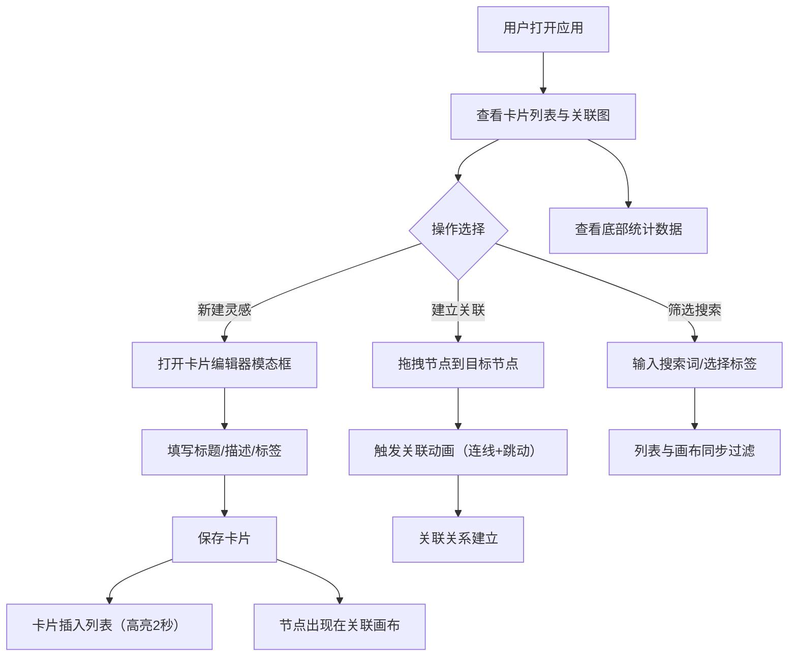

## 1. 产品概述

灵感捕捉器（InspireFlow）是一款帮助用户快速记录灵感与创意的深色主题应用，以卡片化管理和关联图谱为核心，解决传统笔记工具缺乏结构化展示和灵感关联的问题，让想法能以卡片和关联图的形式动态呈现。

- 目标用户：创意工作者、设计师、产品经理、写作者等需要频繁捕捉和管理灵感的人群
- 核心价值：让灵感从"碎片记录"升级为"关联网络"，通过可视化关联图激发创意碰撞

## 2. 核心功能

### 2.1 用户角色

| 角色 | 注册方式 | 核心权限 |
|------|----------|----------|
| 默认用户 | 无需注册 | 创建、编辑、删除灵感卡片，查看关联图，筛选搜索 |

### 2.2 功能模块

1. **主界面**：左侧卡片列表 + 右侧关联画布，顶部搜索与标签筛选，底部统计面板
2. **卡片编辑器**：模态框形式，支持标题、描述、标签的输入与编辑

### 2.3 页面详情

| 页面名称 | 模块名称 | 功能描述 |
|----------|----------|----------|
| 主界面 | 卡片列表 | 左侧固定宽280px列表，展示所有灵感卡片，支持新建、点击查看；新建按钮背景#6BCB77，悬停#8DDF8D，点击缩放0.95；最新卡片高亮边框#FFD93D持续2秒 |
| 主界面 | 关联画布 | 右侧自适应Canvas画布，卡片以节点形式展示，节点半径随关联数变化（1关联30px，每+1关联+5px，最大60px），背景渐变#FF6B6B→#4ECDC4，圆角阴影；拖拽节点到另一节点触发关联动画（连线#FFD93D线宽2px持续0.3s带发光），关联后节点跳动放大1.05倍；支持鼠标拖拽平移（惯性系数0.9）和滚轮缩放（0.5x-3x） |
| 主界面 | 搜索与标签筛选 | 顶部搜索框宽200px圆角20px背景#2D2D44带搜索图标输入边框变#6BCB77；标签筛选区显示所有已用标签为可点击圆角块，选中背景#FFD93D文字#1A1A2E；筛选后列表与画布同步更新，非匹配节点opacity 0.3，动画0.3秒 |
| 主界面 | 统计面板 | 底部显示灵感总数（36px #FFD93D）、关联数量（20px #4ECDC4）、今日新增（16px #6BCB77），数字带淡入动画0.5秒，背景颗粒纹理 |
| 卡片编辑器 | 标题输入 | 输入框宽100%圆角8px背景#2D2D44文字白色 |
| 卡片编辑器 | 描述输入 | 多行文本框高120px，自定义滚动条#4A4A6A |
| 卡片编辑器 | 标签输入 | 输入后回车添加为彩色圆角块，各标签颜色不同，可点击删除 |

## 3. 核心流程

用户打开应用后，左侧卡片列表展示已有灵感，右侧关联画布展示节点关系。用户点击"新建灵感"按钮弹出模态编辑器，填写标题、描述、标签后保存，卡片插入列表并同步出现在关联画布上。用户可在画布上拖拽节点到另一节点建立关联，关联产生连线动画。用户通过顶部搜索框或标签筛选区过滤内容，列表和画布同步响应。底部统计面板实时展示数据。

## 4. 用户界面设计

### 4.1 设计风格

- 主色调：#1A1A2E（深靛蓝）作为整体背景
- 强调色：#FFD93D（金黄）、#6BCB77（绿色）、#4ECDC4（青色）
- 文字色：#E0E0E0（浅灰白）
- 按钮风格：圆角、带悬停变亮与点击缩放反馈
- 字体：选用 Outfit（标题/数字）+ Source Sans 3（正文）搭配
- 布局风格：左右分屏，左侧固定宽卡片列表，右侧自适应关联画布
- 图标风格：线性图标（Lucide图标库）

### 4.2 页面设计概览

| 页面名称 | 模块名称 | UI元素 |
|----------|----------|--------|
| 主界面 | 卡片列表 | 宽280px，背景#1A1A2E，圆角12px，1px #2A2A44边框；卡片项悬停0.2s ease过渡，点击缩放0.95持续0.1s；新建按钮#6BCB77悬停#8DDF8D点击0.95 |
| 主界面 | 关联画布 | Canvas绘制，节点渐变#FF6B6B→#4ECDC4，圆角阴影0 4px 8px #00000066；连线#FFD93D线宽2px带发光；分隔线1px #2A2A44 |
| 主界面 | 搜索筛选栏 | 搜索框200px圆角20px #2D2D44带搜索图标；标签圆角块选中#FFD93D/#1A1A2E |
| 主界面 | 统计面板 | 数字36/20/16px，淡入动画0.5s，背景颗粒纹理 |
| 卡片编辑器 | 模态框 | 半透明遮罩#000000AA；标题输入100%圆角8px #2D2D44；描述120px滚动条#4A4A6A；标签彩色圆角块可删除 |

### 4.3 响应式设计

- 桌面优先设计（>=768px）：左右分屏布局
- 移动端（<768px）：左侧卡片列表变为底部抽屉式面板，初始隐藏，点击汉堡菜单按钮从底部滑出，动画持续0.3秒

### 4.4 性能要求

- 交互响应时间低于100ms
- 关联图渲染在500个节点以内FPS不低于50
- 所有过渡动画使用CSS transform和opacity以保证GPU加速
