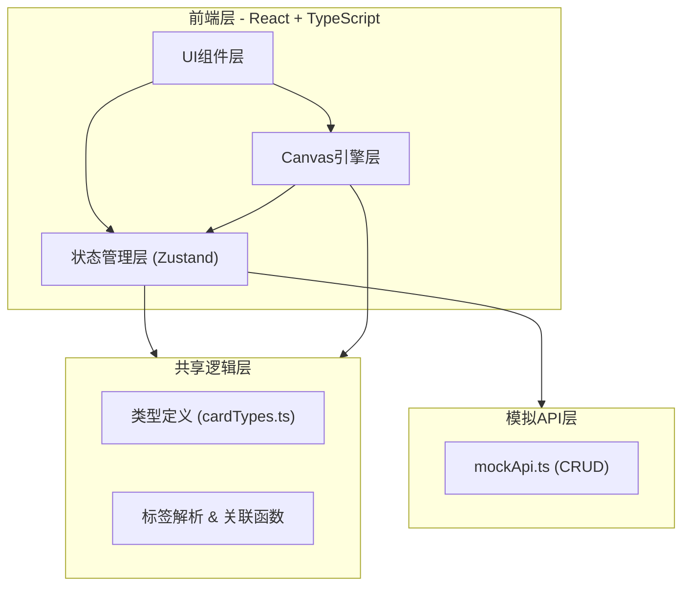
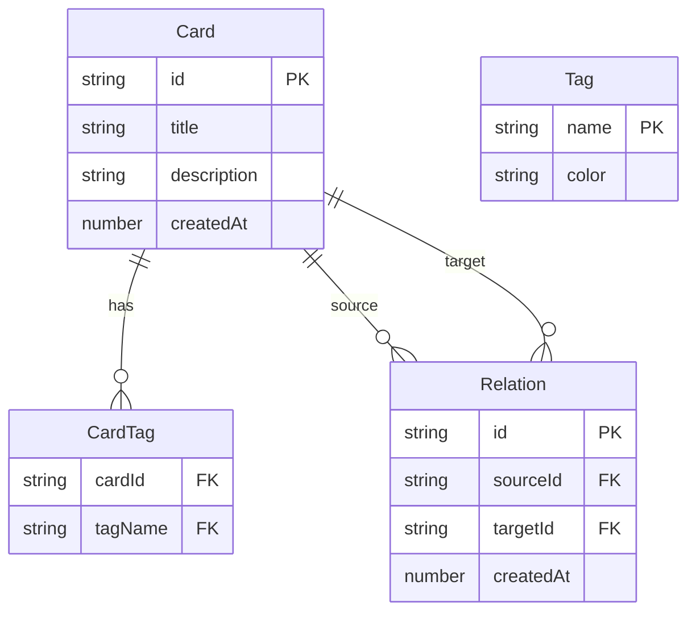

## 1. 架构设计



## 2. 技术说明

- 前端：React 18 + TypeScript + Vite
- 初始化工具：vite-init (react-ts 模板)
- 状态管理：Zustand
- 样式方案：Tailwind CSS + CSS Modules（Canvas引擎部分使用内联样式）
- 后端：无（纯前端应用，使用模拟API）
- 数据库：无（使用内存数据 + 模拟API）
- 图标库：lucide-react

## 3. 路由定义

| 路由 | 用途 |
|------|------|
| / | 主界面，包含卡片列表、关联画布、搜索筛选和统计面板 |

## 4. API定义

模拟API模块（src/api/mockApi.ts）提供以下接口：

```typescript
interface Card {
  id: string;
  title: string;
  description: string;
  tags: string[];
  createdAt: number;
}

interface Relation {
  id: string;
  sourceId: string;
  targetId: string;
  createdAt: number;
}

// CRUD操作
fetchCards(): Promise<Card[]>
createCard(card: Omit<Card, 'id' | 'createdAt'>): Promise<Card>
updateCard(id: string, data: Partial<Card>): Promise<Card>
deleteCard(id: string): Promise<void>
fetchRelations(): Promise<Relation[]>
createRelation(sourceId: string, targetId: string): Promise<Relation>
deleteRelation(id: string): Promise<void>
```

## 5. 数据模型

### 5.1 数据模型定义



### 5.2 核心类型定义

```typescript
// src/shared/cardTypes.ts
interface Card {
  id: string;
  title: string;
  description: string;
  tags: string[];
  createdAt: number;
}

interface Relation {
  id: string;
  sourceId: string;
  targetId: string;
  createdAt: number;
}

interface AppState {
  cards: Card[];
  relations: Relation[];
  searchQuery: string;
  selectedTags: string[];
  isEditorOpen: boolean;
  editingCard: Card | null;
}
```

## 6. 文件结构

```
├── package.json
├── index.html
├── tsconfig.json
├── vite.config.js
├── src/
│   ├── main.tsx
│   ├── App.tsx
│   ├── index.css
│   ├── store/
│   │   └── appStore.ts          # Zustand状态管理
│   ├── card/
│   │   ├── CardList.tsx          # 左侧卡片列表组件
│   │   └── CardEditor.tsx        # 卡片编辑器模态框
│   ├── canvas/
│   │   └── CanvasEngine.ts       # 关联图画布引擎
│   ├── api/
│   │   └── mockApi.ts            # 模拟API模块
│   ├── shared/
│   │   └── cardTypes.ts          # 共享类型定义
│   ├── components/
│   │   ├── SearchBar.tsx         # 搜索栏组件
│   │   ├── TagFilter.tsx         # 标签筛选组件
│   │   └── StatsPanel.tsx        # 统计面板组件
│   └── hooks/
│       └── useCanvas.ts          # Canvas交互Hook
```
