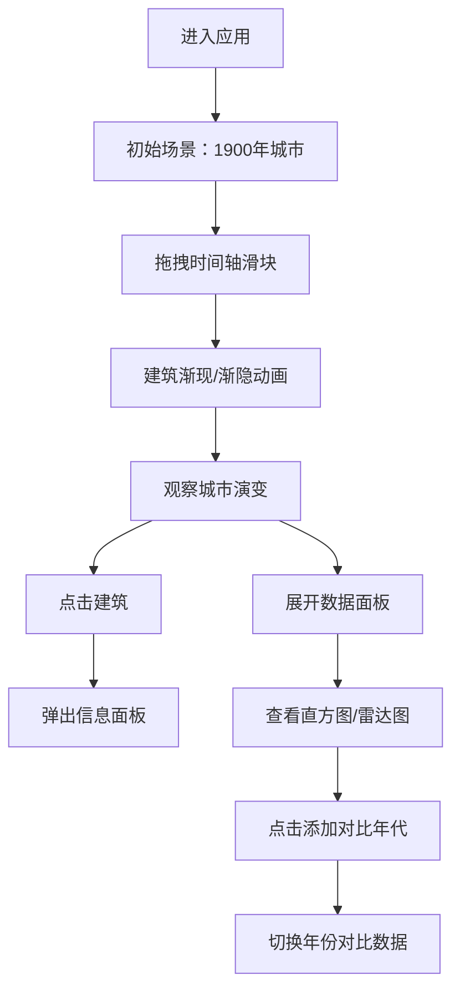

## 1. 产品概述

城市天际线演变 3D 可视化应用，通过交互式 3D 场景和时间轴控制，直观展示城市建筑随时间的动态变化，解决静态规划图难以呈现时间维度演变的问题。

- 核心目标：让用户通过时间轴滑动，沉浸式观察城市从过去到未来的建筑高度、密度和风格变化
- 目标用户：城市规划师、建筑爱好者、学生及对城市发展感兴趣的公众
- 产品价值：将抽象的时间维度转化为可视化的 3D 体验，提升城市演变认知的直观性和趣味性

## 2. 核心功能

### 2.1 功能模块

1. **3D 城市场景**：Three.js 渲染的 3D 城市模型，支持鼠标交互（旋转、缩放、点击）
2. **时间轴控制**：底部水平时间轴，拖拽滑块控制年份，建筑随年代渐现/渐隐
3. **建筑信息面板**：点击建筑弹出详细信息（名称、高度、年代、风格）
4. **城市分区**：4 个功能区域（中心商务区、老城区、滨水区、新兴开发区），区域色块高亮
5. **数据视图面板**：可折叠数据面板，展示高度分布直方图和区域密度雷达图
6. **对比模式**：支持冻结两个年代数据，直方图和雷达图对比显示

### 2.2 页面详情

| 页面名称 | 模块名称 | 功能描述 |
|---------|---------|---------|
| 主页面 | 3D 场景视口 | 渲染城市 3D 模型，支持鼠标旋转缩放，点击建筑选中 |
| 主页面 | 时间轴组件 | 底部水平滑块，1900-2020 年份范围，控制建筑显示状态 |
| 主页面 | 建筑信息面板 | 右上角弹出，显示选中建筑的名称、高度、年代、风格标签 |
| 主页面 | 区域色块与提示 | 地面半透明色块，悬停显示区域名称和建筑数量 |
| 主页面 | 数据视图面板 | 右下角可折叠，包含直方图和雷达图，支持对比模式 |

## 3. 核心流程

用户进入应用 → 看到 1900 年的初始 3D 城市景观 → 拖拽时间轴滑块到不同年份 → 观察建筑渐现/渐隐及高度变化 → 点击建筑查看详情 → 悬停区域色块了解分区信息 → 展开数据面板查看统计图表 → 启用对比模式对比两个年代数据

## 4. 用户界面设计

### 4.1 设计风格

- **主色调**：深蓝 #1A1A2E（科技感深色背景）、青绿 #4ECDC4（交互元素主色）
- **点缀色**：金黄 #FFD93D（时间轴滑块、强调按钮）、玫红 #FF6B6B（后现代风格、图表端点）
- **建筑风格色**：古典 #C4A47A、现代 #4ECDC4、后现代 #FF6B6B
- **区域色块**：商务区 #FFD93D22、老城区 #4D96FF22、滨水区 #6BCB7722、开发区 #9B59B622
- **按钮交互**：悬停 0.2s 背景色过渡 + 0.95 倍缩放
- **字体**：Inter（400/600/700 权重），现代无衬线字体
- **整体风格**：深色科技主题，玻璃态面板，精致阴影与圆角

### 4.2 页面设计概览

| 页面 | 模块 | UI 元素 |
|------|------|---------|
| 主页面 | 3D 场景 | 浅蓝到灰白渐变背景，45° 俯视视角，建筑高度按年代比例增长 |
| 主页面 | 时间轴 | 底部居中，深色轨道 #2D2D44，金色滑块带发光尾迹，圆角 20px |
| 主页面 | 信息面板 | 白色背景 #FFFFFF，圆角 12px，阴影 0 4px 12px rgba(0,0,0,0.15)，宽 240px |
| 主页面 | 数据面板 | 深色背景 #1A1A2E，圆角 16px，1px #2A2A44 边框，可折叠动画 |
| 主页面 | 区域提示 | 深色背景 #1E1E2E，白色文字，圆角 8px，0.2s 动画 |

### 4.3 响应式设计

- **桌面端**（≥768px）：数据面板右下角悬浮（宽 320px，高 60%），时间轴宽 80%
- **移动端**（<768px）：数据面板改为底部全宽抽屉（高度 50%），时间轴宽 95%
- **触控优化**：增大可点击区域，支持触摸拖拽

### 4.4 3D 场景设计

- **背景**：从浅蓝 #87CEEB 渐变到灰白 #F0F0F0 的天空渐变
- **相机**：初始位置 (0, 50, 100)，轨道控制器，旋转灵敏度 0.5，缩放范围 10-200
- **光照**：环境光 #FFFFFF 强度 0.6，平行光 #FFFFFF 强度 0.8 位置 (50, 100, 50)
- **建筑**：BoxGeometry + MeshStandardMaterial，基座 6x6 单位，高度随数据和年代比例变化
- **动画**：建筑透明度过渡 1.5s easeInOut，年代间高度比例插值
- **性能**：50 座建筑，目标 45FPS+，每帧绘制时间 ≤16ms
