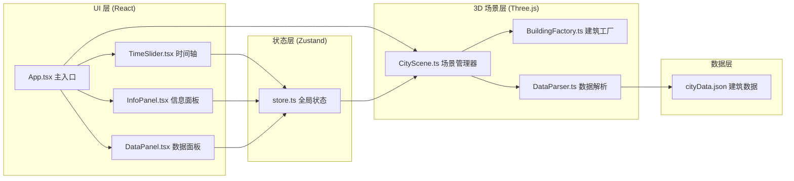

## 1. 架构设计



## 2. 技术选型

- **前端框架**：React 18 + TypeScript
- **构建工具**：Vite 5
- **3D 渲染**：Three.js r160+（原生 three，不使用 react-three-fiber，保持高性能）
- **状态管理**：Zustand（轻量级，简单易用）
- **样式方案**：CSS Modules / 内联样式（组件级样式）
- **UI 组件**：自定义组件（无 UI 库依赖，保持轻量）
- **数据可视化**：Canvas 2D 原生绘制（直方图、雷达图）
- **唯一 ID**：uuid

## 3. 文件结构

```
src/
├── main.tsx              # 应用入口
├── App.tsx               # 根组件
├── store.ts              # Zustand 全局状态
├── types.ts              # TypeScript 类型定义
├── data/
│   └── cityData.json     # 建筑静态数据（50+ 建筑）
├── scene/
│   ├── CityScene.ts      # Three.js 场景管理类
│   ├── BuildingFactory.ts # 建筑生成工厂
│   └── DataParser.ts     # 数据解析模块
└── ui/
    ├── TimeSlider.tsx    # 时间轴组件
    ├── InfoPanel.tsx     # 建筑信息面板
    └── DataPanel.tsx     # 数据视图面板
```

## 4. 数据模型

### 4.1 建筑数据模型

```typescript
interface BuildingData {
  id: string;
  name: string;
  year: number;        // 建造年代
  height: number;      // 基础高度（2020年基准）
  style: 'classical' | 'modern' | 'postmodern';
  zone: 'cbd' | 'oldtown' | 'waterfront' | 'newdistrict';
  x: number;           // X 坐标
  z: number;           // Z 坐标
}
```

### 4.2 区域定义

| 区域 ID | 区域名称 | 颜色 |
|---------|---------|------|
| cbd | 中心商务区 | #FFD93D22 |
| oldtown | 老城区 | #4D96FF22 |
| waterfront | 滨水区 | #6BCB7722 |
| newdistrict | 新兴开发区 | #9B59B622 |

### 4.3 建筑风格

| 风格 ID | 风格名称 | 颜色 |
|---------|---------|------|
| classical | 古典 | #C4A47A |
| modern | 现代 | #4ECDC4 |
| postmodern | 后现代 | #FF6B6B |

## 5. Zustand Store 定义

```typescript
interface AppState {
  year: number;              // 当前年份
  selectedBuilding: string | null; // 选中建筑 ID
  compareYears: number[];    // 对比年代列表（最多2个）
  isDataPanelOpen: boolean;  // 数据面板是否展开
  hoveredZone: string | null; // 悬停区域
  
  // Actions
  setYear: (year: number) => void;
  selectBuilding: (id: string | null) => void;
  toggleCompare: () => void;  // 添加/移除对比年代
  setDataPanelOpen: (open: boolean) => void;
  setHoveredZone: (zone: string | null) => void;
}
```

## 6. 性能优化策略

1. **建筑复用**：所有建筑 Mesh 预创建，通过透明度控制显示/隐藏，避免频繁创建销毁
2. **材质共享**：同风格建筑共享 MeshStandardMaterial，减少 draw call
3. **几何复用**：使用 BoxGeometry 实例化，减少内存占用
4. **光线投射优化**：Raycaster 仅在鼠标点击时检测，减少每帧计算
5. **动画节流**：时间轴拖拽使用 requestAnimationFrame 批量更新
6. **Canvas 图表**：数据面板图表按需重绘，年份变化时才更新

## 7. 关键交互实现

### 7.1 建筑渐现/渐隐
- 所有建筑预加载到场景中，初始透明度 0
- 时间轴变化时，根据建筑建造年代与当前年份比较
- 使用 TWEEN 或自定义插值更新材质 opacity（1.5s easeInOut）
- 建筑高度按年代比例缩放（1900年最大30单位，2020年最大80单位）

### 7.2 建筑点击检测
- Three.js Raycaster 进行射线检测
- 点击时检测所有可见建筑（opacity > 0.5）
- 命中后更新 store.selectedBuilding，触发 InfoPanel 显示

### 7.3 对比模式
- 点击"添加对比年代"按钮，将当前年份加入 compareYears 数组
- 数据面板同时显示两组数据（当前年份 + 对比年份）
- 直方图重叠显示（50% 透明度），雷达图双线对比

## 8. 响应式断点

| 断点 | 布局变化 |
|------|---------|
| ≥768px | 桌面端：数据面板右下角悬浮，时间轴宽 80% |
| <768px | 移动端：数据面板底部抽屉，时间轴宽 95% |
