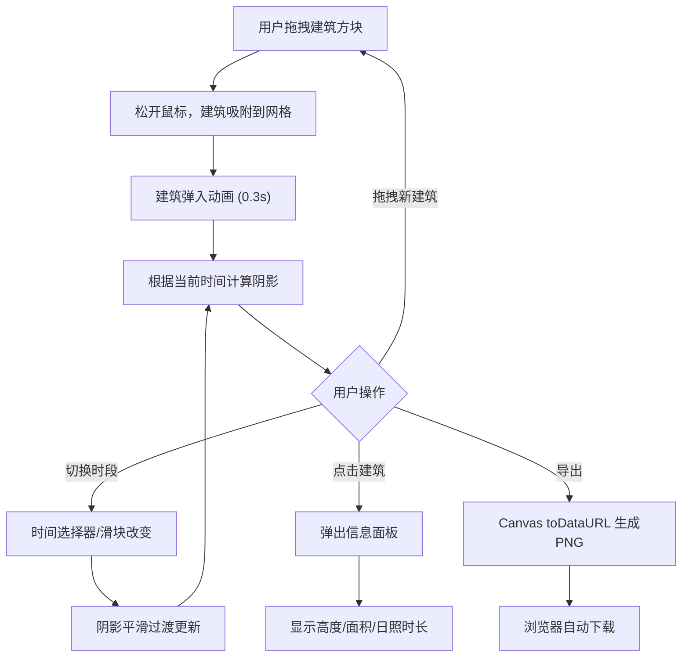

## 1. 产品概述

城市光影规划板是一款基于Canvas的交互式城市沙盘应用，让用户在虚拟网格上拖拽建筑方块规划街区布局，并实时查看不同时段（清晨、正午、黄昏、夜晚）的动态光影变化。建筑会根据太阳角度投射动态阴影，用户可点击建筑查看体积数据和日照时长，最终导出城市光影效果图。

- 目标用户：城市规划爱好者、建筑设计学生、创意爱好者
- 核心价值：通过直觉化的拖拽交互和实时光影模拟，让城市规划变得可视化、趣味化

## 2. 核心功能

### 2.1 功能模块

1. **主沙盘页面**：网格画布、工具栏面板、时间选择器、信息面板、时间轴滑块、导出按钮

### 2.2 页面详情

| 页面名称 | 模块名称 | 功能描述 |
|---------|---------|---------|
| 主沙盘页面 | 网格画布 | 500x500px Canvas俯视网格，背景#2D2D44，网格线1px #4A4A6A，每格40x40px，建筑吸附放置 |
| 主沙盘页面 | 工具栏面板 | 左侧280px宽面板，背景#1A1A2E，圆角16px，包含可拖拽建筑方块（40x40px，颜色#E8A87C） |
| 主沙盘页面 | 时间选择器 | 顶部4个圆形按钮（直径48px），渐变色表示4个时段，选中时8px同色光晕，点击缩放0.95过渡0.2s |
| 主沙盘页面 | 建筑信息面板 | 点击建筑弹出，宽240px，圆角12px，白色背景，显示高度/面积/日照时长进度条，底部滑入0.3s动画 |
| 主沙盘页面 | 时间轴滑块 | 底部宽80%，高8px，滑块半径12px，背景#4A4A6A，填充#FFD93D，连续调整太阳角度0-90度 |
| 主沙盘页面 | 导出按钮 | 右上角，背景#6BCB77，圆角8px，点击导出Canvas为PNG，文件名city-shadow-{时间戳}.png |

## 3. 核心流程

1. 用户从左侧工具栏拖拽建筑方块到网格上
2. 松开鼠标后建筑吸附到最近网格交叉点，播放弹入动画
3. 建筑根据当前时间自动投射动态阴影
4. 用户点击时间选择器或拖拽时间轴滑块切换时段，阴影实时更新
5. 用户点击已放置建筑，弹出信息面板查看数据
6. 用户点击导出按钮，将当前画布保存为PNG图片

## 4. 用户界面设计

### 4.1 设计风格

- 主色调：深紫#1A1A2E，搭配亮黄#FFD93D和蓝绿#4ECDC4点缀
- 按钮风格：圆角12-16px，柔和阴影0 4px 12px rgba(0,0,0,0.2)
- 字体：12px白色字体用于滑块标签，主标题使用深色主题对比
- 布局：左侧工具栏 + 中央画布 + 顶部时间选择器，Flexbox排列
- 动画：0.2-0.3s过渡动画，建筑放置弹入动画0.3s cubic-bezier(0.34, 1.56, 0.64, 1)

### 4.2 页面设计概览

| 页面名称 | 模块名称 | UI元素 |
|---------|---------|--------|
| 主沙盘页面 | 网格画布 | 深色背景#2D2D44，网格线#4A4A6A，建筑方块#E8A87C，阴影随时间渐变 |
| 主沙盘页面 | 工具栏 | 深紫背景#1A1A2E，圆角16px，边框#2A2A44，建筑预览方块 |
| 主沙盘页面 | 时间选择器 | 4个渐变圆形按钮：清晨#FF9A56→#FFD6A5、正午#FFE066→#FFF5B8、黄昏#FF6B6B→#FFA07A、夜晚#3B3B98→#6C6CB8 |
| 主沙盘页面 | 信息面板 | 白色#FFFFFF，圆角12px，阴影0 4px 16px rgba(0,0,0,0.15)，关闭按钮#999悬停#666 |
| 主沙盘页面 | 时间轴滑块 | 圆形滑块半径12px，背景#4A4A6A，填充#FFD93D，白色12px文字 |
| 主沙盘页面 | 导出按钮 | 绿色#6BCB77，悬停#8DDF8D，圆角8px，白色文字，点击缩放0.95 |

### 4.3 响应式

- 桌面优先设计，最低支持1280x720分辨率
- 页面居中布局，画布固定500x500px
- 工具栏固定280px宽度，信息面板固定240px宽度
