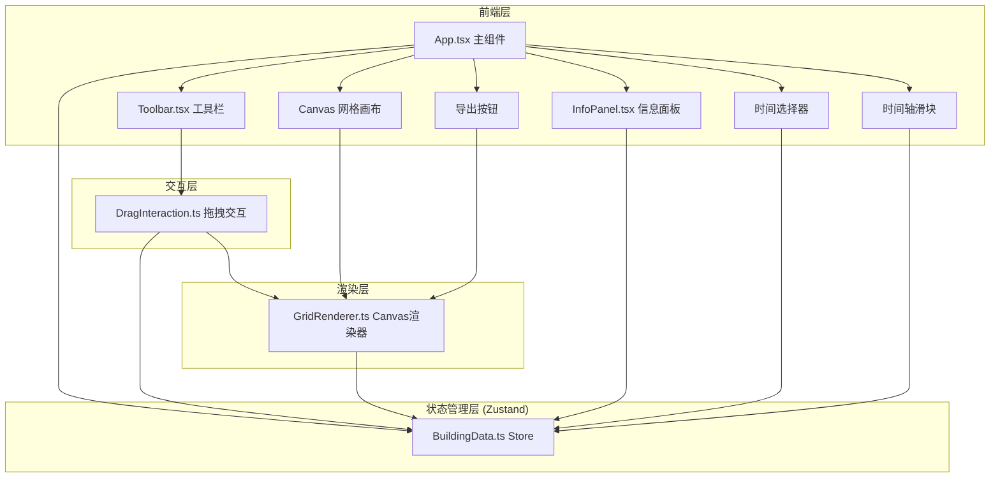

## 1. 架构设计



## 2. 技术说明

- 前端：React 18 + TypeScript + Vite + Zustand
- 初始化工具：vite-init（react-ts模板）
- 构建工具：Vite
- 后端：无
- 数据库：无（纯前端状态管理）

## 3. 路由定义

| 路由 | 用途 |
|------|------|
| / | 主沙盘页面，包含所有功能模块 |

## 4. 文件结构

```
├── package.json
├── index.html
├── tsconfig.json
├── vite.config.ts
├── src/
│   ├── App.tsx                # 主组件，组合所有模块
│   ├── main.tsx               # 入口
│   ├── data/
│   │   └── BuildingData.ts    # 建筑接口定义和Zustand Store
│   ├── renderer/
│   │   └── GridRenderer.ts    # Canvas渲染引擎
│   ├── interaction/
│   │   └── DragInteraction.ts # 拖拽交互处理
│   ├── components/
│   │   ├── Toolbar.tsx        # 工具栏组件
│   │   └── InfoPanel.tsx      # 信息面板组件
│   └── styles.css             # 全局样式
```

## 5. 核心数据模型

```mermaid
classDiagram
    class Building {
        +string id
        +object position {x: number, y: number}
        +object size {width: number, height: number}
        +number height_m
    }

    class TimePeriod {
        <<enumeration>>
        DAWN
        NOON
        DUSK
        NIGHT
    }

    class BuildingStore {
        +Building[] buildings
        +TimePeriod currentTime
        +number sunAngle
        +string selectedBuildingId
        +addBuilding(building)
        +removeBuilding(id)
        +setTime(time)
        +setSunAngle(angle)
        +selectBuilding(id)
        +clearBuildings()
        +getShadowDirection()
    }

    BuildingStore --> Building : manages
    BuildingStore --> TimePeriod : tracks
```

## 6. 核心算法

### 6.1 阴影计算

- 太阳角度由时间轴滑块控制（0°~90°）
- 阴影长度 = 建筑高度 / tan(太阳角度)（正午90°最短40px，黄昏/清晨0°最长120px）
- 阴影方向根据时段计算：清晨向东，正午向下，黄昏向西，夜晚无阴影
- 阴影颜色插值：浅灰#C0C0C0（正午）→ 深蓝#4A4A6A（夜晚）

### 6.2 日照时长计算

- 基于建筑位置和周围建筑的阴影遮挡
- 从6:00到18:00（12小时），计算每小时的遮挡情况
- 日照时长 = 未被遮挡的小时数

### 6.3 网格吸附

- 鼠标释放时，建筑位置吸附到最近的40px网格交叉点
- 坐标计算：snapX = Math.round(mouseX / 40) * 40
