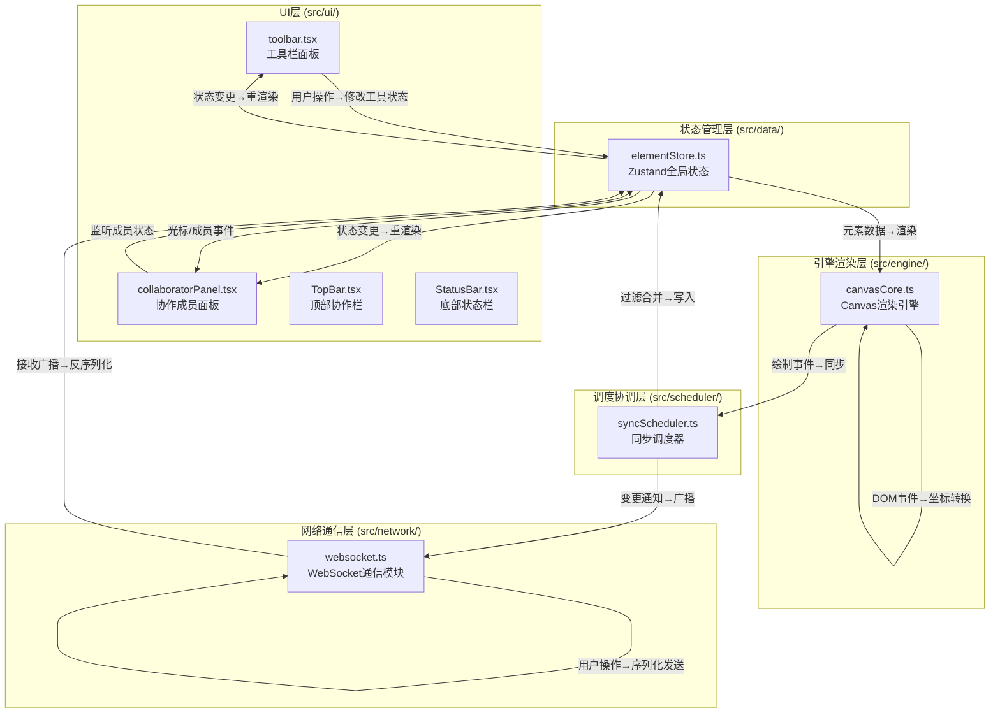

## 1. 架构设计



## 2. 技术说明

- **前端框架**：React@18 + TypeScript@5 + Vite@5
- **状态管理**：Zustand@4（轻量级，支持中间件）
- **构建工具**：Vite@5 + @vitejs/plugin-react
- **工具库**：uuid（唯一ID生成）、lodash（深拷贝/防抖/节流）
- **图标库**：lucide-react（SVG线性图标）
- **通信方式**：WebSocket模拟（本地事件总线模拟多用户协作，0-100ms随机延迟）
- **渲染引擎**：Canvas 2D API 原生渲染（高性能，支持50FPS+）
- **样式方案**：原生CSS + CSS Variables（模块化，避免Tailwind引入额外依赖）

## 3. 目录结构定义

```
src/
├── network/
│   └── websocket.ts          # WebSocket通信管理（连接/发送/接收/模拟延迟）
├── engine/
│   └── canvasCore.ts         # Canvas渲染引擎（绘制/事件处理/坐标转换）
├── ui/
│   ├── toolbar.tsx           # 左侧工具栏（工具选择/参数调节）
│   ├── collaboratorPanel.tsx # 右侧协作面板（在线用户/光标）
│   ├── TopBar.tsx            # 顶部协作栏（房间ID/分享/用户头像）
│   └── StatusBar.tsx         # 底部状态栏（工具/人数/时间）
├── data/
│   └── elementStore.ts       # Zustand全局状态（元素/工具/历史/成员）
├── scheduler/
│   └── syncScheduler.ts      # 同步调度器（冲突合并/历史栈/深度控制）
├── types/
│   └── index.ts              # 全局类型定义（元素/用户/事件）
├── App.tsx                   # 主应用组件（布局拼装）
├── main.tsx                  # 入口文件
└── index.css                 # 全局样式（CSS变量/重置/布局）
```

## 4. 核心类型定义

```typescript
// 用户颜色分配池
const USER_COLORS = ['#FF6B6B', '#4ECDC4', '#FFD93D', '#6BCB77', '#9B59B6'];

// 工具类型
type ToolType = 'brush' | 'rectangle' | 'circle' | 'polygon' | 'text' | 'image' | 'select';

// 白板元素基类
interface BaseElement {
  id: string;
  type: 'path' | 'rectangle' | 'circle' | 'polygon' | 'text' | 'image';
  userId: string;
  color: string;
  createdAt: number;
  updatedAt: number;
}

// 自由路径
interface PathElement extends BaseElement {
  type: 'path';
  points: { x: number; y: number }[];
  width: number; // 2-8px
}

// 矩形
interface RectangleElement extends BaseElement {
  type: 'rectangle';
  x: number; y: number;
  width: number; height: number;
  borderRadius: number; // 0-20px
  borderWidth: number;
}

// 圆形
interface CircleElement extends BaseElement {
  type: 'circle';
  cx: number; cy: number;
  radiusX: number; radiusY: number;
  borderWidth: number;
}

// 多边形
interface PolygonElement extends BaseElement {
  type: 'polygon';
  cx: number; cy: number;
  radius: number;
  sides: number; // 3-8
  rotation: number;
  borderWidth: number;
}

// 文字便签
interface TextElement extends BaseElement {
  type: 'text';
  x: number; y: number;
  content: string;
  fontSize: number;
  bgColor: string; // #FFF3CD
}

// 图片元素
interface ImageElement extends BaseElement {
  type: 'image';
  x: number; y: number;
  width: number; height: number;
  src: string; // base64 data URL
  originalWidth: number;
  originalHeight: number;
}

type WhiteboardElement = PathElement | RectangleElement | CircleElement 
  | PolygonElement | TextElement | ImageElement;

// 协作成员
interface Collaborator {
  id: string;
  name: string;
  color: string;
  cursorX: number;
  cursorY: number;
  lastActive: number;
}

// 协作事件
type CollabEventType = 'element_add' | 'element_update' | 'element_delete' 
  | 'cursor_move' | 'user_join' | 'user_leave' | 'undo' | 'redo';

interface CollabEvent {
  type: CollabEventType;
  userId: string;
  roomId: string;
  timestamp: number;
  payload: any;
}
```

## 5. 数据流向与调用关系

### 5.1 绘制操作数据流向
```
用户鼠标按下 → engine/canvasCore.ts (mousedown)
  → 判断当前工具类型（elementStore.tool）
  → 开始绘制：记录起始坐标
  → 鼠标移动：实时渲染到Canvas（离屏缓冲）
  → 鼠标抬起：生成WhiteboardElement对象
  → 调用 scheduler/syncScheduler.ts.addElement(element)
    → 检查冲突/合并路径点
    → 写入 elementStore.elements 数组
    → 推入 elementStore.historyStack（控制深度≤50）
    → 调用 network/websocket.ts.broadcast(event)
      → 序列化事件 + 随机延迟0-100ms
      → 模拟广播到本地其他用户
      → 更新 elementStore.collaborators 光标
```

### 5.2 撤销重做数据流向
```
用户按Ctrl+Z → ui/toolbar.tsx 捕获快捷键
  → 调用 elementStore.undo()
    → scheduler/syncScheduler.ts.undo() 控制栈深度
    → 从historyStack.pop()当前状态
    → 推入redoStack
    → 更新elements = historyStack[top]
    → engine/canvasCore.ts 监听elements变化 → 重新渲染
    → network.broadcast({type:'undo'})
```

### 5.3 模块调用关系
| 模块 | 被调用者 | 调用时机 | 说明 |
|------|----------|----------|------|
| canvasCore.ts | elementStore.getState() | 每一帧渲染 | 读取元素列表、工具状态 |
| canvasCore.ts | syncScheduler.addElement() | 绘制完成时 | 提交新元素 |
| canvasCore.ts | websocket.sendCursor() | 鼠标移动时 | 发送光标位置 |
| toolbar.tsx | elementStore.setTool() | 按钮点击 | 切换当前工具 |
| toolbar.tsx | elementStore.undo()/redo() | 按钮/快捷键 | 撤销重做 |
| toolbar.tsx | elementStore.setBrushWidth() | 滑块调节 | 调整画笔参数 |
| collaboratorPanel.tsx | elementStore.collaborators | 订阅状态 | 渲染用户列表 |
| syncScheduler.ts | elementStore.setState() | 同步完成 | 更新状态 |
| syncScheduler.ts | websocket.broadcast() | 状态变更 | 广播事件 |
| websocket.ts | elementStore.dispatch() | 接收消息 | 更新本地状态 |

## 6. 性能优化策略

### 6.1 Canvas渲染优化
- 双缓冲渲染：离屏Canvas预渲染静态元素，主Canvas只重绘变化区域
- requestAnimationFrame驱动渲染循环，锁定帧率（目标60FPS）
- 脏矩形优化：只重绘元素变更区域
- 大元素图像缓存：复杂形状预渲染为ImageBitmap复用

### 6.2 状态更新优化
- Zustand浅比较订阅：useStore(state => state.elements, shallow)
- 批量更新：16ms内多次addElement合并为一次setState
- 防抖节流：光标移动事件节流到每16ms一次

### 6.3 数据结构优化
- 元素列表：按zIndex分层存储，渲染时按层级遍历
- 历史栈：存储elements的引用快照（浅拷贝+不可变更新），避免深拷贝
- 历史栈深度控制：超过50步时移除最早记录

### 6.4 协作同步优化
- 操作增量传输：只发送变更的元素diff，不发送全量数据
- 本地乐观更新：先渲染本地操作，服务器确认失败时回滚
- 冲突解决：最后写入优先（LWW），辅以userId作为tie-breaker

## 7. 初始化与构建配置

### 7.1 package.json 依赖
```json
{
  "dependencies": {
    "react": "^18.3.0",
    "react-dom": "^18.3.0",
    "zustand": "^4.5.0",
    "uuid": "^9.0.0",
    "lodash": "^4.17.21",
    "lucide-react": "^0.400.0"
  },
  "devDependencies": {
    "typescript": "^5.4.0",
    "vite": "^5.3.0",
    "@vitejs/plugin-react": "^4.3.0",
    "@types/react": "^18.3.0",
    "@types/react-dom": "^18.3.0",
    "@types/uuid": "^9.0.0",
    "@types/lodash": "^4.17.0"
  }
}
```

### 7.2 vite.config.js 路径别名
```
@/* -> src/*
@network/* -> src/network/*
@engine/* -> src/engine/*
@ui/* -> src/ui/*
@data/* -> src/data/*
@scheduler/* -> src/scheduler/*
@types/* -> src/types/*
```

### 7.3 tsconfig.json 关键配置
- 严格模式：strict: true
- 模块系统：module: ESNext, moduleResolution: bundler
- 目标：target: ES2020
- JSX：jsx: react-jsx
- 路径别名与vite.config同步
