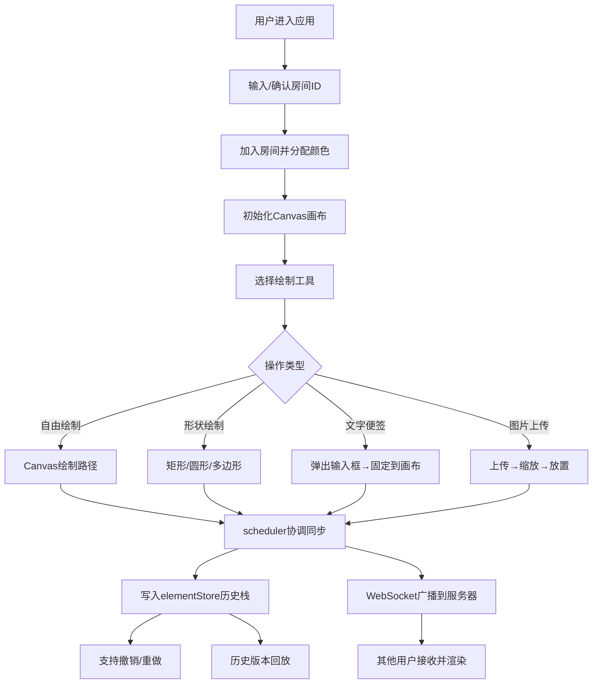

## 1. 产品概述

画布共鸣是一款面向创意工作者社群的实时协作式虚拟白板应用，支持多用户同时在同一白板上进行自由绘制、添加文字便签和上传图片，完整记录编辑历史以便回溯灵感演变过程。

- 核心价值：打破时空限制，让创意团队可以实时协作、头脑风暴，完整保留创作过程
- 目标用户：设计师、产品经理、创意团队、教育工作者

## 2. 核心功能

### 2.1 用户角色
| 角色 | 注册方式 | 核心权限 |
|------|----------|----------|
| 普通用户 | 匿名加入房间 | 创建/加入房间、绘制图形、添加便签、上传图片、撤销重做、历史回放 |

### 2.2 功能模块
1. **房间管理模块**：创建/加入房间、房间ID管理、在线用户列表
2. **画布渲染模块**：Canvas 2D矢量渲染、自由路径、矩形、圆形、多边形绘制
3. **便签与图片模块**：文字便签输入、图片上传与缩放、拖拽移动
4. **协作同步模块**：WebSocket实时通信、光标跟随、操作广播
5. **历史管理模块**：撤销重做（最多50步）、历史版本回放
6. **UI交互模块**：工具栏、协作面板、状态栏、响应式适配

### 2.3 页面详情
| 页面名称 | 模块名称 | 功能描述 |
|----------|----------|----------|
| 白板主页面 | 顶部协作栏 | 显示房间ID、在线用户头像、分享按钮 |
| 白板主页面 | 左侧工具栏 | 画笔/文字/图片工具、形状选择、撤销重做、历史回放 |
| 白板主页面 | 中心画布区域 | Canvas渲染、矢量绘制、便签图片交互 |
| 白板主页面 | 右侧协作面板 | 在线用户列表、光标位置显示 |
| 白板主页面 | 底部状态栏 | 当前工具、在线人数、最后操作时间 |

## 3. 核心流程

用户进入应用 → 输入房间ID（默认room-001）加入 → 系统分配用户颜色和光标 → 用户选择工具进行操作 → 本地渲染并同步到服务器 → 服务器广播给其他用户 → 其他用户画布实时更新 → 所有操作记录到历史栈 → 支持撤销重做和历史回放

## 4. 用户界面设计

### 4.1 设计风格
- 主色调：深空紫蓝渐变（#1A1A2E → #2D2D44），营造沉浸式创作氛围
- 强调色：翠绿（#6BCB77）选中状态、青色（#4ECDC4）分享按钮、金黄（#FFD93D）人数指示、珊瑚红（#FF6B6B）用户颜色1、紫色（#9B59B6）时间指示
- 按钮风格：圆角12px方形按钮（64x64px），悬停时背景加深并上移2px，过渡0.15s ease
- 字体：选用现代无衬线字体，字号层级分明（标题16px，标签12px）
- 布局：卡片式设计，主画布居中，工具栏左置、协作面板右置、状态栏底部
- 图标风格：白色SVG线性图标，简洁现代

### 4.2 页面设计概述
| 页面名称 | 模块名称 | UI元素 |
|----------|----------|--------|
| 白板主页面 | 顶部协作栏 | 高56px，背景#0B0D17，房间ID（#E0E0E0），圆形头像36px，分享按钮#4ECDC4圆角8px |
| 白板主页面 | 左侧工具栏 | 宽280px，背景#1A1A2E，圆角16px，边框1px #2A2A44，3列网格布局，按钮64x64px圆角12px，选中态#6BCB77 |
| 白板主页面 | 中心画布 | 径向渐变背景#1A1A2E→#2D2D44，光标彩色圆点12px带白色边框，用户名标签12px |
| 白板主页面 | 右侧协作面板 | 用户彩色头像+姓名首字母，在线状态指示 |
| 白板主页面 | 底部状态栏 | 高32px，背景#1A1A2E，工具名#6BCB77，人数#FFD93D，时间#9B59B6 |

### 4.3 响应式适配
- Desktop-first 设计
- 窗口宽度 <768px：工具栏收缩为可拖动浮动圆形按钮（直径48px），点击展开弹出面板
- 画布区域自适应剩余空间
- 移动端优化触摸手势支持

### 4.4 动画与微交互
- 工具按钮悬停：背景#3D3D5C + 上移2px + 过渡0.15s ease
- 图片缩放：0.15s ease动画
- 光标跟随：平滑过渡移动
- 历史回放：2倍速播放，步进300ms，当前操作元素半透明红色高亮
- 便签弹出：淡入动画
